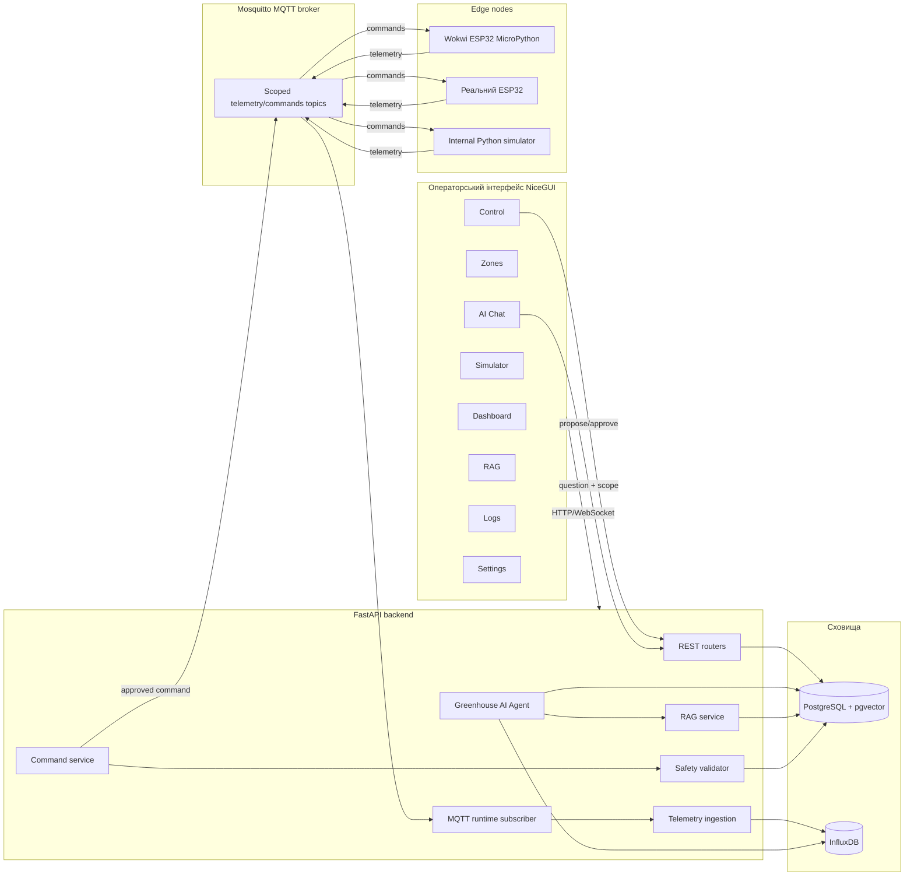
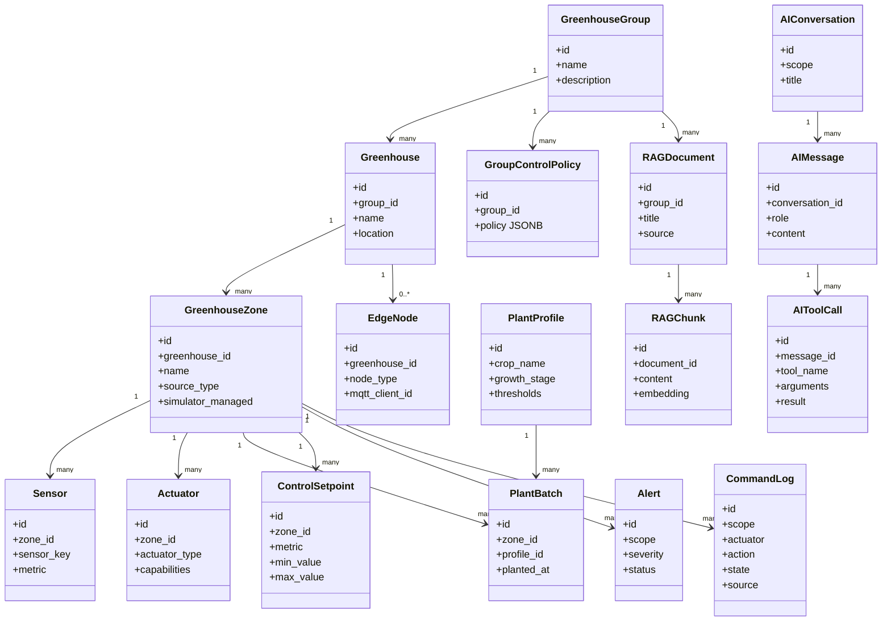
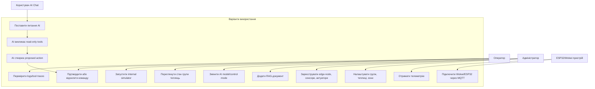
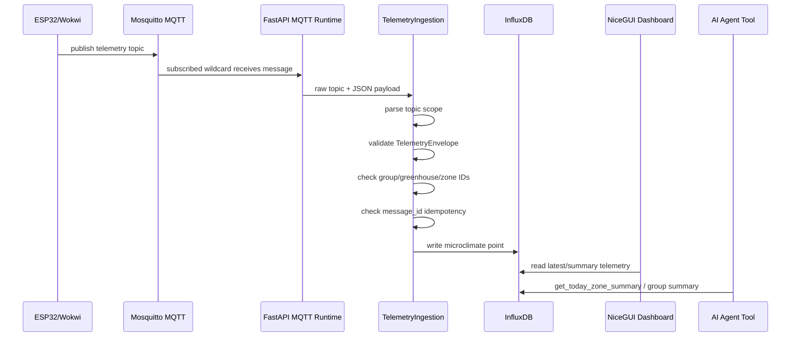
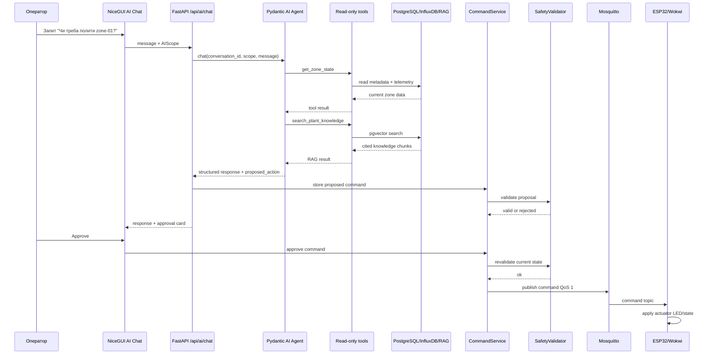
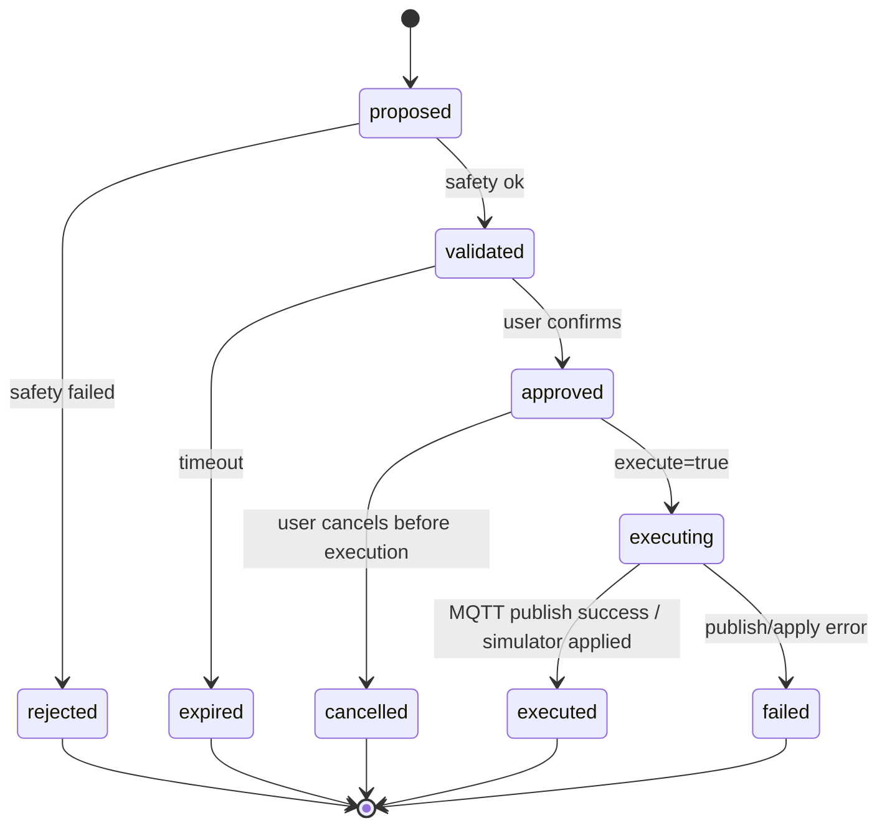
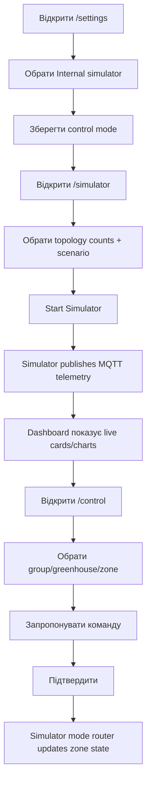
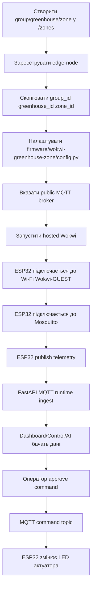
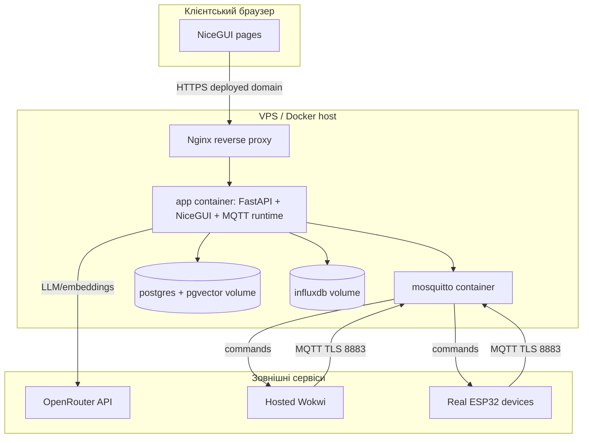
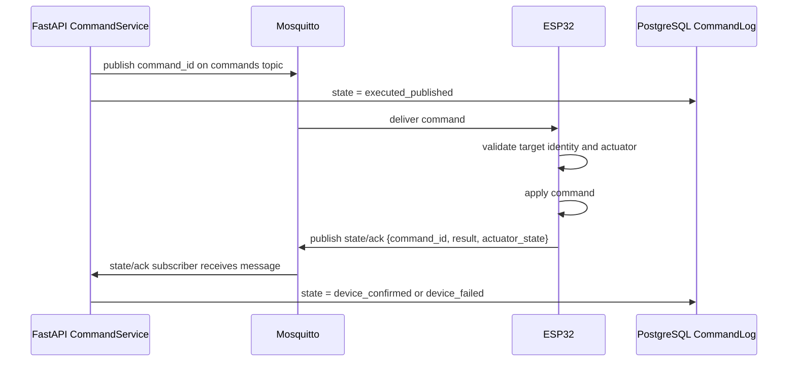

# 02. UML/Mermaid діаграми українською

Цей файл містить діаграми у Mermaid syntax. Їх можна вставляти в Mermaid Live Editor, GitHub Markdown або передавати LLM/генератору зображень як структурний опис.

## 1. Компонентна діаграма системи

## 2. Доменна модель / class diagram

## 3. Use case diagram

## 4. Sequence: телеметрія від ESP32 до dashboard/AI

## 5. Sequence: AI пропонує полив, оператор підтверджує

## 6. State diagram: життєвий цикл команди

## 7. Activity: internal simulator demo

## 8. Activity: Wokwi/ESP32 MQTT flow

## 9. Deployment diagram

## 10. Suggested target architecture extension: command acknowledgement

