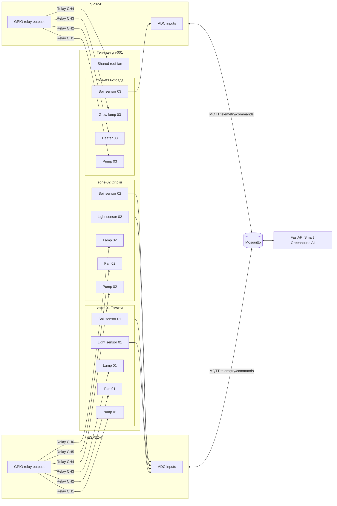
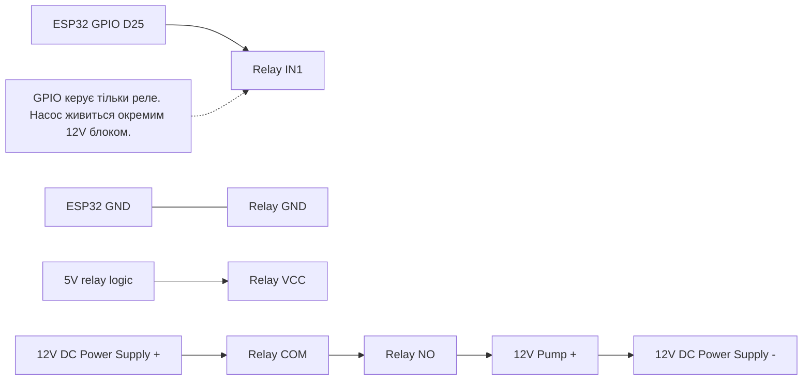
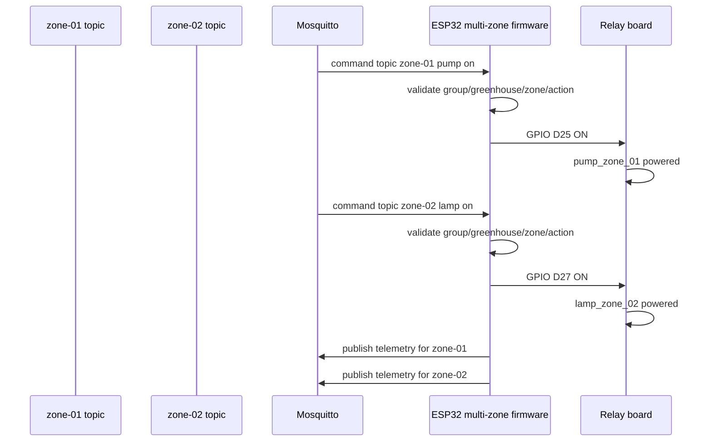

# 06. Фізична інтеграція ESP32, реле, насосів, ламп, вентиляторів і зон

Цей документ описує не один демонстраційний Wokwi-приклад, а реалістичну фізичну схему для кількох зон теплиці: декілька ESP32 або один ESP32 на кілька зон, релейні модулі, насоси, лампи, вентилятори, нагрівачі, сенсори й прив'язка всього до MQTT topics системи Smart Greenhouse AI.

## Важлива межа безпеки

ESP32 не має напряму живити насоси, лампи, вентилятори або нагрівачі від GPIO. GPIO тільки керує входом реле/SSR/MOSFET-драйвера. Силове навантаження живиться окремим блоком живлення або мережею через захищений комутаційний модуль.

```text
ESP32 GPIO -> IN релейного модуля / SSR / MOSFET driver
Силове живлення -> COM/NO реле -> насос/лампа/вентилятор/нагрівач
```

Для 220V AC використовувати тільки сертифіковані реле/SSR, корпус, запобіжники, заземлення, УЗО/RCD і фізичну ізоляцію низької та високої напруги.

## Типова фізична топологія

```text
Група group-farm-001
  Теплиця gh-001
    ESP32-A керує zone-01 і zone-02
      zone-01: томати
        sensors: DHT22, soil_01, light_01, co2_01
        actuators: pump_01, fan_01, lamp_01
      zone-02: огірки
        sensors: DHT22 або окремий DHT22, soil_02, light_02
        actuators: pump_02, fan_02, lamp_02
    ESP32-B керує zone-03 і загальними механізмами теплиці
      zone-03: розсада
        sensors: DHT22, soil_03, light_03
        actuators: pump_03, heater_03, grow_lamp_03
      shared greenhouse actuators:
        roof_fan, circulation_fan, main_light_line
```

## Варіант A: один ESP32 на одну зону

Це найпростіша й найбезпечніша модель для масштабування.

```text
ESP32-zone-01
  MQTT identity:
    group_id = group-farm-001
    greenhouse_id = gh-001
    zone_id = zone-01
  sensors:
    DHT22 -> D15
    soil -> D34
    light -> D35
    co2 -> D32
  relay outputs:
    pump -> D25
    fan -> D26
    heater -> D27
    lamp -> D14
```

Плюси:

- проста відповідність між ESP32 і `zone_id`;
- менше логіки маршрутизації команд у firmware;
- легше діагностувати відмову;
- відмова одного ESP32 не зупиняє всі зони.

Мінуси:

- більше плат ESP32;
- більше MQTT clients;
- більше блоків живлення/корпусів.

## Варіант B: один ESP32 на кілька зон

Один ESP32 може керувати 2-4 зонами, якщо вистачає GPIO/ADC і навантаження фізично поруч.

```text
ESP32-gh-001-controller
  zone-01:
    soil_01 ADC -> D34
    pump_01 relay -> D25
    lamp_01 relay -> D14
  zone-02:
    soil_02 ADC -> D35
    pump_02 relay -> D26
    lamp_02 relay -> D27
  shared:
    DHT22 greenhouse air -> D15
    roof_fan relay -> D33
```

У firmware треба мати map команд:

```python
ACTUATOR_PIN_MAP = {
    ("zone-01", "pump"): 25,
    ("zone-01", "lamp"): 14,
    ("zone-02", "pump"): 26,
    ("zone-02", "lamp"): 27,
    ("greenhouse", "roof_fan"): 33,
}
```

Команда застосовується тільки якщо `group_id` і `greenhouse_id` збігаються, а `zone_id + actuator` існує в map.

Плюси:

- менше контролерів;
- дешевше для компактної теплиці;
- зручно для спільних пристроїв теплиці.

Мінуси:

- складніша прошивка;
- одна відмова ESP32 впливає на кілька зон;
- ADC pins ESP32 обмежені, а Wi-Fi може впливати на деякі ADC2 pins, тому краще використовувати ADC1 pins для analog sensors.

## Варіант C: ESP32 + I/O expander або relay board

Для великої кількості реле краще не забирати всі GPIO напряму. Можна використати:

- MCP23017 I2C GPIO expander;
- PCF8574 I2C relay board;
- shift register board;
- industrial Modbus relay module через RS485 gateway.

```text
ESP32
  I2C SDA/SCL -> MCP23017
  MCP23017 pins -> relay module inputs
  Relay channels:
    CH1 pump_zone_01
    CH2 pump_zone_02
    CH3 pump_zone_03
    CH4 lamp_zone_01
    CH5 lamp_zone_02
    CH6 fan_greenhouse
    CH7 heater_zone_03
    CH8 spare
```

Це краще для 8/16/32 каналів, але firmware має вести таблицю відповідності channel -> actuator.

## Релейний модуль: логічна сторона

Типовий 4-channel relay module:

| Relay module pin | Підключення |
|---|---|
| VCC | 5V або 3.3V залежно від модуля |
| GND | спільна земля з ESP32 для логічної сторони |
| IN1 | ESP32 GPIO для pump |
| IN2 | ESP32 GPIO для fan |
| IN3 | ESP32 GPIO для heater |
| IN4 | ESP32 GPIO для lamp |

Багато релейних модулів є active-low: `GPIO LOW = relay ON`, `GPIO HIGH = relay OFF`. Це треба явно задати у firmware, щоб після reboot всі актуатори були OFF.

```python
RELAY_ACTIVE_LOW = True
SAFE_OFF_LEVEL = 1
ACTIVE_ON_LEVEL = 0
```

## Релейний модуль: силова сторона DC

Приклад для 12V DC насоса:

```text
12V+ power supply -> relay COM
relay NO -> pump +
pump - -> 12V- power supply
ESP32 GPIO -> relay IN
ESP32 GND -> relay logic GND
```

Коли relay OFF, контакт NO розімкнений і насос не працює. Коли relay ON, COM з'єднується з NO і насос отримує 12V.

## MOSFET замість реле для DC насосів/LED стрічок

Для DC навантажень, які часто вмикаються або потребують PWM, краще MOSFET driver, а не механічне реле.

```text
ESP32 PWM GPIO -> MOSFET gate driver
12V+ -> load +
load - -> MOSFET drain
MOSFET source -> 12V-
ESP32 GND спільний із 12V-
```

Використання:

- `fan set_power 75%`;
- LED grow light dimming;
- DC pump speed control, якщо насос це підтримує.

## SSR для AC ламп або нагрівачів

Для AC навантажень, які часто перемикаються, можна SSR, але треба правильно підібрати тип:

- SSR AC для AC load;
- SSR DC для DC load;
- запас по струму й охолодження;
- heatsink для великих навантажень.

```text
ESP32 GPIO -> SSR input + resistor/driver if needed
AC Live -> SSR load terminal 1
SSR load terminal 2 -> lamp/heater Live
Neutral -> lamp/heater Neutral
Ground -> корпус/заземлення обладнання
```

## Приклад: 3 зони, 2 ESP32, 10 актуаторів

```text
group-farm-001 / gh-001

ESP32-A: zones 01-02
  MQTT client_id: esp32-gh001-a
  publishes:
    .../zones/zone-01/telemetry
    .../zones/zone-02/telemetry
  subscribes:
    .../zones/zone-01/commands
    .../zones/zone-02/commands

  GPIO outputs:
    D25 -> relay CH1 -> pump_zone_01
    D26 -> relay CH2 -> fan_zone_01
    D27 -> relay CH3 -> lamp_zone_01
    D14 -> relay CH4 -> pump_zone_02
    D33 -> relay CH5 -> fan_zone_02
    D32 -> relay CH6 -> lamp_zone_02

ESP32-B: zone 03 + shared greenhouse devices
  MQTT client_id: esp32-gh001-b
  publishes:
    .../zones/zone-03/telemetry
    .../zones/shared/telemetry або окремий greenhouse-level topic майбутнього розширення
  subscribes:
    .../zones/zone-03/commands
    .../zones/zone-01/commands якщо shared actuator впливає на zone-01
    .../zones/zone-02/commands якщо shared actuator впливає на zone-02
    .../zones/zone-03/commands якщо shared actuator впливає на zone-03

  GPIO outputs:
    D25 -> relay CH1 -> pump_zone_03
    D26 -> relay CH2 -> heater_zone_03
    D27 -> relay CH3 -> grow_lamp_zone_03
    D14 -> relay CH4 -> roof_fan_shared
```

Для shared actuator є два варіанти моделювання:

1. Дублювати його як actuator у кожній зоні, але physical target той самий.
2. Додати greenhouse-level actuator model у майбутньому, щоб команда мала scope `greenhouse` без `zone_id`.

У поточній архітектурі безпечніше перше: команда все одно scoped до конкретної зони, а firmware map знає, що кілька zone commands можуть керувати одним physical relay.

## Приклад MQTT mapping для multi-zone ESP32

```text
Command topic:
greenhouse-groups/group-farm-001/greenhouses/gh-001/zones/zone-02/commands

Payload:
{
  "command_id": "cmd-002",
  "group_id": "group-farm-001",
  "greenhouse_id": "gh-001",
  "zone_id": "zone-02",
  "actuator": "pump",
  "action": "on",
  "duration_seconds": 30,
  "source": "manual",
  "reason": "Operator approved watering"
}

Firmware route:
(group-farm-001, gh-001, zone-02, pump) -> GPIO D14 -> relay CH4 -> pump_zone_02
```

## Таблиця прикладу фізичних пристроїв

| Logical actuator | Physical device | Driver | Voltage | Control | Notes |
|---|---|---|---:|---|---|
| `pump` zone-01 | 12V peristaltic pump | Relay або MOSFET | 12V DC | on/off, duration | Потрібен cooldown |
| `fan` zone-01 | 12V fan | MOSFET/PWM або relay | 12V DC | on/off або set_power | PWM краще для `set_power` |
| `heater` zone-03 | Heating mat | SSR/relay | AC або DC | on/off, duration | Заборонити при temp > max |
| `lamp` zone-01 | LED grow lamp | Relay/SSR/MOSFET | AC/DC | on/off, duration | Врахувати quiet hours |
| `roof_fan` shared | Exhaust fan | Relay/SSR | AC/DC | on/off або power | Може впливати на всі зони |
| `main_light_line` shared | Верхня лінія світла | SSR/contactor | AC | on/off | Краще окремий автомат/запобіжник |

## Power architecture

```text
220V AC mains
  -> RCD/УЗО
  -> circuit breaker
  -> enclosed power distribution
     -> 5V PSU для ESP32/relay logic
     -> 12V PSU для DC pumps/fans/LED strip
     -> AC line через SSR/relay/contactor для grow lamps/heaters

Low voltage box:
  ESP32
  logic relay inputs
  sensor wires

High voltage box:
  AC relay/SSR/contactor output
  fuses
  terminal blocks
  strain relief
```

Низьку напругу й 220V AC фізично розділяти. Не вести sensor wires поруч із силовими AC проводами без потреби.

## Sensor placement examples

### Zone-level sensors

```text
zone-01 tomatoes:
  soil_01: біля кореневої зони, не прямо під крапельницею
  dht22_01: на висоті листя, захищений від прямого поливу
  light_01: на рівні крони, не під лампою впритул
  co2_01: там, де є повітрообмін, не біля вентилятора напряму
```

### Greenhouse-level shared sensors

```text
gh-001:
  dht22_shared: середня висота теплиці
  co2_shared: центральна точка
  outside_temp: зовні теплиці, тінь
```

Якщо один sensor представляє кілька зон, у telemetry можна або публікувати однакове reading у кожну zone, або додати майбутній greenhouse-level telemetry scope. Поточна система очікує zone-level telemetry, тому для сумісності краще публікувати reading у кожну affected zone.

## Firmware safety defaults

Firmware має стартувати з усіма актуаторами OFF.

```python
def set_all_outputs_safe_off():
    for pin in OUTPUT_PINS:
        pin.value(SAFE_OFF_LEVEL)
```

Команда має бути відхилена firmware, якщо:

- `group_id` не збігається;
- `greenhouse_id` не збігається;
- `zone_id` невідомий;
- `actuator` невідомий для цієї зони;
- `duration_seconds` перевищує firmware hard limit;
- JSON malformed;
- action unsupported.

Backend safety є головним шаром, але firmware теж повинен мати локальні hard limits.

## Fail-safe рекомендації

- Реле насосів і нагрівачів мають бути normally open, щоб при втраті живлення навантаження вимикалося.
- Після reboot ESP32 всі GPIO переводити в OFF до MQTT reconnect.
- Для насосів використовувати maximum duration у firmware навіть якщо backend помилився.
- Для нагрівачів бажаний окремий термостат або thermal fuse.
- Для AC lamps/heaters використовувати корпус і запобіжники.
- Для water pumps тримати електроніку вище рівня води й окремо від резервуара.

## Mermaid: фізична схема multi-zone greenhouse



## Mermaid: силова логіка реле



## Mermaid: one ESP32 controls multiple MQTT zone topics



## Що варто додати в майбутньому

1. `edge_nodes` capabilities field: список zones і actuator mappings, якими керує конкретний node.
2. Device acknowledgement: `state/ack` payload після фізичного застосування relay state.
3. Greenhouse-level actuators для shared roof fan, main irrigation valve, main lamp line.
4. Firmware config generator із UI: export `config.py` або JSON mapping для конкретного edge-node.
5. Diagram generator із `edge_nodes + actuators + sensors`: автоматична схема wiring/MQTT для оператора.
6. Electrical checklist для installation: fuse, RCD, enclosure, wire gauge, waterproof connectors.
