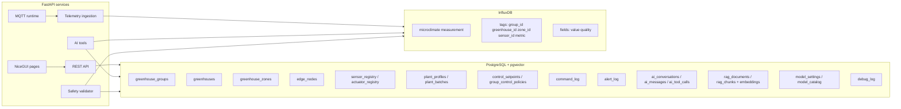
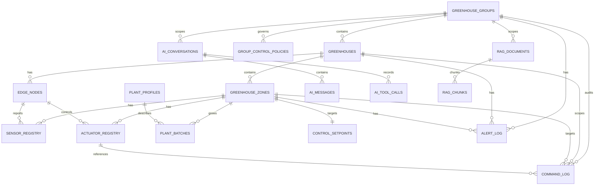
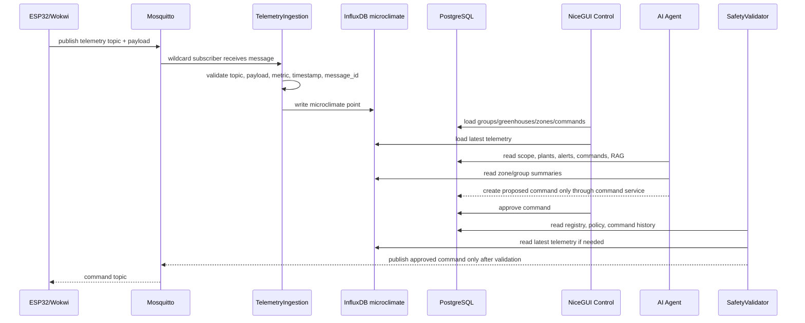

# 07. Схема даних і модель зберігання Smart Greenhouse AI

Цей документ пояснює, які дані зберігає система Smart Greenhouse AI, чому вони розділені між PostgreSQL/pgvector та InfluxDB, як пов'язані таблиці, як виглядає життєвий цикл команд і алертів, і які дані використовують UI, AI tools, RAG та safety layer.

## 1. Загальна ідея data architecture

Система має два основні типи даних:

1. **Структурні та семантичні дані** — хто існує в системі, які є групи теплиць, теплиці, зони, сенсори, актуатори, рослини, команди, алерти, AI-розмови, RAG-документи. Вони зберігаються в **PostgreSQL**.
2. **Часові ряди телеметрії** — значення температури, вологості, CO2, світла, вологості ґрунту й станів актуаторів у часі. Вони зберігаються в **InfluxDB**.

```text
PostgreSQL + pgvector
  -> groups, greenhouses, zones
  -> devices, sensors, actuators
  -> plant profiles, plant batches, setpoints, policies
  -> command logs, alerts
  -> AI conversations, messages, tool calls
  -> RAG documents, chunks, embeddings

InfluxDB
  -> microclimate time-series points
  -> latest telemetry
  -> historical ranges and summaries
  -> anomaly checks and greenhouse comparisons
```

Причина розділення проста: PostgreSQL добре підходить для зв'язків, транзакцій, FK, JSONB і векторного пошуку через pgvector; InfluxDB краще підходить для частих time-series записів і діапазонних запитів по часу.

## 2. Головна ієрархія домену

Базова структура системи:

```text
GreenhouseGroup
  -> Greenhouse
    -> GreenhouseZone
      -> Sensor
      -> Actuator
      -> PlantBatch
      -> ControlSetpoint
      -> CommandLog
      -> Alert
      -> AIConversation scope
```

Один `GreenhouseGroup` може містити багато `Greenhouse`. Одна `Greenhouse` має багато `GreenhouseZone`. Зона є головною одиницею керування: саме до зони прив'язуються сенсори, актуатори, рослини, telemetry scope, команди й алерти.

## 3. PostgreSQL: структурні таблиці

### `greenhouse_groups`

Група теплиць — верхній рівень операційної області.

Типові поля:

- `id` — UUID primary key.
- `name` — назва групи.
- `location` — місце або опис локації.
- `description` — вільний опис.
- `created_at` — час створення.

Пов'язана з:

- `greenhouses`;
- `group_control_policies`;
- `command_log`;
- `alert_log`;
- `ai_conversations`;
- `rag_documents`.

### `greenhouses`

Окрема теплиця всередині групи.

Типові поля:

- `id` — UUID primary key.
- `group_id` — FK на `greenhouse_groups`.
- `name` — назва теплиці.
- `location` — фізична або логічна локація.
- `description` — опис.

Пов'язана з:

- `greenhouse_zones`;
- `edge_nodes`;
- `command_log`;
- `alert_log`;
- `ai_conversations`.

### `greenhouse_zones`

Зона вирощування всередині теплиці. Це ключовий operational scope для телеметрії, AI-аналізу й команд.

Типові поля:

- `id` — UUID primary key.
- `greenhouse_id` — FK на `greenhouses`.
- `name` — назва зони, наприклад `Томати`, `Салат`, `Розсада`.
- `description` — опис.
- `source_type` — джерело даних: `real` або `simulator`.
- `simulator_managed` — чи зона керується внутрішнім симулятором.

Пов'язана з:

- `sensor_registry`;
- `actuator_registry`;
- `plant_batches`;
- `control_setpoints`;
- `command_log`;
- `alert_log`;
- `ai_conversations`.

## 4. PostgreSQL: пристрої, сенсори й актуатори

### `edge_nodes`

Edge-node — фізичний або симуляторний контролер, наприклад ESP32, Wokwi node, gateway або internal simulator.

Типові поля:

- `id` — UUID primary key.
- `greenhouse_id` — FK на теплицю.
- `node_key` — унікальний ключ node, наприклад `esp32-gh001-zone01`.
- `name` — людська назва.
- `node_type` — тип: `esp32`, `simulator`, `gateway`.
- `firmware_version` — версія firmware.
- `mqtt_username` — MQTT identity для node.
- `mqtt_token` — токен/секрет для MQTT доступу.
- `last_seen_at` — останній heartbeat або telemetry contact.

Edge-node може мати багато сенсорів і актуаторів. Один ESP32 може керувати однією зоною або кількома зонами, якщо firmware має mapping `zone_id + actuator -> GPIO`.

### `sensor_registry`

Реєстр логічних сенсорів у зоні.

Типові поля:

- `id` — UUID primary key.
- `zone_id` — FK на зону.
- `edge_node_id` — FK на edge-node, nullable.
- `sensor_key` — стабільний ключ сенсора в межах зони.
- `metric` — метрика, наприклад `temperature`, `soil_moisture`, `co2`.
- `unit` — одиниця виміру.
- `is_active` — чи сенсор активний.

Унікальність:

```text
(zone_id, sensor_key)
```

Це не time-series таблиця. Вона описує, які сенсори існують. Самі readings пишуться в InfluxDB.

### `actuator_registry`

Реєстр логічних актуаторів у зоні.

Типові поля:

- `id` — UUID primary key.
- `zone_id` — FK на зону.
- `edge_node_id` — FK на edge-node, nullable.
- `actuator_key` — стабільний ключ актуатора в межах зони.
- `actuator_type` — тип: `pump`, `fan`, `heater`, `lamp`.
- `is_active` — чи актуатор активний.

Унікальність:

```text
(zone_id, actuator_key)
```

Актуатор може бути пов'язаний із командами в `command_log` через `actuator_id`, але команда також дублює `actuator_name`, щоб зберегти історичний audit навіть якщо registry зміниться.

## 5. PostgreSQL: рослини, профілі, setpoints і політики

### `plant_profiles`

Профіль культури й стадії росту. Це довідник рекомендованих меж.

Типові поля:

- `id` — UUID primary key.
- `crop_name` — культура: tomato, cucumber, lettuce тощо.
- `growth_stage` — стадія росту.
- `temp_min`, `temp_opt`, `temp_max`.
- `humidity_min`, `humidity_opt`, `humidity_max`.
- `soil_moisture_min`, `soil_moisture_opt`, `soil_moisture_max`.
- `co2_min`, `co2_opt`, `co2_max`.
- `light_min`, `light_opt`, `light_max`.
- `description` — пояснення профілю.

Ці значення є editable starter values, а не абсолютні агрономічні істини. AI і control engine мають використовувати їх як контекст, а не як автономний дозвіл на фізичну дію.

### `plant_batches`

Партія рослин у конкретній зоні.

Типові поля:

- `id` — UUID primary key.
- `zone_id` — FK на зону.
- `profile_id` — FK на `plant_profiles`, nullable/optional за сценарієм.
- `name` — назва партії.
- `species` — вид.
- `cultivar` — сорт.
- `planted_at` — дата посадки.
- `growth_stage` — поточна стадія.
- `notes` — нотатки оператора.

Через `plant_batches` AI може відповідати не просто "у зоні сухо", а "у зоні томатів на flowering stage soil moisture нижча за рекомендований діапазон".

### `control_setpoints`

Налаштування цільових значень для зони.

Типові поля:

- `id` — UUID primary key.
- `zone_id` — FK на зону, зазвичай один setpoint на одну зону.
- `temperature_target`.
- `humidity_target`.
- `soil_moisture_target`.
- `co2_target`.
- `light_target`.
- `updated_by`.
- `updated_at`.

Setpoints описують бажані операційні цілі. Вони доповнюють plant profile: профіль дає агрономічний діапазон, setpoint дає локальну операційну ціль.

### `group_control_policies`

Group-level JSONB політика безпеки й поведінки control engine.

Типові поля:

- `id` — UUID primary key.
- `group_id` — FK на групу.
- `name` — назва політики.
- `policy` — JSONB документ.
- `is_active` — чи політика активна.
- `updated_at`.

Приклад policy:

```json
{
  "version": 1,
  "watering": {
    "enabled": true,
    "max_duration_seconds": 60,
    "cooldown_seconds": 300
  },
  "heating": {
    "enabled": true,
    "max_power": 80,
    "forbidden_if_temperature_above": 28
  },
  "approval": {
    "require_manual_confirmation": true,
    "allow_ai_propose": true,
    "allow_control_engine_auto_propose": true
  }
}
```

Політика не замінює hard-coded safety limits. Вона є додатковим group-level контекстом.

## 6. PostgreSQL: команди й фізичні дії

### `command_log`

`command_log` — audit trail усіх proposed, validated, approved і executed команд. Це центральна таблиця safety workflow.

Типові поля:

- `id` — UUID primary key.
- `group_id` — FK на групу.
- `greenhouse_id` — FK на теплицю.
- `zone_id` — FK на зону.
- `actuator_id` — FK на `actuator_registry`, nullable.
- `actuator_name` — назва актуатора: `pump`, `fan`, `heater`, `lamp`.
- `action` — дія: `on`, `off`, `set_power`.
- `value` — числове значення, наприклад power percent.
- `unit` — одиниця значення.
- `duration_seconds` — тривалість дії.
- `source` — джерело: `manual`, `control_engine`, `ai_agent`, `safety_override`.
- `reason` — пояснення, чому команда створена.
- `mode` — `mqtt` або `simulator`.
- `validation_errors` — JSONB список/об'єкт помилок валідації.
- `status` — state machine status.
- `valid_until` — коли proposal expires.
- `created_at`, `updated_at`.

Життєвий цикл:

```text
proposed -> validated -> approved -> executing -> executed
                         └-> cancelled / rejected / expired / failed
```

Важлива межа: `executed` у поточній v1 логіці означає, що backend успішно опублікував MQTT command або simulator застосував state. Для реального ESP32 це ще не повна гарантія фізичного виконання, доки не буде `state/ack` flow.

### Safety validation для команд

Команда має пройти перевірки:

- існує `group_id`, `greenhouse_id`, `zone_id`;
- актуатор існує або підтримується логічною моделлю;
- action дозволений для actuator type;
- `duration_seconds` не перевищує safety max;
- `value` не перевищує max power;
- pump cooldown не порушений;
- heater не запускається при температурі вище hard limit;
- command mode відповідає поточному control mode;
- оператор явно підтвердив фізичну дію.

Типові actuator limits:

| Актуатор | Дії | Max duration | Max power | Додатково |
|---|---|---:|---:|---|
| `pump` | `on`, `off` | 60s | — | cooldown 300s |
| `fan` | `on`, `off`, `set_power` | 600s | 100 | вентиляція |
| `heater` | `on`, `off`, `set_power` | 300s | 80 | forbidden if temp > 28°C |
| `lamp` | `on`, `off` | 3600s | — | враховувати quiet hours/policy |

## 7. PostgreSQL: алерти

### `alert_log`

Таблиця активних і завершених алертів.

Типові поля:

- `id` — UUID primary key.
- `group_id` — FK на групу.
- `greenhouse_id` — FK на теплицю, nullable.
- `zone_id` — FK на зону, nullable.
- `metric` — метрика, яка спричинила алерт.
- `severity` — `info`, `warning`, `critical`.
- `title` — короткий заголовок.
- `message` — детальний опис.
- `status` — `active`, `resolved`, `dismissed`.
- `source` — `threshold`, `control_engine`, `ai_agent`, `system`.
- `resolved_at` — час завершення.
- `created_at`.

Поточний lifecycle:

```text
active -> resolved
active -> dismissed
```

Рекомендоване майбутнє розширення:

```text
active -> acknowledged -> resolved
active -> dismissed
active -> escalated -> resolved
```

Алерти використовуються dashboard, AI tools і control operator panel як контекст ризику.

## 8. PostgreSQL: AI conversations і tool calls

### `ai_conversations`

AI-розмова з optional scope.

Типові поля:

- `id` — UUID primary key.
- `group_id` — nullable FK.
- `greenhouse_id` — nullable FK.
- `zone_id` — nullable FK.
- `user_id` — nullable UUID.
- `title` — назва розмови.
- `created_at`.

Scope визначає, про що AI має право говорити:

```text
group scope: group_id set, greenhouse_id null, zone_id null
greenhouse scope: group_id + greenhouse_id set, zone_id null
zone scope: group_id + greenhouse_id + zone_id set
```

### `ai_messages`

Повідомлення в AI-розмові.

Типові поля:

- `id` — UUID primary key.
- `conversation_id` — FK на `ai_conversations`.
- `role` — `user`, `assistant`, system-like role за потреби.
- `content` — текст повідомлення.
- `model` — модель, яка відповідала.
- `token_input` — input tokens.
- `token_output` — output tokens.
- `created_at`.

### `ai_tool_calls`

Журнал tool calling для explainability.

Типові поля:

- `id` — UUID primary key.
- `conversation_id` — FK на `ai_conversations`.
- `tool_name` — назва tool.
- `arguments` — JSONB аргументи.
- `result` — JSONB результат.
- `status` — success/error/etc.
- `error` — текст помилки.
- `created_at`.

Ця таблиця важлива для debugging: якщо AI дав неправильну відповідь, треба дивитися, які tools він викликав, із якими аргументами й що отримав.

## 9. PostgreSQL + pgvector: RAG

### `rag_documents`

Документ знань для AI/RAG.

Типові поля:

- `id` — UUID primary key.
- `group_id` — nullable FK; `NULL` означає global document.
- `title` — назва документа.
- `source_type` — тип джерела.
- `source_url` — URL або reference.
- `content` — повний текст.
- `metadata` — JSONB metadata.
- `created_at`.

### `rag_chunks`

Фрагменти документів із embeddings.

Типові поля:

- `id` — UUID primary key.
- `document_id` — FK на `rag_documents`.
- `chunk_index` — порядок фрагмента.
- `content` — текст chunk.
- `embedding` — pgvector vector, за замовчуванням dimension 1536.
- `embedding_model` — модель embedding.
- `metadata` — JSONB metadata.
- `created_at`.

RAG flow:

```text
/rag document upload
  -> store rag_documents
  -> split into chunks
  -> create embeddings
  -> store rag_chunks.embedding
  -> AI tool search_plant_knowledge(query, group_id)
  -> pgvector similarity search
  -> return cited chunks to AI
```

Group scoping важливий: локальні правила господарства або специфічні plant notes можуть бути доступні тільки в межах конкретної групи.

## 10. PostgreSQL: settings, model catalog і logs

### `model_settings`

Singleton-таблиця з поточними налаштуваннями AI/model/control mode.

Типові поля:

- `id` — UUID primary key.
- `selected_chat_model` — активна chat model.
- `embedding_model` — активна embedding model.
- `embedding_dimension` — dimension embeddings.
- `last_refresh_at` — останнє оновлення каталогу моделей.
- `last_refresh_error` — помилка refresh.
- `last_refresh_status` — `success` або `failed`.
- `selected_model_available` — чи доступна обрана модель.
- `control_mode` — `mqtt` або `simulator`.

`control_mode` — project-wide gate для actuator commands: система має знати, чи виконувати approved command через MQTT, чи через internal simulator.

### `openrouter_model_catalog`

Кеш OpenRouter model catalog для UI settings.

Типові поля:

- `id` — UUID primary key.
- `model_id` — унікальний id моделі.
- `name` — display name.
- `provider` — provider.
- `capability_flags` — JSONB capability flags.
- `prompt_price`, `completion_price` — ціни за million tokens.
- `context_length`.
- `max_completion_tokens`.
- `raw_metadata` — JSONB оригінальна metadata.

### `debug_log`

Діагностичний журнал без FK до доменних таблиць.

Типові поля:

- `id` — UUID primary key.
- `level` — `debug`, `info`, `warning`, `error`.
- `event_type` — тип події.
- `component` — компонент: `api`, `ai_agent`, `mqtt`, etc.
- `message` — текст.
- `path`, `method`, `status_code`, `duration_ms` — HTTP context.
- `request_id` — correlation id.
- `error_type`, `stack_trace`.
- `metadata` — JSONB додатковий контекст.
- `created_at`.

Для AI debugging важливі записи:

```text
level = "error"
component = "ai_agent"
event_type = "ai_chat_failed"
```

Після цього треба корелювати `debug_log` з `ai_tool_calls` і `ai_messages`.

## 11. InfluxDB: telemetry measurement

InfluxDB зберігає measurement:

```text
measurement: microclimate
```

Tags:

```text
group_id
greenhouse_id
zone_id
sensor_id
metric
```

Fields:

```text
value: float
quality: string, наприклад ok / warn / error
```

Timestamp:

```text
UTC timestamp from telemetry reading
```

Приклад conceptual point:

```text
microclimate,
  group_id=group-demo-001,
  greenhouse_id=gh-001,
  zone_id=zone-01,
  sensor_id=dht22-01,
  metric=temperature
value=24.5,quality="ok" 2026-05-21T12:00:00Z
```

Valid metrics:

| Категорія | Метрики |
|---|---|
| Environment | `temperature`, `air_humidity`, `soil_moisture`, `co2`, `light` |
| Actuator state | `pump_state`, `fan_power`, `heater_power`, `lamp_state` |

Actuator state metrics також зберігаються як telemetry, щоб dashboard/AI бачили не тільки середовище, а й останній відомий стан обладнання.

## 12. Telemetry ingestion contract

MQTT topic:

```text
greenhouse-groups/{group_id}/greenhouses/{greenhouse_id}/zones/{zone_id}/telemetry
```

Payload shape:

```json
{
  "message_id": "wokwi-zone-01-temperature-0001",
  "qos": 0,
  "reading": {
    "group_id": "group-demo-001",
    "greenhouse_id": "gh-001",
    "zone_id": "zone-01",
    "sensor_id": "dht22-01",
    "metric": "temperature",
    "value": 24.5,
    "quality": "ok",
    "timestamp": "2026-05-21T12:00:00Z"
  }
}
```

Ingestion validation:

1. Parse MQTT topic scope.
2. Decode JSON payload.
3. Validate Pydantic envelope.
4. Check metric is known.
5. Reject NaN/Inf values.
6. Reject stale/future timestamps outside accepted window.
7. Compare topic `group_id/greenhouse_id/zone_id` against payload scope.
8. Deduplicate by `message_id`.
9. Write point to InfluxDB.

Це означає, що device не може випадково publish topic однієї зони, а payload іншої зони: backend має відкинути mismatch.

## 13. Query patterns for UI and AI

### Dashboard

Dashboard читає:

- groups з PostgreSQL;
- latest telemetry з InfluxDB;
- active alerts з PostgreSQL;
- historical ranges з InfluxDB для charts.

### Control page

Control page читає:

- group/greenhouse/zone structure з PostgreSQL;
- latest telemetry з InfluxDB;
- plant context з PostgreSQL;
- recent commands з PostgreSQL;
- control mode з `model_settings`.

### AI tools

AI tools читають:

- scope metadata з PostgreSQL;
- latest/range telemetry з InfluxDB;
- active alerts і commands з PostgreSQL;
- plant profile/batch/context з PostgreSQL;
- RAG chunks через pgvector.

AI tools мають бути read-only, окрім створення proposed action через контрольований command proposal path.

### Safety layer

Safety layer читає:

- registry актуаторів;
- hard-coded actuator limits;
- command history для cooldown;
- latest telemetry для risky checks;
- group policy;
- zone/setpoint context.

## 14. Mermaid: data storage split



## 15. Mermaid: core relational model



## 16. Mermaid: command and telemetry together



## 17. Practical LLM context summary

Якщо LLM має пояснити схему даних коротко, core message такий:

```text
Smart Greenhouse AI зберігає identity, topology, policies, commands, alerts, AI history і RAG у PostgreSQL + pgvector. Часті sensor readings і actuator state readings зберігаються в InfluxDB measurement microclimate. Усі telemetry points scoped by group_id, greenhouse_id, zone_id. Усі physical commands scoped так само й проходять command_log state machine, safety validation і manual approval. AI читає PostgreSQL, InfluxDB і RAG, але не публікує MQTT напряму; він може тільки створити proposed action.
```
