# ALL-IN-ONE: Smart Greenhouse AI — український пакет для LLM

Цей файл автоматично зведений із документів директорії `docs/llm-upload-uk/`. Його можна завантажувати в LLM як один контекст для генерації схем, презентацій, описів архітектури або технічної документації.


---

# Source: README.md

# Пакет документації для LLM: Smart Greenhouse AI

Ця директорія містить стислий, але повний україномовний пакет для завантаження в LLM або генератор схем/зображень. Він описує актуальну архітектуру системи, ключові потоки, UML/Mermaid-діаграми, ESP32/Wokwi інтеграцію, групи теплиць, зони, сенсори, виконавчі механізми, AI/RAG і контури безпеки.

## Файли

- [01-system-overview-uk.md](01-system-overview-uk.md) — предметна область, архітектурні принципи, компоненти, потоки даних.
- [02-diagrams-uk.md](02-diagrams-uk.md) — Mermaid/UML-діаграми компонентів, варіантів використання, послідовностей, станів і розгортання.
- [03-operational-flows-uk.md](03-operational-flows-uk.md) — основні сценарії: внутрішній симулятор, Wokwi/ESP32, AI-аналіз, підтвердження команд, RAG.
- [04-examples-and-payloads-uk.md](04-examples-and-payloads-uk.md) — приклади топологій, MQTT topics, telemetry/command payloads, політик і правил.
- [05-llm-image-prompts-uk.md](05-llm-image-prompts-uk.md) — готові промпти українською для генерації архітектурних зображень.
- [06-physical-esp32-wiring-uk.md](06-physical-esp32-wiring-uk.md) — фізична інтеграція кількох ESP32, зон, реле, насосів, ламп, вентиляторів, нагрівачів і силового живлення.
- [07-schema-and-data-uk.md](07-schema-and-data-uk.md) — детальна схема даних: PostgreSQL/pgvector, InfluxDB telemetry, команди, алерти, AI history і RAG.
- [ALL-IN-ONE-uk.md](ALL-IN-ONE-uk.md) — один зведений файл для завантаження в LLM.

## Як використовувати

1. Для текстового аналізу LLM завантажити `ALL-IN-ONE-uk.md`.
2. Для генерації окремих схем брати відповідний Mermaid-блок з `02-diagrams-uk.md` або промпт з `05-llm-image-prompts-uk.md`.
3. Для технічної перевірки ESP32/Wokwi брати `03-operational-flows-uk.md` і `04-examples-and-payloads-uk.md`.

## Межі системи

- AI ніколи не керує MQTT або актуаторами напряму.
- Будь-яка фізична дія проходить шлях: **AI/оператор → пропозиція → FastAPI safety validation → підтвердження користувача → MQTT команда**.
- Головна ієрархія: **група теплиць → теплиця → зона → сенсори/актуатори/рослини**.
- Телеметрія зберігається в InfluxDB, структурні дані й RAG — у PostgreSQL + pgvector.


---

# Source: 01-system-overview-uk.md

# 01. Огляд системи Smart Greenhouse AI

## Призначення

Smart Greenhouse AI — система керування групою малих теплиць із підтримкою IoT, MQTT, телеметрії, візуального операційного інтерфейсу, AI-аналізу, RAG-знань і безпечного workflow для фізичних команд.

Система не моделює одну ізольовану теплицю. Базова одиниця масштабу — **група теплиць**, у якій є кілька теплиць, а кожна теплиця має кілька зон вирощування.

```text
Група теплиць
  ├── Теплиця 1
  │     ├── Зона 1: томати, сенсори, насос, вентилятор, лампа
  │     └── Зона 2: салат, інший мікроклімат
  └── Теплиця 2
        ├── Зона 1: огірки
        └── Зона 2: перець
```

## Основні архітектурні принципи

1. **AI не виконує фізичні команди напряму.** LLM може аналізувати дані та створювати пропозиції, але не має прямого доступу до MQTT або актуаторів.
2. **Кожна дія має область дії.** Команда завжди містить `group_id`, `greenhouse_id`, `zone_id` і цільовий актуатор.
3. **Безпека перед виконанням.** FastAPI повторно перевіряє стан зони, політики групи, cooldown-и й межі актуаторів перед публікацією MQTT-команди.
4. **Телеметрія і доменна модель розділені.** InfluxDB зберігає часові ряди; PostgreSQL зберігає групи, теплиці, зони, пристрої, рослини, команди, алерти, AI-історію й RAG.
5. **Реальні пристрої й симулятори мають однакову модель topics.** Внутрішній симулятор і ESP32/Wokwi працюють через ту саму scoped-ієрархію MQTT.

## Компоненти системи

| Компонент | Роль |
|---|---|
| NiceGUI UI | Панелі dashboard, zones, control, simulator, AI chat, RAG, logs, settings |
| FastAPI backend | REST API, валідація, safety layer, AI endpoint, MQTT runtime |
| Mosquitto MQTT | Брокер між ESP32/симулятором і backend |
| InfluxDB | Телеметрія мікроклімату: температура, вологість, CO2, світло, стан актуаторів |
| PostgreSQL + pgvector | Структурні дані, команди, алерти, AI conversations, RAG chunks/embeddings |
| Pydantic AI + OpenRouter | AI-агент із tool calling і structured response |
| Wokwi ESP32 MicroPython | Віртуальний edge-node з DHT22, потенціометрами й LED-актуаторами |
| Internal simulator | Python MQTT publisher для демонстраційних сценаріїв |
| Control engine | Rule-based observer/proposer, що створює пропозиції, а не публікує команди напряму |
| Worker | Фонові задачі: reindex/RAG/майбутні summary jobs |

## Доменна модель

```text
GreenhouseGroup 1 ── 1..* Greenhouse
Greenhouse 1 ── 1..* GreenhouseZone
Greenhouse 1 ── 0..* EdgeNode
GreenhouseZone 1 ── 0..* Sensor
GreenhouseZone 1 ── 0..* Actuator
GreenhouseZone 1 ── 0..* PlantBatch
PlantProfile 1 ── 0..* PlantBatch
GreenhouseZone 1 ── 0..* ControlSetpoint
GreenhouseZone 1 ── 0..* Alert
GreenhouseZone 1 ── 0..* CommandLog
GreenhouseGroup 1 ── 0..* GroupControlPolicy
GreenhouseGroup 1 ── 0..* RAGDocument
RAGDocument 1 ── 0..* RAGChunk
AIConversation 1 ── 0..* AIMessage
AIMessage 1 ── 0..* AIToolCall
```

## Рівні аналізу AI

AI-агент працює на трьох рівнях:

1. **Zone scope** — одна зона, її рослини, сенсори, актуатори, setpoints, алерти й recent commands.
2. **Greenhouse scope** — агрегований стан усіх зон однієї теплиці.
3. **Group scope** — порівняння теплиць і пріоритизація проблем у всій групі.

Приклад питань:

- `Що відбувається із зоною томатів у теплиці gh-001?`
- `Порівняй теплиці в group-001 і скажи, де найбільший ризик.`
- `Чи треба поливати zone-01? Якщо так — запропонуй безпечну дію.`

## Основний шлях даних

```text
ESP32/Wokwi або internal simulator
  -> MQTT telemetry topic
  -> Mosquitto
  -> FastAPI MQTTRuntime
  -> TelemetryIngestion validation
  -> InfluxDB microclimate measurement
  -> UI dashboard/control/AI tools
  -> AI аналізує дані й RAG
  -> AI створює proposed action
  -> користувач підтверджує
  -> FastAPI safety validation
  -> MQTT command topic
  -> ESP32/Wokwi або simulator застосовує стан актуатора
```

## MQTT topic model

```text
greenhouse-groups/{group_id}/greenhouses/{greenhouse_id}/zones/{zone_id}/{channel}
```

Канали:

- `telemetry` — сенсори й стан актуаторів від device до app.
- `commands` — підтверджені команди від app до device.
- `state` — майбутній канал для device acknowledgements/state sync.
- `alerts` — резерв для scoped-alert повідомлень.

## Контур безпеки фізичних дій

Будь-яка команда проходить state machine:

```text
proposed -> validated -> approved -> executing -> executed
                         └-> rejected / cancelled / expired / failed
```

Перевірки:

- чи існує group/greenhouse/zone/actuator;
- чи актуатор підтримує requested action;
- чи не перевищено максимальну тривалість або потужність;
- чи не активний cooldown;
- чи команда не конфліктує з поточним станом;
- чи не порушує group policy або zone setpoint;
- чи користувач явно підтвердив дію.

## ESP32/Wokwi модель зони

Одна Wokwi-зона імітує edge-node ESP32:

| Пристрій | Pin | Метрика / дія |
|---|---:|---|
| DHT22 | D15 | `temperature`, `air_humidity` |
| Soil potentiometer | D34 | `soil_moisture` |
| Light potentiometer | D35 | `light` |
| CO2 potentiometer | D32 | `co2` |
| Pump LED | D25 | `pump_state` / pump command |
| Fan LED | D26 | `fan_power` / fan command |
| Heater LED | D27 | `heater_power` / heater command |
| Lamp LED | D14 | `lamp_state` / lamp command |

## Що система має покривати далі

Під час review виявлені області, які варто документувати й розвивати:

- формальна схема `GroupControlPolicy.policy` JSON;
- поливна стратегія: thresholds, duty cycles, cooldowns, plant profile integration;
- світлова стратегія: денний цикл, DLI, minimum/maximum lamp duration;
- device acknowledgement flow: `command published` не дорівнює `actuator executed`;
- alert lifecycle: active/resolved/dismissed/escalated;
- інтеграція control engine як фонового observer job або telemetry-triggered evaluator;
- окремий rendered pinout/circuit для Wokwi ESP32.


---

# Source: 02-diagrams-uk.md

# 02. UML/Mermaid діаграми українською

Цей файл містить діаграми у Mermaid syntax. Їх можна вставляти в Mermaid Live Editor, GitHub Markdown або передавати LLM/генератору зображень як структурний опис.

## 1. Компонентна діаграма системи

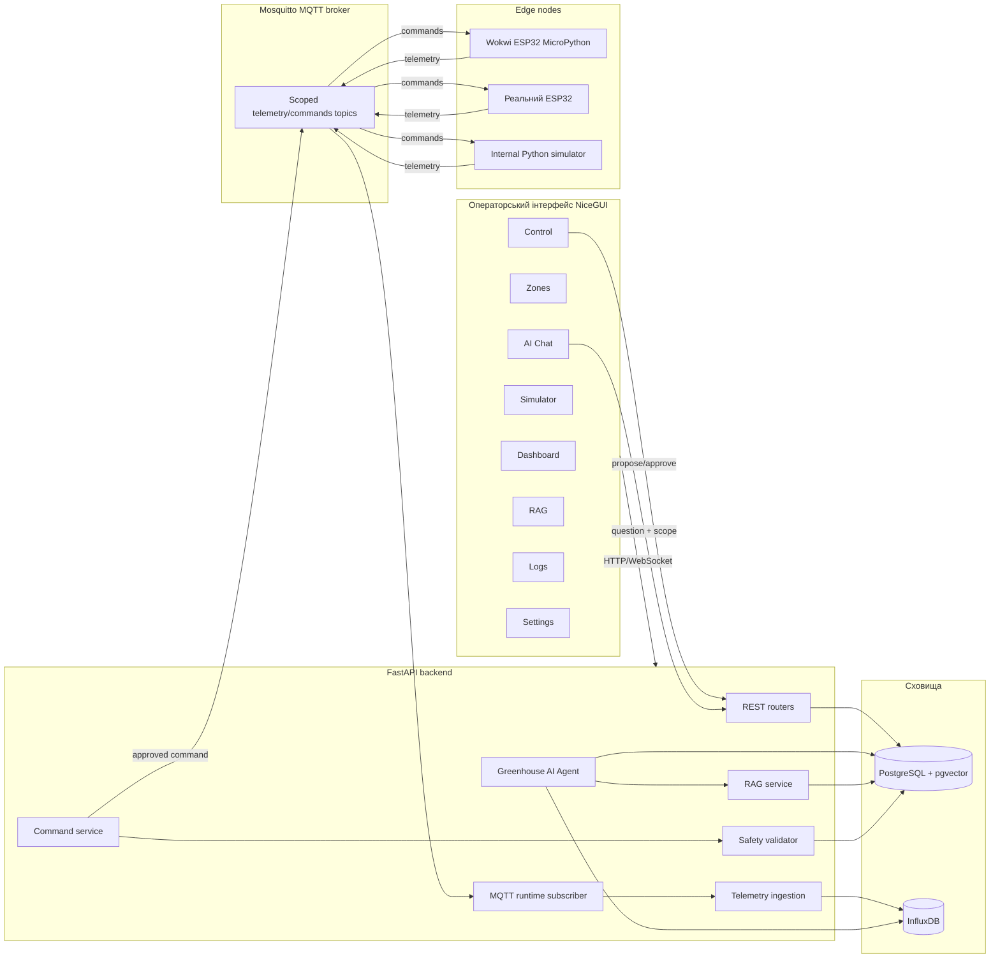

## 2. Доменна модель / class diagram

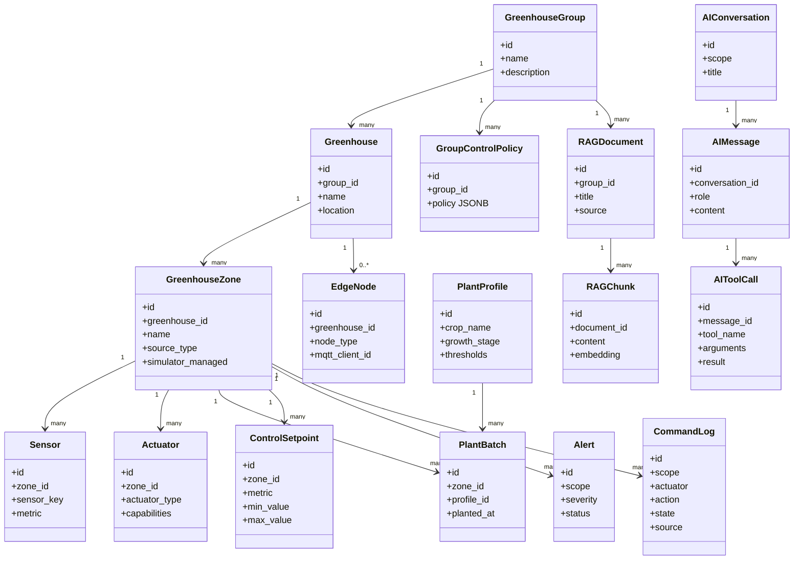

## 3. Use case diagram

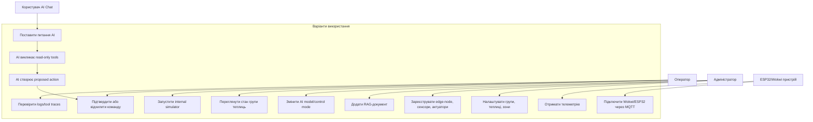

## 4. Sequence: телеметрія від ESP32 до dashboard/AI

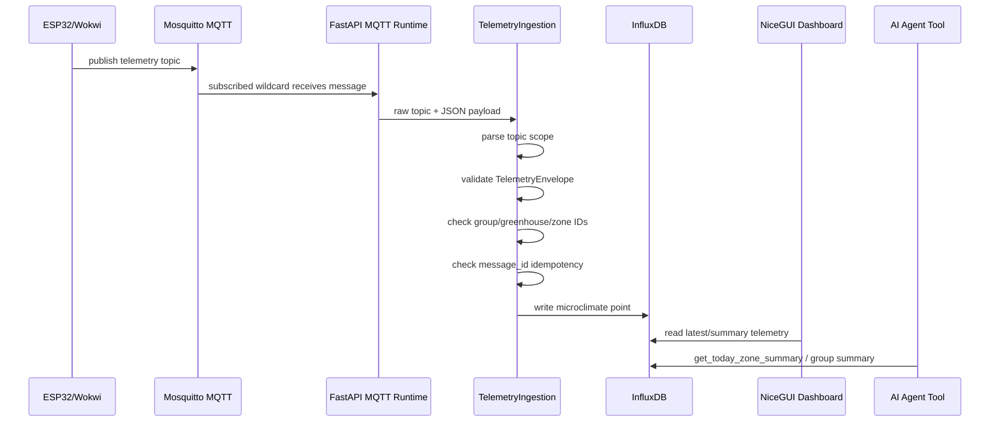

## 5. Sequence: AI пропонує полив, оператор підтверджує

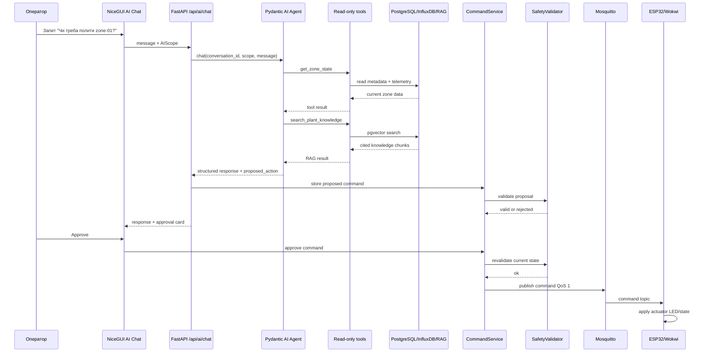

## 6. State diagram: життєвий цикл команди

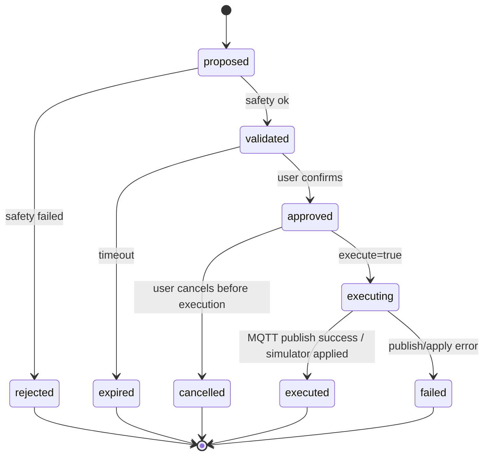

## 7. Activity: internal simulator demo

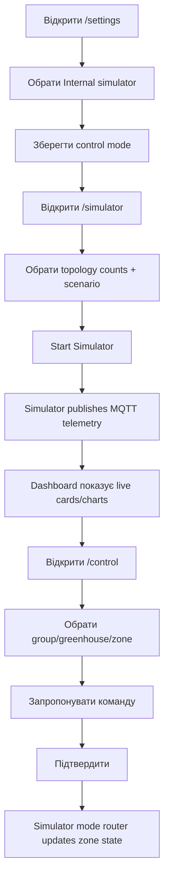

## 8. Activity: Wokwi/ESP32 MQTT flow

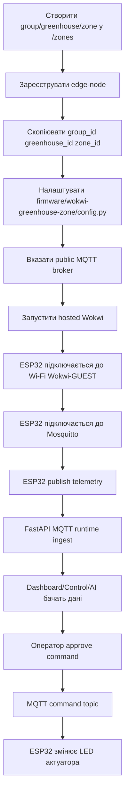

## 9. Deployment diagram

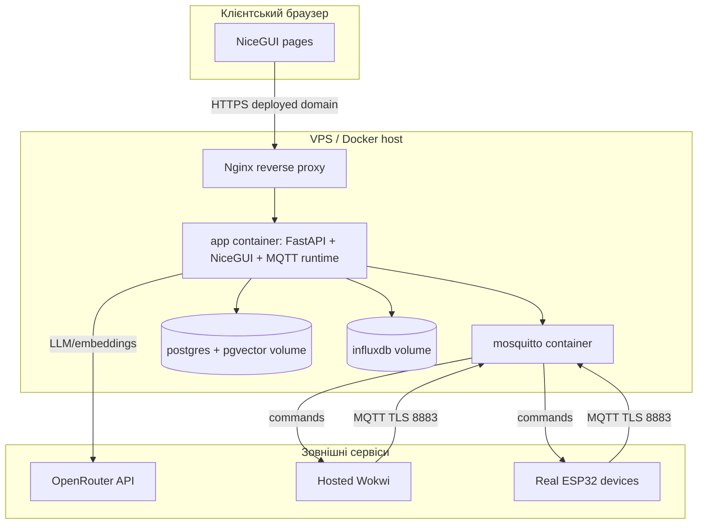

## 10. Suggested target architecture extension: command acknowledgement

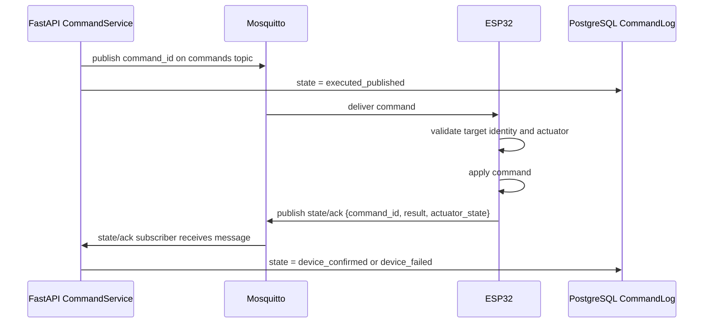


---

# Source: 03-operational-flows-uk.md

# 03. Операційні потоки системи

## Flow 1: створення структури група → теплиця → зона

```text
Оператор відкриває /zones
  -> створює або обирає GreenhouseGroup
  -> створює Greenhouse у групі
  -> створює GreenhouseZone у теплиці
  -> задає source_type: simulator або real/mqtt
  -> додає EdgeNode для теплиці
  -> додає Sensor registry для zone metrics
  -> додає Actuator registry: pump/fan/heater/lamp
  -> прив'язує PlantBatch до PlantProfile
  -> задає ControlSetpoint-и для температури, вологості ґрунту, CO2, світла
```

Навіщо це потрібно:

- MQTT topic і payload мають збігатися з реальною структурою.
- AI tools можуть коректно відповідати тільки коли знають scope.
- Safety layer може перевірити команду тільки коли знає actuator capabilities і setpoints.

## Flow 2: internal simulator demo

```text
/settings
  -> Control Mode = Internal simulator
  -> Save
/simulator
  -> scenario: normal / dry_soil / overheating / low_light
  -> topology: groups, greenhouses, zones
  -> Start Simulator
Simulator process
  -> publish telemetry every interval
FastAPI MQTTRuntime
  -> ingest telemetry
InfluxDB
  -> store microclimate points
/dashboard
  -> show group/greenhouse/zone summaries
/control
  -> propose command
  -> approve command
Simulator mode router
  -> applies state change without real MQTT device
```

Коли використовувати:

- демонстрація без ESP32;
- тестування UI й AI flows;
- перевірка group/greenhouse/zone масштабування;
- швидке створення даних для AI Chat.

## Flow 3: Wokwi / ESP32 MQTT інтеграція

```text
1. Підняти public Mosquitto broker на VPS.
2. У app .env вказати MQTT_HOST, MQTT_PORT, MQTT_USERNAME, MQTT_PASSWORD.
3. У firmware/wokwi-greenhouse-zone/config.py вказати:
   - MQTT_HOST / MQTT_PORT
   - MQTT_USER / MQTT_PASSWORD
   - GROUP_ID / GREENHOUSE_ID / ZONE_ID
4. У Wokwi відкрити MicroPython project.
5. Запустити simulation.
6. Переконатися, що serial monitor показує Wi-Fi connected і MQTT connected.
7. У /settings обрати MQTT remote devices.
8. У /simulator перевірити MQTT status panel.
9. У /dashboard побачити telemetry.
10. У /control або /ai-chat створити й підтвердити команду.
11. ESP32 отримує command topic і перемикає LED актуатора.
```

Важлива умова: hosted Wokwi не бачить Docker `localhost`, тому broker має бути публічно доступним.

## Flow 4: телеметрія

```text
Device creates TelemetryEnvelope
  -> topic: greenhouse-groups/{group}/greenhouses/{greenhouse}/zones/{zone}/telemetry
  -> payload contains same group_id/greenhouse_id/zone_id
Mosquitto receives publish
FastAPI wildcard subscriber receives message
TelemetryIngestion:
  -> parse topic
  -> decode JSON
  -> validate Pydantic schema
  -> reject stale timestamp
  -> reject NaN/Inf/out-of-contract metric
  -> compare topic scope vs payload scope
  -> check message_id idempotency
  -> write InfluxDB point
```

Метрики:

- `temperature`
- `air_humidity`
- `soil_moisture`
- `co2`
- `light`
- `pump_state`
- `fan_power`
- `heater_power`
- `lamp_state`

## Flow 5: операторська команда з Control page

```text
/control
  -> operator selects group/greenhouse/zone
  -> clicks zone on greenhouse map
  -> opens actuator controls
  -> chooses actuator/action/duration/value
  -> API creates CommandLog(state=proposed)
  -> SafetyValidator validates proposal
  -> UI shows approval workflow
  -> operator approves
  -> SafetyValidator revalidates current state
  -> if mode=simulator: simulator mode router applies command
  -> if mode=mqtt: CommandPublisher publishes MQTT command
```

Чому потрібна повторна валідація:

- telemetry могла змінитися між propose і approve;
- cooldown міг активуватися;
- інша команда могла вже змінити стан актуатора;
- group policy могла стати stricter.

## Flow 6: AI chat scoped analysis

```text
/ai-chat
  -> user selects conversation or creates new conversation
  -> user selects scope: group / greenhouse / zone
  -> user asks natural language question
FastAPI /api/ai/chat
  -> loads conversation history bounded window
  -> creates AIScope
  -> sends prompt to Pydantic AI Agent
Agent
  -> calls read-only tools
  -> may call RAG search
  -> returns structured response
UI
  -> renders summary, observations, recommendations
  -> renders tool-call trace
  -> renders proposed action cards if present
```

AI може:

- пояснити проблему;
- порівняти теплиці;
- знайти зони з ризиком;
- використати RAG knowledge;
- запропонувати полив/вентиляцію/освітлення/нагрів.

AI не може:

- напряму publish MQTT;
- приховувати tool calls;
- вигадувати telemetry;
- створювати фізичну дію без `group_id`, `greenhouse_id`, `zone_id`.

## Flow 7: RAG knowledge base

```text
/rag
  -> admin adds document: plant care, system constraints, local notes
API
  -> stores rag_document
Worker/API
  -> chunks document
  -> creates embeddings
  -> stores rag_chunks with pgvector embedding
AI Chat
  -> calls search_plant_knowledge(query, group_id)
  -> receives cited chunks
  -> combines RAG + telemetry + plant profile + alerts
```

Типи корисних RAG-документів:

- догляд за томатами/огірками/салатом/перцем;
- дефіцит води, перегрів, симптоми стресу;
- CO2 interpretation;
- локальні правила господарства;
- обмеження актуаторів і обладнання;
- нотатки оператора для конкретної групи.

## Flow 8: control engine observer/proposer

```text
Control engine one-shot або background job
  -> reads zones + setpoints + latest telemetry
  -> evaluate_zone_rules
  -> creates ControlProposal list
  -> CommandService.propose
  -> SafetyValidator validates
  -> UI shows proposals
  -> user approves/rejects
```

Поточна роль control engine — **observer/proposer**, не autonomous publisher. Це важливо для безпеки: навіть rule-based automation має проходити через той самий CommandLog і approval pipeline.

## Flow 9: alerts and logs

```text
Telemetry or rule evaluation
  -> threshold exceeded
  -> Alert created or updated
UI alert panel
  -> shows active alerts
AI tools
  -> get_active_alerts(scope)
Logs page
  -> debug_log entries
  -> ai_tool_calls correlation
```

Рекомендована майбутня модель alert lifecycle:

```text
active -> acknowledged -> resolved
active -> dismissed
active -> escalated -> resolved
```

## Flow 10: production verification

Production перевіряти через deployed domain/nginx, не тільки через localhost або internal Docker.

```text
Browser -> HTTPS deployed domain -> nginx -> app container
External Wokwi/ESP32 -> public MQTT TLS -> mosquitto -> app MQTT runtime
App -> PostgreSQL/InfluxDB/OpenRouter
```

Мінімальні production checks:

- deployed domain відкриває UI;
- admin auth працює;
- dashboard завантажується;
- AI chat повертає відповідь або зрозумілу помилку;
- MQTT status показує broker connection;
- Wokwi telemetry доходить до app;
- approved command доходить до Wokwi;
- logs не містять `ai_chat_failed` або ingestion errors після тесту.


---

# Source: 04-examples-and-payloads-uk.md

# 04. Приклади топологій, topics, payloads і політик

## Приклад 1: мала домашня група

```text
group-home-001
  greenhouse gh-balcony
    zone zone-tomatoes
      plant: tomato / flowering
      sensors: temperature, air_humidity, soil_moisture, light
      actuators: pump, fan, lamp
    zone zone-lettuce
      plant: lettuce / vegetative
      sensors: temperature, air_humidity, soil_moisture, light
      actuators: pump, lamp
```

Сценарій:

- зона томатів має нижчу межу вологості ґрунту 45%;
- зона салату потребує менш інтенсивного світла;
- AI на group scope має порівняти ризики й пріоритизувати томати, якщо soil_moisture < threshold.

## Приклад 2: навчальна Wokwi-група

```text
group-demo-001
  greenhouse gh-001
    zone zone-01
      edge-node: wokwi-esp32-zone-01
      DHT22: temperature + air_humidity
      potentiometer D34: soil_moisture
      potentiometer D35: light
      potentiometer D32: co2
      LEDs:
        D25 pump
        D26 fan
        D27 heater
        D14 lamp
```

Це canonical demo topology для Wokwi.

## Приклад 3: кілька теплиць і зон

```text
group-farm-001
  greenhouse gh-001
    zone zone-01 tomatoes
    zone zone-02 cucumbers
  greenhouse gh-002
    zone zone-01 peppers
    zone zone-02 lettuce
  greenhouse gh-003
    zone zone-01 seedlings
```

AI group-level питання:

```text
Порівняй усі теплиці в group-farm-001 і покажи, де треба втручання сьогодні.
```

Очікувана поведінка AI:

- викликати group overview;
- отримати today summaries;
- порівняти теплиці;
- перевірити active alerts;
- не вигадувати дані;
- запропонувати scoped actions тільки для конкретних зон.

## MQTT topics

### Telemetry

```text
greenhouse-groups/group-demo-001/greenhouses/gh-001/zones/zone-01/telemetry
```

### Commands

```text
greenhouse-groups/group-demo-001/greenhouses/gh-001/zones/zone-01/commands
```

### State / acknowledgements майбутнього розширення

```text
greenhouse-groups/group-demo-001/greenhouses/gh-001/zones/zone-01/state
```

## Telemetry payload: температура

```json
{
  "message_id": "wokwi-zone-01-temperature-0001",
  "qos": 0,
  "reading": {
    "group_id": "group-demo-001",
    "greenhouse_id": "gh-001",
    "zone_id": "zone-01",
    "sensor_id": "dht22-01",
    "metric": "temperature",
    "value": 24.5,
    "quality": "ok",
    "timestamp": "2026-05-21T12:00:00Z"
  }
}
```

## Telemetry payload: вологість ґрунту

```json
{
  "message_id": "wokwi-zone-01-soil-0001",
  "qos": 0,
  "reading": {
    "group_id": "group-demo-001",
    "greenhouse_id": "gh-001",
    "zone_id": "zone-01",
    "sensor_id": "soil-pot-01",
    "metric": "soil_moisture",
    "value": 34.0,
    "quality": "ok",
    "timestamp": "2026-05-21T12:00:05Z"
  }
}
```

## Command payload: насос увімкнути на 30 секунд

```json
{
  "command_id": "cmd-20260521-0001",
  "group_id": "group-demo-001",
  "greenhouse_id": "gh-001",
  "zone_id": "zone-01",
  "actuator": "pump",
  "action": "on",
  "value": null,
  "duration_seconds": 30,
  "source": "ai_agent",
  "reason": "Soil moisture is below the tomato profile minimum."
}
```

## Command payload: вентилятор 75%

```json
{
  "command_id": "cmd-20260521-0002",
  "group_id": "group-demo-001",
  "greenhouse_id": "gh-001",
  "zone_id": "zone-01",
  "actuator": "fan",
  "action": "set_power",
  "value": 75,
  "duration_seconds": 300,
  "source": "control_engine",
  "reason": "Temperature is above the zone setpoint maximum."
}
```

## Suggested GroupControlPolicy JSON

Це рекомендований формат для документації й майбутньої формалізації. Він описує group-level правила, які safety layer і control engine можуть враховувати перед виконанням команд.

```json
{
  "version": 1,
  "priority": 100,
  "applies_to": {
    "greenhouse_ids": ["*"],
    "zone_ids": ["*"]
  },
  "watering": {
    "enabled": true,
    "max_duration_seconds": 60,
    "cooldown_seconds": 300,
    "min_soil_moisture_before_block": 70,
    "forbid_if_recent_rain_detected": false
  },
  "ventilation": {
    "enabled": true,
    "max_power": 100,
    "max_duration_seconds": 600,
    "prefer_over_heating_conflict": true
  },
  "heating": {
    "enabled": true,
    "max_power": 80,
    "max_duration_seconds": 300,
    "forbidden_if_temperature_above": 28
  },
  "lighting": {
    "enabled": true,
    "max_duration_seconds": 3600,
    "quiet_hours": {
      "start": "22:00",
      "end": "06:00"
    }
  },
  "approval": {
    "require_manual_confirmation": true,
    "allow_control_engine_auto_propose": true,
    "allow_ai_propose": true
  }
}
```

## Suggested watering strategy

```text
Inputs:
  - latest soil_moisture
  - plant profile min/max soil moisture
  - growth stage
  - last pump command timestamp
  - command cooldown
  - group watering policy

Decision:
  if soil_moisture < profile.min - 10:
      severity = critical
      propose pump on 30-60 seconds
  else if soil_moisture < profile.min:
      severity = warning
      propose pump on 15-30 seconds
  else:
      no watering proposal

Never:
  - run pump longer than safety max
  - repeat pump command inside cooldown
  - water without zone scope
  - water if sensor data is missing/stale
```

## Suggested lighting strategy

```text
Inputs:
  - latest light value
  - plant profile light range
  - local day/night schedule
  - quiet hours policy
  - lamp max duration

Decision:
  if light < profile.min and outside quiet hours:
      propose lamp on 10-30 minutes
  if light is sufficient:
      no lamp proposal
  if temperature too high:
      avoid lamp if it can increase heat load
```

## Suggested ventilation strategy

```text
Inputs:
  - latest temperature
  - latest air_humidity
  - CO2 trend
  - plant profile temperature max
  - fan actuator capabilities

Decision:
  if temperature > max:
      propose fan set_power 50-75%
  if humidity very high:
      propose ventilation if temperature not too low
  if heater is active:
      check conflict before fan proposal
```

## Suggested AI response example

```json
{
  "scope": {
    "level": "zone",
    "group_id": "group-demo-001",
    "greenhouse_id": "gh-001",
    "zone_id": "zone-01"
  },
  "status": "warning",
  "summary": "У zone-01 вологість ґрунту нижча за рекомендований діапазон для томатів.",
  "observations": [
    "Останнє значення soil_moisture: 34%.",
    "Температура 24.5°C у межах допустимого діапазону.",
    "Активних критичних алертів для вентиляції немає."
  ],
  "recommendations": [
    "Перевірити, чи датчик вологості стабільно передає дані.",
    "Запропонувати короткий полив і повторно оцінити soil_moisture після наступних telemetry readings."
  ],
  "proposed_actions": [
    {
      "group_id": "group-demo-001",
      "greenhouse_id": "gh-001",
      "zone_id": "zone-01",
      "actuator": "pump",
      "action": "on",
      "duration_seconds": 30,
      "reason": "Soil moisture is below the tomato profile minimum.",
      "requires_confirmation": true
    }
  ]
}
```

## Wokwi pinout summary

| Wokwi part | ESP32 pin | Призначення |
|---|---:|---|
| DHT22 SDA | D15 | Температура + вологість повітря |
| Soil potentiometer SIG | D34 | Вологість ґрунту |
| Light potentiometer SIG | D35 | Освітленість |
| CO2 potentiometer SIG | D32 | CO2 simulation |
| Pump LED anode | D25 | Візуалізація насоса |
| Fan LED anode | D26 | Візуалізація вентилятора |
| Heater LED anode | D27 | Візуалізація нагрівача |
| Lamp LED anode | D14 | Візуалізація лампи |


---

# Source: 05-llm-image-prompts-uk.md

# 05. Промпти для генерації архітектурних зображень

Ці промпти можна передати LLM або image-generation model для створення презентаційних схем українською мовою. Усі підписи на зображеннях мають бути українською.

## Prompt 1: загальна архітектура системи

```text
Створи чисту технічну архітектурну діаграму українською мовою для системи "Smart Greenhouse AI".

Покажи такі блоки:
1. Операторський браузер з NiceGUI UI: Dashboard, Zones, Control, Simulator, AI Chat, RAG, Logs, Settings.
2. FastAPI backend: REST API, MQTT runtime, Telemetry ingestion, Command service, Safety validator, AI Agent, RAG service.
3. Mosquitto MQTT broker з двома потоками: telemetry від пристроїв до backend, commands від backend до пристроїв.
4. InfluxDB для microclimate time-series telemetry.
5. PostgreSQL + pgvector для груп, теплиць, зон, пристроїв, рослин, команд, алертів, AI conversations, RAG chunks.
6. Edge nodes: Wokwi ESP32, real ESP32, internal Python simulator.
7. OpenRouter/Pydantic AI як зовнішній LLM provider.

Головний меседж на діаграмі: AI НЕ керує пристроями напряму. Шлях команди: AI або оператор → proposed action → FastAPI safety validation → user approval → MQTT command.

Стиль: modern cloud architecture, світлий фон, синьо-зелена палітра, чіткі стрілки, українські labels, без зайвого тексту.
```

## Prompt 2: доменна модель групи теплиць

```text
Створи UML-style domain model diagram українською для Smart Greenhouse AI.

Покажи ієрархію:
- Група теплиць має багато теплиць.
- Теплиця має багато зон і edge nodes.
- Зона має сенсори, актуатори, партії рослин, setpoints, alerts, command logs.
- Профіль рослини пов'язаний із партією рослин.
- Група має group control policies і RAG documents.
- AI conversation має AI messages, AI message має tool calls.
- RAG document має RAG chunks з embeddings.

Підписи українською:
Група теплиць, Теплиця, Зона, Сенсор, Актуатор, Партія рослин, Профіль рослин, Налаштування цілей, Політика групи, Алерт, Команда, AI розмова, AI повідомлення, Виклик інструмента, RAG документ, RAG фрагмент.

Стиль: clean UML class diagram, мінімалістично, читабельно, без коду, з cardinality 1..*, 0..*.
```

## Prompt 3: Wokwi ESP32 зона

```text
Створи технічну схему Wokwi ESP32 greenhouse zone українською мовою.

Покажи ESP32 DevKit у центрі. Зліва покажи actuator LEDs:
- Pump LED синій на D25
- Fan LED блакитний на D26
- Heater LED червоний на D27
- Lamp LED жовтий на D14

Справа покажи sensors:
- DHT22 на D15 для температури і вологості повітря
- Soil potentiometer на D34 для вологості ґрунту
- Light potentiometer на D35 для освітленості
- CO2 potentiometer на D32 для CO2

Покажи MQTT flow:
ESP32 publish telemetry → Mosquitto broker → FastAPI app
FastAPI approved command → Mosquitto broker → ESP32 changes LED actuator

Підписи українською, але зберегти технічні назви pins і metrics: temperature, air_humidity, soil_moisture, light, co2, pump_state, fan_power, heater_power, lamp_state.

Стиль: educational IoT diagram, clean wiring, not photorealistic, suitable for README.
```

## Prompt 4: AI safety workflow

```text
Створи flow diagram українською для безпечного AI workflow у Smart Greenhouse AI.

Показати послідовність:
Користувач питає AI → AI викликає read-only tools → AI читає InfluxDB/PostgreSQL/RAG → AI формує structured response → AI створює proposed action → CommandService створює CommandLog → SafetyValidator перевіряє → UI показує approval card → оператор підтверджує → SafetyValidator перевіряє ще раз → CommandPublisher публікує MQTT command → ESP32/симулятор змінює актуатор.

Окремо виділити червоним "Заборонено": AI → MQTT напряму.
Окремо зеленим "Дозволено": AI → proposed action → safety → approval → MQTT.

Стиль: process flow, українські labels, чіткі кольори для safe/forbidden paths.
```

## Prompt 5: multi-greenhouse operations dashboard

```text
Створи концептуальну діаграму операційного dashboard для групи теплиць українською.

Показати:
- Верхній рівень: group overview із загальним статусом.
- Карти теплиць gh-001, gh-002, gh-003.
- Всередині кожної теплиці 2-3 зони.
- Кожна зона має mini telemetry: температура, вологість ґрунту, CO2, світло.
- Alerts badges: warning/critical.
- Шлях drill-down: group → greenhouse → zone.
- Action panel: pump, fan, heater, lamp, але з approval step.

Мова підписів: українська.
Стиль: UI wireframe + system explanation, clean, not too detailed.
```

## Prompt 6: data storage split

```text
Створи діаграму українською, яка пояснює розділення даних у Smart Greenhouse AI.

Ліва частина: InfluxDB "Часові ряди телеметрії".
Приклади: temperature, air_humidity, soil_moisture, co2, light, pump_state, fan_power, heater_power, lamp_state.
Tags: group_id, greenhouse_id, zone_id, sensor_id, metric.

Права частина: PostgreSQL + pgvector "Структурні та семантичні дані".
Приклади: groups, greenhouses, zones, sensors, actuators, plant profiles, plant batches, setpoints, policies, command logs, alerts, AI conversations, tool calls, RAG documents, RAG chunks, embeddings.

Посередині: FastAPI services читають обидва сховища для UI, AI tools і safety validation.
Стиль: clean data architecture diagram, українські labels, database icons.
```

## Prompt 7: future command acknowledgement extension

```text
Створи sequence diagram українською для майбутнього command acknowledgement у Smart Greenhouse AI.

Показати lifelines:
FastAPI CommandService, Mosquitto MQTT, ESP32/Wokwi, PostgreSQL CommandLog, NiceGUI UI.

Поточний v1 стан: executed означає "backend опублікував MQTT command", але не гарантує, що ESP32 реально виконав.
Майбутній flow:
1. CommandService publishes command_id на commands topic.
2. CommandLog state = published.
3. ESP32 receives command.
4. ESP32 validates target group_id/greenhouse_id/zone_id.
5. ESP32 applies actuator state.
6. ESP32 publishes state/ack with command_id and result.
7. FastAPI receives ack.
8. CommandLog state = device_confirmed або device_failed.
9. UI shows confirmed physical execution.

Стиль: technical sequence diagram, українські labels, clear distinction current vs future.
```

## Prompt 8: zones, motors, watering, lighting

```text
Створи детальну агротехнічну схему українською для однієї теплиці з кількома зонами.

Показати теплицю gh-001 із зонами:
- zone-01 Томати: pump, fan, heater, lamp, DHT22, soil sensor, light sensor, CO2 sensor.
- zone-02 Салат: pump, lamp, DHT22, soil sensor, light sensor.
- zone-03 Розсада: pump, heater, lamp, humidity sensor.

Показати, що кожна зона має власні setpoints і plant profile.
Показати, що group policy задає глобальні обмеження: pump max 60s, fan max 100%, heater forbidden above 28°C, lamp quiet hours 22:00-06:00.
Показати потоки:
Sensors → MQTT telemetry → InfluxDB → AI/control engine
AI/control engine → proposed action → approval → MQTT command → actuator.

Стиль: readable system + greenhouse hybrid diagram, українські labels, акцент на zones and actuators.
```

## Prompt 9: фізична електрична схема ESP32 + реле + багато зон

```text
Створи детальну фізичну wiring-схему українською для теплиці gh-001 з трьома зонами та двома ESP32.

Показати:
1. ESP32-A керує zone-01 і zone-02.
   - D25 -> relay CH1 -> pump_zone_01, 12V DC насос.
   - D26 -> relay CH2 -> fan_zone_01, 12V DC вентилятор.
   - D27 -> relay CH3 -> lamp_zone_01, grow lamp.
   - D14 -> relay CH4 -> pump_zone_02.
   - D33 -> relay CH5 -> fan_zone_02.
   - D32 -> relay CH6 -> lamp_zone_02.
2. ESP32-B керує zone-03 і shared devices.
   - D25 -> relay CH1 -> pump_zone_03.
   - D26 -> relay CH2 -> heater_zone_03.
   - D27 -> relay CH3 -> grow_lamp_zone_03.
   - D14 -> relay CH4 -> roof_fan_shared.
3. Sensor side:
   - soil sensors to ADC pins.
   - DHT22 sensors to digital pins.
   - light/CO2 analog sensors to ADC pins.
4. Power side:
   - 5V PSU для ESP32/relay logic.
   - 12V PSU для DC pumps/fans/LED strip.
   - 220V AC через RCD/circuit breaker/enclosed SSR або relay тільки для AC lamp/heater.
5. MQTT mapping:
   ESP32 publish telemetry to greenhouse-groups/{group}/greenhouses/{greenhouse}/zones/{zone}/telemetry.
   Backend publishes approved commands to corresponding commands topic.

Візуально розділити low-voltage control side і high-voltage/power side. Додати попередження: GPIO не живить насос напряму, GPIO керує тільки реле/SSR/MOSFET.
Стиль: technical wiring diagram, educational, clean, українські labels, pins and topics exact.
```

## Prompt 10: relay power path for pump/lamp/heater

```text
Створи три міні-схеми українською поруч:

1. 12V DC pump через mechanical relay:
ESP32 GPIO -> relay IN, 12V+ -> COM, NO -> pump +, pump - -> 12V-. Підпис: GPIO керує тільки реле, насос живиться окремим 12V PSU.

2. DC fan або LED strip через MOSFET/PWM:
ESP32 PWM GPIO -> MOSFET gate driver, load між 12V+ і MOSFET drain, source to 12V-, common GND. Підпис: підходить для fan set_power і dimming.

3. AC lamp/heater через SSR:
ESP32 GPIO -> SSR input, AC Live -> SSR -> lamp/heater Live, Neutral напряму до load, Ground до корпусу. Підпис: тільки сертифікований корпус, fuse, RCD/УЗО, ізоляція.

Стиль: електротехнічна навчальна схема, українські labels, не фотореалізм, чітке розділення low voltage і high voltage.
```


---

# Source: 06-physical-esp32-wiring-uk.md

# 06. Фізична інтеграція ESP32, реле, насосів, ламп, вентиляторів і зон

Цей документ описує не один демонстраційний Wokwi-приклад, а реалістичну фізичну схему для кількох зон теплиці: декілька ESP32 або один ESP32 на кілька зон, релейні модулі, насоси, лампи, вентилятори, нагрівачі, сенсори й прив'язка всього до MQTT topics системи Smart Greenhouse AI.

## Важлива межа безпеки

ESP32 не має напряму живити насоси, лампи, вентилятори або нагрівачі від GPIO. GPIO тільки керує входом реле/SSR/MOSFET-драйвера. Силове навантаження живиться окремим блоком живлення або мережею через захищений комутаційний модуль.

```text
ESP32 GPIO -> IN релейного модуля / SSR / MOSFET driver
Силове живлення -> COM/NO реле -> насос/лампа/вентилятор/нагрівач
```

Для 220V AC використовувати тільки сертифіковані реле/SSR, корпус, запобіжники, заземлення, УЗО/RCD і фізичну ізоляцію низької та високої напруги.

## Типова фізична топологія

```text
Група group-farm-001
  Теплиця gh-001
    ESP32-A керує zone-01 і zone-02
      zone-01: томати
        sensors: DHT22, soil_01, light_01, co2_01
        actuators: pump_01, fan_01, lamp_01
      zone-02: огірки
        sensors: DHT22 або окремий DHT22, soil_02, light_02
        actuators: pump_02, fan_02, lamp_02
    ESP32-B керує zone-03 і загальними механізмами теплиці
      zone-03: розсада
        sensors: DHT22, soil_03, light_03
        actuators: pump_03, heater_03, grow_lamp_03
      shared greenhouse actuators:
        roof_fan, circulation_fan, main_light_line
```

## Варіант A: один ESP32 на одну зону

Це найпростіша й найбезпечніша модель для масштабування.

```text
ESP32-zone-01
  MQTT identity:
    group_id = group-farm-001
    greenhouse_id = gh-001
    zone_id = zone-01
  sensors:
    DHT22 -> D15
    soil -> D34
    light -> D35
    co2 -> D32
  relay outputs:
    pump -> D25
    fan -> D26
    heater -> D27
    lamp -> D14
```

Плюси:

- проста відповідність між ESP32 і `zone_id`;
- менше логіки маршрутизації команд у firmware;
- легше діагностувати відмову;
- відмова одного ESP32 не зупиняє всі зони.

Мінуси:

- більше плат ESP32;
- більше MQTT clients;
- більше блоків живлення/корпусів.

## Варіант B: один ESP32 на кілька зон

Один ESP32 може керувати 2-4 зонами, якщо вистачає GPIO/ADC і навантаження фізично поруч.

```text
ESP32-gh-001-controller
  zone-01:
    soil_01 ADC -> D34
    pump_01 relay -> D25
    lamp_01 relay -> D14
  zone-02:
    soil_02 ADC -> D35
    pump_02 relay -> D26
    lamp_02 relay -> D27
  shared:
    DHT22 greenhouse air -> D15
    roof_fan relay -> D33
```

У firmware треба мати map команд:

```python
ACTUATOR_PIN_MAP = {
    ("zone-01", "pump"): 25,
    ("zone-01", "lamp"): 14,
    ("zone-02", "pump"): 26,
    ("zone-02", "lamp"): 27,
    ("greenhouse", "roof_fan"): 33,
}
```

Команда застосовується тільки якщо `group_id` і `greenhouse_id` збігаються, а `zone_id + actuator` існує в map.

Плюси:

- менше контролерів;
- дешевше для компактної теплиці;
- зручно для спільних пристроїв теплиці.

Мінуси:

- складніша прошивка;
- одна відмова ESP32 впливає на кілька зон;
- ADC pins ESP32 обмежені, а Wi-Fi може впливати на деякі ADC2 pins, тому краще використовувати ADC1 pins для analog sensors.

## Варіант C: ESP32 + I/O expander або relay board

Для великої кількості реле краще не забирати всі GPIO напряму. Можна використати:

- MCP23017 I2C GPIO expander;
- PCF8574 I2C relay board;
- shift register board;
- industrial Modbus relay module через RS485 gateway.

```text
ESP32
  I2C SDA/SCL -> MCP23017
  MCP23017 pins -> relay module inputs
  Relay channels:
    CH1 pump_zone_01
    CH2 pump_zone_02
    CH3 pump_zone_03
    CH4 lamp_zone_01
    CH5 lamp_zone_02
    CH6 fan_greenhouse
    CH7 heater_zone_03
    CH8 spare
```

Це краще для 8/16/32 каналів, але firmware має вести таблицю відповідності channel -> actuator.

## Релейний модуль: логічна сторона

Типовий 4-channel relay module:

| Relay module pin | Підключення |
|---|---|
| VCC | 5V або 3.3V залежно від модуля |
| GND | спільна земля з ESP32 для логічної сторони |
| IN1 | ESP32 GPIO для pump |
| IN2 | ESP32 GPIO для fan |
| IN3 | ESP32 GPIO для heater |
| IN4 | ESP32 GPIO для lamp |

Багато релейних модулів є active-low: `GPIO LOW = relay ON`, `GPIO HIGH = relay OFF`. Це треба явно задати у firmware, щоб після reboot всі актуатори були OFF.

```python
RELAY_ACTIVE_LOW = True
SAFE_OFF_LEVEL = 1
ACTIVE_ON_LEVEL = 0
```

## Релейний модуль: силова сторона DC

Приклад для 12V DC насоса:

```text
12V+ power supply -> relay COM
relay NO -> pump +
pump - -> 12V- power supply
ESP32 GPIO -> relay IN
ESP32 GND -> relay logic GND
```

Коли relay OFF, контакт NO розімкнений і насос не працює. Коли relay ON, COM з'єднується з NO і насос отримує 12V.

## MOSFET замість реле для DC насосів/LED стрічок

Для DC навантажень, які часто вмикаються або потребують PWM, краще MOSFET driver, а не механічне реле.

```text
ESP32 PWM GPIO -> MOSFET gate driver
12V+ -> load +
load - -> MOSFET drain
MOSFET source -> 12V-
ESP32 GND спільний із 12V-
```

Використання:

- `fan set_power 75%`;
- LED grow light dimming;
- DC pump speed control, якщо насос це підтримує.

## SSR для AC ламп або нагрівачів

Для AC навантажень, які часто перемикаються, можна SSR, але треба правильно підібрати тип:

- SSR AC для AC load;
- SSR DC для DC load;
- запас по струму й охолодження;
- heatsink для великих навантажень.

```text
ESP32 GPIO -> SSR input + resistor/driver if needed
AC Live -> SSR load terminal 1
SSR load terminal 2 -> lamp/heater Live
Neutral -> lamp/heater Neutral
Ground -> корпус/заземлення обладнання
```

## Приклад: 3 зони, 2 ESP32, 10 актуаторів

```text
group-farm-001 / gh-001

ESP32-A: zones 01-02
  MQTT client_id: esp32-gh001-a
  publishes:
    .../zones/zone-01/telemetry
    .../zones/zone-02/telemetry
  subscribes:
    .../zones/zone-01/commands
    .../zones/zone-02/commands

  GPIO outputs:
    D25 -> relay CH1 -> pump_zone_01
    D26 -> relay CH2 -> fan_zone_01
    D27 -> relay CH3 -> lamp_zone_01
    D14 -> relay CH4 -> pump_zone_02
    D33 -> relay CH5 -> fan_zone_02
    D32 -> relay CH6 -> lamp_zone_02

ESP32-B: zone 03 + shared greenhouse devices
  MQTT client_id: esp32-gh001-b
  publishes:
    .../zones/zone-03/telemetry
    .../zones/shared/telemetry або окремий greenhouse-level topic майбутнього розширення
  subscribes:
    .../zones/zone-03/commands
    .../zones/zone-01/commands якщо shared actuator впливає на zone-01
    .../zones/zone-02/commands якщо shared actuator впливає на zone-02
    .../zones/zone-03/commands якщо shared actuator впливає на zone-03

  GPIO outputs:
    D25 -> relay CH1 -> pump_zone_03
    D26 -> relay CH2 -> heater_zone_03
    D27 -> relay CH3 -> grow_lamp_zone_03
    D14 -> relay CH4 -> roof_fan_shared
```

Для shared actuator є два варіанти моделювання:

1. Дублювати його як actuator у кожній зоні, але physical target той самий.
2. Додати greenhouse-level actuator model у майбутньому, щоб команда мала scope `greenhouse` без `zone_id`.

У поточній архітектурі безпечніше перше: команда все одно scoped до конкретної зони, а firmware map знає, що кілька zone commands можуть керувати одним physical relay.

## Приклад MQTT mapping для multi-zone ESP32

```text
Command topic:
greenhouse-groups/group-farm-001/greenhouses/gh-001/zones/zone-02/commands

Payload:
{
  "command_id": "cmd-002",
  "group_id": "group-farm-001",
  "greenhouse_id": "gh-001",
  "zone_id": "zone-02",
  "actuator": "pump",
  "action": "on",
  "duration_seconds": 30,
  "source": "manual",
  "reason": "Operator approved watering"
}

Firmware route:
(group-farm-001, gh-001, zone-02, pump) -> GPIO D14 -> relay CH4 -> pump_zone_02
```

## Таблиця прикладу фізичних пристроїв

| Logical actuator | Physical device | Driver | Voltage | Control | Notes |
|---|---|---|---:|---|---|
| `pump` zone-01 | 12V peristaltic pump | Relay або MOSFET | 12V DC | on/off, duration | Потрібен cooldown |
| `fan` zone-01 | 12V fan | MOSFET/PWM або relay | 12V DC | on/off або set_power | PWM краще для `set_power` |
| `heater` zone-03 | Heating mat | SSR/relay | AC або DC | on/off, duration | Заборонити при temp > max |
| `lamp` zone-01 | LED grow lamp | Relay/SSR/MOSFET | AC/DC | on/off, duration | Врахувати quiet hours |
| `roof_fan` shared | Exhaust fan | Relay/SSR | AC/DC | on/off або power | Може впливати на всі зони |
| `main_light_line` shared | Верхня лінія світла | SSR/contactor | AC | on/off | Краще окремий автомат/запобіжник |

## Power architecture

```text
220V AC mains
  -> RCD/УЗО
  -> circuit breaker
  -> enclosed power distribution
     -> 5V PSU для ESP32/relay logic
     -> 12V PSU для DC pumps/fans/LED strip
     -> AC line через SSR/relay/contactor для grow lamps/heaters

Low voltage box:
  ESP32
  logic relay inputs
  sensor wires

High voltage box:
  AC relay/SSR/contactor output
  fuses
  terminal blocks
  strain relief
```

Низьку напругу й 220V AC фізично розділяти. Не вести sensor wires поруч із силовими AC проводами без потреби.

## Sensor placement examples

### Zone-level sensors

```text
zone-01 tomatoes:
  soil_01: біля кореневої зони, не прямо під крапельницею
  dht22_01: на висоті листя, захищений від прямого поливу
  light_01: на рівні крони, не під лампою впритул
  co2_01: там, де є повітрообмін, не біля вентилятора напряму
```

### Greenhouse-level shared sensors

```text
gh-001:
  dht22_shared: середня висота теплиці
  co2_shared: центральна точка
  outside_temp: зовні теплиці, тінь
```

Якщо один sensor представляє кілька зон, у telemetry можна або публікувати однакове reading у кожну zone, або додати майбутній greenhouse-level telemetry scope. Поточна система очікує zone-level telemetry, тому для сумісності краще публікувати reading у кожну affected zone.

## Firmware safety defaults

Firmware має стартувати з усіма актуаторами OFF.

```python
def set_all_outputs_safe_off():
    for pin in OUTPUT_PINS:
        pin.value(SAFE_OFF_LEVEL)
```

Команда має бути відхилена firmware, якщо:

- `group_id` не збігається;
- `greenhouse_id` не збігається;
- `zone_id` невідомий;
- `actuator` невідомий для цієї зони;
- `duration_seconds` перевищує firmware hard limit;
- JSON malformed;
- action unsupported.

Backend safety є головним шаром, але firmware теж повинен мати локальні hard limits.

## Fail-safe рекомендації

- Реле насосів і нагрівачів мають бути normally open, щоб при втраті живлення навантаження вимикалося.
- Після reboot ESP32 всі GPIO переводити в OFF до MQTT reconnect.
- Для насосів використовувати maximum duration у firmware навіть якщо backend помилився.
- Для нагрівачів бажаний окремий термостат або thermal fuse.
- Для AC lamps/heaters використовувати корпус і запобіжники.
- Для water pumps тримати електроніку вище рівня води й окремо від резервуара.

## Mermaid: фізична схема multi-zone greenhouse

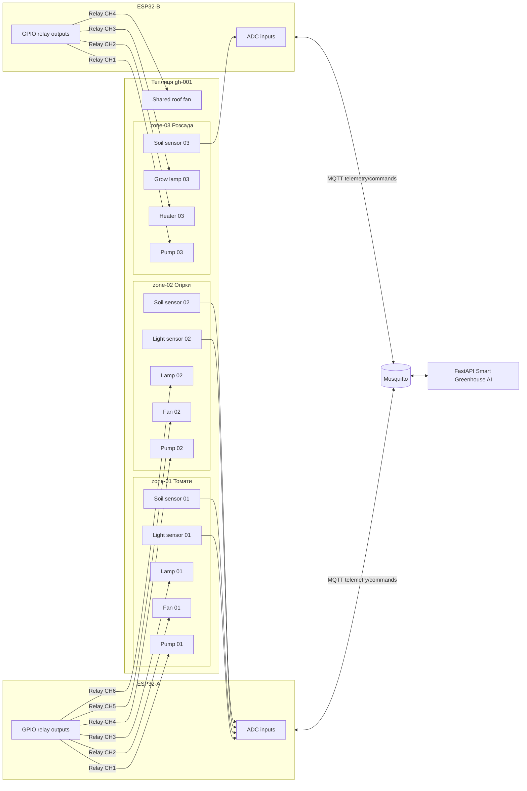

## Mermaid: силова логіка реле

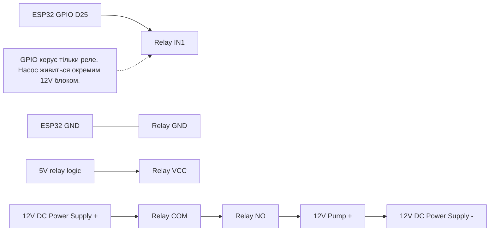

## Mermaid: one ESP32 controls multiple MQTT zone topics

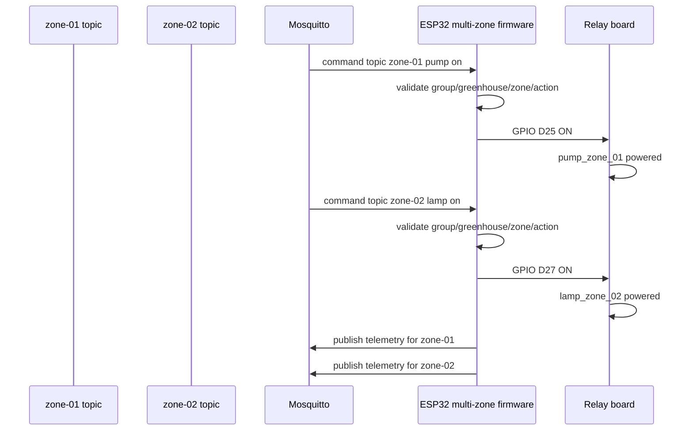

## Що варто додати в майбутньому

1. `edge_nodes` capabilities field: список zones і actuator mappings, якими керує конкретний node.
2. Device acknowledgement: `state/ack` payload після фізичного застосування relay state.
3. Greenhouse-level actuators для shared roof fan, main irrigation valve, main lamp line.
4. Firmware config generator із UI: export `config.py` або JSON mapping для конкретного edge-node.
5. Diagram generator із `edge_nodes + actuators + sensors`: автоматична схема wiring/MQTT для оператора.
6. Electrical checklist для installation: fuse, RCD, enclosure, wire gauge, waterproof connectors.


---

# Source: 07-schema-and-data-uk.md

# 07. Схема даних і модель зберігання Smart Greenhouse AI

Цей документ пояснює, які дані зберігає система Smart Greenhouse AI, чому вони розділені між PostgreSQL/pgvector та InfluxDB, як пов'язані таблиці, як виглядає життєвий цикл команд і алертів, і які дані використовують UI, AI tools, RAG та safety layer.

## 1. Загальна ідея data architecture

Система має два основні типи даних:

1. **Структурні та семантичні дані** — хто існує в системі, які є групи теплиць, теплиці, зони, сенсори, актуатори, рослини, команди, алерти, AI-розмови, RAG-документи. Вони зберігаються в **PostgreSQL**.
2. **Часові ряди телеметрії** — значення температури, вологості, CO2, світла, вологості ґрунту й станів актуаторів у часі. Вони зберігаються в **InfluxDB**.

```text
PostgreSQL + pgvector
  -> groups, greenhouses, zones
  -> devices, sensors, actuators
  -> plant profiles, plant batches, setpoints, policies
  -> command logs, alerts
  -> AI conversations, messages, tool calls
  -> RAG documents, chunks, embeddings

InfluxDB
  -> microclimate time-series points
  -> latest telemetry
  -> historical ranges and summaries
  -> anomaly checks and greenhouse comparisons
```

Причина розділення проста: PostgreSQL добре підходить для зв'язків, транзакцій, FK, JSONB і векторного пошуку через pgvector; InfluxDB краще підходить для частих time-series записів і діапазонних запитів по часу.

## 2. Головна ієрархія домену

Базова структура системи:

```text
GreenhouseGroup
  -> Greenhouse
    -> GreenhouseZone
      -> Sensor
      -> Actuator
      -> PlantBatch
      -> ControlSetpoint
      -> CommandLog
      -> Alert
      -> AIConversation scope
```

Один `GreenhouseGroup` може містити багато `Greenhouse`. Одна `Greenhouse` має багато `GreenhouseZone`. Зона є головною одиницею керування: саме до зони прив'язуються сенсори, актуатори, рослини, telemetry scope, команди й алерти.

## 3. PostgreSQL: структурні таблиці

### `greenhouse_groups`

Група теплиць — верхній рівень операційної області.

Типові поля:

- `id` — UUID primary key.
- `name` — назва групи.
- `location` — місце або опис локації.
- `description` — вільний опис.
- `created_at` — час створення.

Пов'язана з:

- `greenhouses`;
- `group_control_policies`;
- `command_log`;
- `alert_log`;
- `ai_conversations`;
- `rag_documents`.

### `greenhouses`

Окрема теплиця всередині групи.

Типові поля:

- `id` — UUID primary key.
- `group_id` — FK на `greenhouse_groups`.
- `name` — назва теплиці.
- `location` — фізична або логічна локація.
- `description` — опис.

Пов'язана з:

- `greenhouse_zones`;
- `edge_nodes`;
- `command_log`;
- `alert_log`;
- `ai_conversations`.

### `greenhouse_zones`

Зона вирощування всередині теплиці. Це ключовий operational scope для телеметрії, AI-аналізу й команд.

Типові поля:

- `id` — UUID primary key.
- `greenhouse_id` — FK на `greenhouses`.
- `name` — назва зони, наприклад `Томати`, `Салат`, `Розсада`.
- `description` — опис.
- `source_type` — джерело даних: `real` або `simulator`.
- `simulator_managed` — чи зона керується внутрішнім симулятором.

Пов'язана з:

- `sensor_registry`;
- `actuator_registry`;
- `plant_batches`;
- `control_setpoints`;
- `command_log`;
- `alert_log`;
- `ai_conversations`.

## 4. PostgreSQL: пристрої, сенсори й актуатори

### `edge_nodes`

Edge-node — фізичний або симуляторний контролер, наприклад ESP32, Wokwi node, gateway або internal simulator.

Типові поля:

- `id` — UUID primary key.
- `greenhouse_id` — FK на теплицю.
- `node_key` — унікальний ключ node, наприклад `esp32-gh001-zone01`.
- `name` — людська назва.
- `node_type` — тип: `esp32`, `simulator`, `gateway`.
- `firmware_version` — версія firmware.
- `mqtt_username` — MQTT identity для node.
- `mqtt_token` — токен/секрет для MQTT доступу.
- `last_seen_at` — останній heartbeat або telemetry contact.

Edge-node може мати багато сенсорів і актуаторів. Один ESP32 може керувати однією зоною або кількома зонами, якщо firmware має mapping `zone_id + actuator -> GPIO`.

### `sensor_registry`

Реєстр логічних сенсорів у зоні.

Типові поля:

- `id` — UUID primary key.
- `zone_id` — FK на зону.
- `edge_node_id` — FK на edge-node, nullable.
- `sensor_key` — стабільний ключ сенсора в межах зони.
- `metric` — метрика, наприклад `temperature`, `soil_moisture`, `co2`.
- `unit` — одиниця виміру.
- `is_active` — чи сенсор активний.

Унікальність:

```text
(zone_id, sensor_key)
```

Це не time-series таблиця. Вона описує, які сенсори існують. Самі readings пишуться в InfluxDB.

### `actuator_registry`

Реєстр логічних актуаторів у зоні.

Типові поля:

- `id` — UUID primary key.
- `zone_id` — FK на зону.
- `edge_node_id` — FK на edge-node, nullable.
- `actuator_key` — стабільний ключ актуатора в межах зони.
- `actuator_type` — тип: `pump`, `fan`, `heater`, `lamp`.
- `is_active` — чи актуатор активний.

Унікальність:

```text
(zone_id, actuator_key)
```

Актуатор може бути пов'язаний із командами в `command_log` через `actuator_id`, але команда також дублює `actuator_name`, щоб зберегти історичний audit навіть якщо registry зміниться.

## 5. PostgreSQL: рослини, профілі, setpoints і політики

### `plant_profiles`

Профіль культури й стадії росту. Це довідник рекомендованих меж.

Типові поля:

- `id` — UUID primary key.
- `crop_name` — культура: tomato, cucumber, lettuce тощо.
- `growth_stage` — стадія росту.
- `temp_min`, `temp_opt`, `temp_max`.
- `humidity_min`, `humidity_opt`, `humidity_max`.
- `soil_moisture_min`, `soil_moisture_opt`, `soil_moisture_max`.
- `co2_min`, `co2_opt`, `co2_max`.
- `light_min`, `light_opt`, `light_max`.
- `description` — пояснення профілю.

Ці значення є editable starter values, а не абсолютні агрономічні істини. AI і control engine мають використовувати їх як контекст, а не як автономний дозвіл на фізичну дію.

### `plant_batches`

Партія рослин у конкретній зоні.

Типові поля:

- `id` — UUID primary key.
- `zone_id` — FK на зону.
- `profile_id` — FK на `plant_profiles`, nullable/optional за сценарієм.
- `name` — назва партії.
- `species` — вид.
- `cultivar` — сорт.
- `planted_at` — дата посадки.
- `growth_stage` — поточна стадія.
- `notes` — нотатки оператора.

Через `plant_batches` AI може відповідати не просто "у зоні сухо", а "у зоні томатів на flowering stage soil moisture нижча за рекомендований діапазон".

### `control_setpoints`

Налаштування цільових значень для зони.

Типові поля:

- `id` — UUID primary key.
- `zone_id` — FK на зону, зазвичай один setpoint на одну зону.
- `temperature_target`.
- `humidity_target`.
- `soil_moisture_target`.
- `co2_target`.
- `light_target`.
- `updated_by`.
- `updated_at`.

Setpoints описують бажані операційні цілі. Вони доповнюють plant profile: профіль дає агрономічний діапазон, setpoint дає локальну операційну ціль.

### `group_control_policies`

Group-level JSONB політика безпеки й поведінки control engine.

Типові поля:

- `id` — UUID primary key.
- `group_id` — FK на групу.
- `name` — назва політики.
- `policy` — JSONB документ.
- `is_active` — чи політика активна.
- `updated_at`.

Приклад policy:

```json
{
  "version": 1,
  "watering": {
    "enabled": true,
    "max_duration_seconds": 60,
    "cooldown_seconds": 300
  },
  "heating": {
    "enabled": true,
    "max_power": 80,
    "forbidden_if_temperature_above": 28
  },
  "approval": {
    "require_manual_confirmation": true,
    "allow_ai_propose": true,
    "allow_control_engine_auto_propose": true
  }
}
```

Політика не замінює hard-coded safety limits. Вона є додатковим group-level контекстом.

## 6. PostgreSQL: команди й фізичні дії

### `command_log`

`command_log` — audit trail усіх proposed, validated, approved і executed команд. Це центральна таблиця safety workflow.

Типові поля:

- `id` — UUID primary key.
- `group_id` — FK на групу.
- `greenhouse_id` — FK на теплицю.
- `zone_id` — FK на зону.
- `actuator_id` — FK на `actuator_registry`, nullable.
- `actuator_name` — назва актуатора: `pump`, `fan`, `heater`, `lamp`.
- `action` — дія: `on`, `off`, `set_power`.
- `value` — числове значення, наприклад power percent.
- `unit` — одиниця значення.
- `duration_seconds` — тривалість дії.
- `source` — джерело: `manual`, `control_engine`, `ai_agent`, `safety_override`.
- `reason` — пояснення, чому команда створена.
- `mode` — `mqtt` або `simulator`.
- `validation_errors` — JSONB список/об'єкт помилок валідації.
- `status` — state machine status.
- `valid_until` — коли proposal expires.
- `created_at`, `updated_at`.

Життєвий цикл:

```text
proposed -> validated -> approved -> executing -> executed
                         └-> cancelled / rejected / expired / failed
```

Важлива межа: `executed` у поточній v1 логіці означає, що backend успішно опублікував MQTT command або simulator застосував state. Для реального ESP32 це ще не повна гарантія фізичного виконання, доки не буде `state/ack` flow.

### Safety validation для команд

Команда має пройти перевірки:

- існує `group_id`, `greenhouse_id`, `zone_id`;
- актуатор існує або підтримується логічною моделлю;
- action дозволений для actuator type;
- `duration_seconds` не перевищує safety max;
- `value` не перевищує max power;
- pump cooldown не порушений;
- heater не запускається при температурі вище hard limit;
- command mode відповідає поточному control mode;
- оператор явно підтвердив фізичну дію.

Типові actuator limits:

| Актуатор | Дії | Max duration | Max power | Додатково |
|---|---|---:|---:|---|
| `pump` | `on`, `off` | 60s | — | cooldown 300s |
| `fan` | `on`, `off`, `set_power` | 600s | 100 | вентиляція |
| `heater` | `on`, `off`, `set_power` | 300s | 80 | forbidden if temp > 28°C |
| `lamp` | `on`, `off` | 3600s | — | враховувати quiet hours/policy |

## 7. PostgreSQL: алерти

### `alert_log`

Таблиця активних і завершених алертів.

Типові поля:

- `id` — UUID primary key.
- `group_id` — FK на групу.
- `greenhouse_id` — FK на теплицю, nullable.
- `zone_id` — FK на зону, nullable.
- `metric` — метрика, яка спричинила алерт.
- `severity` — `info`, `warning`, `critical`.
- `title` — короткий заголовок.
- `message` — детальний опис.
- `status` — `active`, `resolved`, `dismissed`.
- `source` — `threshold`, `control_engine`, `ai_agent`, `system`.
- `resolved_at` — час завершення.
- `created_at`.

Поточний lifecycle:

```text
active -> resolved
active -> dismissed
```

Рекомендоване майбутнє розширення:

```text
active -> acknowledged -> resolved
active -> dismissed
active -> escalated -> resolved
```

Алерти використовуються dashboard, AI tools і control operator panel як контекст ризику.

## 8. PostgreSQL: AI conversations і tool calls

### `ai_conversations`

AI-розмова з optional scope.

Типові поля:

- `id` — UUID primary key.
- `group_id` — nullable FK.
- `greenhouse_id` — nullable FK.
- `zone_id` — nullable FK.
- `user_id` — nullable UUID.
- `title` — назва розмови.
- `created_at`.

Scope визначає, про що AI має право говорити:

```text
group scope: group_id set, greenhouse_id null, zone_id null
greenhouse scope: group_id + greenhouse_id set, zone_id null
zone scope: group_id + greenhouse_id + zone_id set
```

### `ai_messages`

Повідомлення в AI-розмові.

Типові поля:

- `id` — UUID primary key.
- `conversation_id` — FK на `ai_conversations`.
- `role` — `user`, `assistant`, system-like role за потреби.
- `content` — текст повідомлення.
- `model` — модель, яка відповідала.
- `token_input` — input tokens.
- `token_output` — output tokens.
- `created_at`.

### `ai_tool_calls`

Журнал tool calling для explainability.

Типові поля:

- `id` — UUID primary key.
- `conversation_id` — FK на `ai_conversations`.
- `tool_name` — назва tool.
- `arguments` — JSONB аргументи.
- `result` — JSONB результат.
- `status` — success/error/etc.
- `error` — текст помилки.
- `created_at`.

Ця таблиця важлива для debugging: якщо AI дав неправильну відповідь, треба дивитися, які tools він викликав, із якими аргументами й що отримав.

## 9. PostgreSQL + pgvector: RAG

### `rag_documents`

Документ знань для AI/RAG.

Типові поля:

- `id` — UUID primary key.
- `group_id` — nullable FK; `NULL` означає global document.
- `title` — назва документа.
- `source_type` — тип джерела.
- `source_url` — URL або reference.
- `content` — повний текст.
- `metadata` — JSONB metadata.
- `created_at`.

### `rag_chunks`

Фрагменти документів із embeddings.

Типові поля:

- `id` — UUID primary key.
- `document_id` — FK на `rag_documents`.
- `chunk_index` — порядок фрагмента.
- `content` — текст chunk.
- `embedding` — pgvector vector, за замовчуванням dimension 1536.
- `embedding_model` — модель embedding.
- `metadata` — JSONB metadata.
- `created_at`.

RAG flow:

```text
/rag document upload
  -> store rag_documents
  -> split into chunks
  -> create embeddings
  -> store rag_chunks.embedding
  -> AI tool search_plant_knowledge(query, group_id)
  -> pgvector similarity search
  -> return cited chunks to AI
```

Group scoping важливий: локальні правила господарства або специфічні plant notes можуть бути доступні тільки в межах конкретної групи.

## 10. PostgreSQL: settings, model catalog і logs

### `model_settings`

Singleton-таблиця з поточними налаштуваннями AI/model/control mode.

Типові поля:

- `id` — UUID primary key.
- `selected_chat_model` — активна chat model.
- `embedding_model` — активна embedding model.
- `embedding_dimension` — dimension embeddings.
- `last_refresh_at` — останнє оновлення каталогу моделей.
- `last_refresh_error` — помилка refresh.
- `last_refresh_status` — `success` або `failed`.
- `selected_model_available` — чи доступна обрана модель.
- `control_mode` — `mqtt` або `simulator`.

`control_mode` — project-wide gate для actuator commands: система має знати, чи виконувати approved command через MQTT, чи через internal simulator.

### `openrouter_model_catalog`

Кеш OpenRouter model catalog для UI settings.

Типові поля:

- `id` — UUID primary key.
- `model_id` — унікальний id моделі.
- `name` — display name.
- `provider` — provider.
- `capability_flags` — JSONB capability flags.
- `prompt_price`, `completion_price` — ціни за million tokens.
- `context_length`.
- `max_completion_tokens`.
- `raw_metadata` — JSONB оригінальна metadata.

### `debug_log`

Діагностичний журнал без FK до доменних таблиць.

Типові поля:

- `id` — UUID primary key.
- `level` — `debug`, `info`, `warning`, `error`.
- `event_type` — тип події.
- `component` — компонент: `api`, `ai_agent`, `mqtt`, etc.
- `message` — текст.
- `path`, `method`, `status_code`, `duration_ms` — HTTP context.
- `request_id` — correlation id.
- `error_type`, `stack_trace`.
- `metadata` — JSONB додатковий контекст.
- `created_at`.

Для AI debugging важливі записи:

```text
level = "error"
component = "ai_agent"
event_type = "ai_chat_failed"
```

Після цього треба корелювати `debug_log` з `ai_tool_calls` і `ai_messages`.

## 11. InfluxDB: telemetry measurement

InfluxDB зберігає measurement:

```text
measurement: microclimate
```

Tags:

```text
group_id
greenhouse_id
zone_id
sensor_id
metric
```

Fields:

```text
value: float
quality: string, наприклад ok / warn / error
```

Timestamp:

```text
UTC timestamp from telemetry reading
```

Приклад conceptual point:

```text
microclimate,
  group_id=group-demo-001,
  greenhouse_id=gh-001,
  zone_id=zone-01,
  sensor_id=dht22-01,
  metric=temperature
value=24.5,quality="ok" 2026-05-21T12:00:00Z
```

Valid metrics:

| Категорія | Метрики |
|---|---|
| Environment | `temperature`, `air_humidity`, `soil_moisture`, `co2`, `light` |
| Actuator state | `pump_state`, `fan_power`, `heater_power`, `lamp_state` |

Actuator state metrics також зберігаються як telemetry, щоб dashboard/AI бачили не тільки середовище, а й останній відомий стан обладнання.

## 12. Telemetry ingestion contract

MQTT topic:

```text
greenhouse-groups/{group_id}/greenhouses/{greenhouse_id}/zones/{zone_id}/telemetry
```

Payload shape:

```json
{
  "message_id": "wokwi-zone-01-temperature-0001",
  "qos": 0,
  "reading": {
    "group_id": "group-demo-001",
    "greenhouse_id": "gh-001",
    "zone_id": "zone-01",
    "sensor_id": "dht22-01",
    "metric": "temperature",
    "value": 24.5,
    "quality": "ok",
    "timestamp": "2026-05-21T12:00:00Z"
  }
}
```

Ingestion validation:

1. Parse MQTT topic scope.
2. Decode JSON payload.
3. Validate Pydantic envelope.
4. Check metric is known.
5. Reject NaN/Inf values.
6. Reject stale/future timestamps outside accepted window.
7. Compare topic `group_id/greenhouse_id/zone_id` against payload scope.
8. Deduplicate by `message_id`.
9. Write point to InfluxDB.

Це означає, що device не може випадково publish topic однієї зони, а payload іншої зони: backend має відкинути mismatch.

## 13. Query patterns for UI and AI

### Dashboard

Dashboard читає:

- groups з PostgreSQL;
- latest telemetry з InfluxDB;
- active alerts з PostgreSQL;
- historical ranges з InfluxDB для charts.

### Control page

Control page читає:

- group/greenhouse/zone structure з PostgreSQL;
- latest telemetry з InfluxDB;
- plant context з PostgreSQL;
- recent commands з PostgreSQL;
- control mode з `model_settings`.

### AI tools

AI tools читають:

- scope metadata з PostgreSQL;
- latest/range telemetry з InfluxDB;
- active alerts і commands з PostgreSQL;
- plant profile/batch/context з PostgreSQL;
- RAG chunks через pgvector.

AI tools мають бути read-only, окрім створення proposed action через контрольований command proposal path.

### Safety layer

Safety layer читає:

- registry актуаторів;
- hard-coded actuator limits;
- command history для cooldown;
- latest telemetry для risky checks;
- group policy;
- zone/setpoint context.

## 14. Mermaid: data storage split

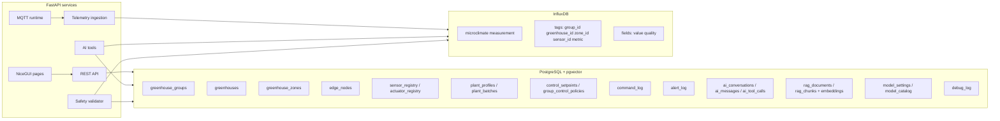

## 15. Mermaid: core relational model

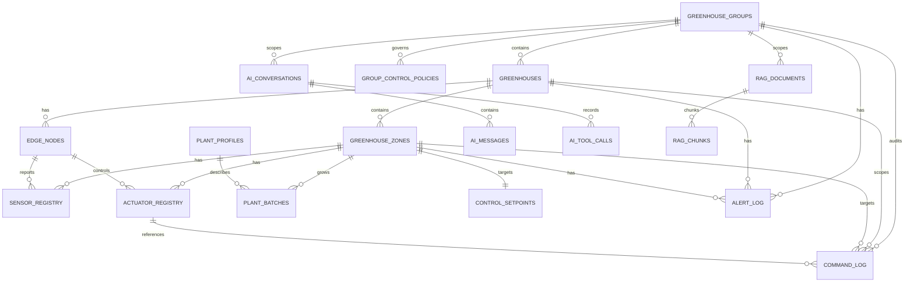

## 16. Mermaid: command and telemetry together

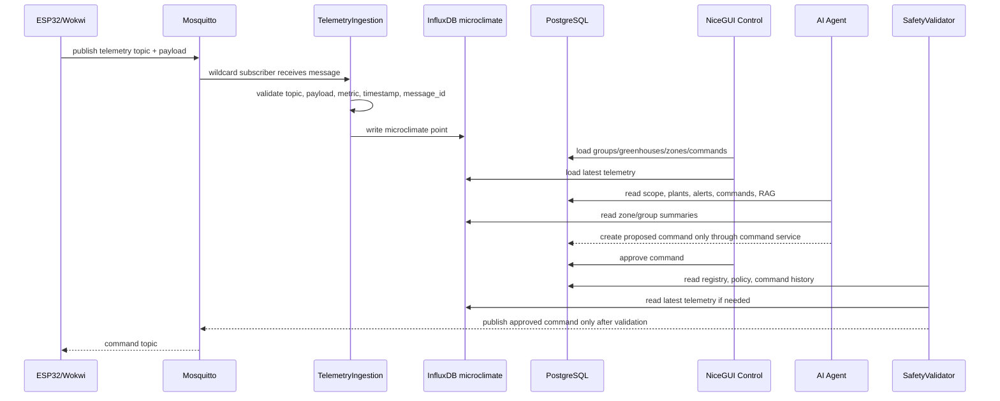

## 17. Practical LLM context summary

Якщо LLM має пояснити схему даних коротко, core message такий:

```text
Smart Greenhouse AI зберігає identity, topology, policies, commands, alerts, AI history і RAG у PostgreSQL + pgvector. Часті sensor readings і actuator state readings зберігаються в InfluxDB measurement microclimate. Усі telemetry points scoped by group_id, greenhouse_id, zone_id. Усі physical commands scoped так само й проходять command_log state machine, safety validation і manual approval. AI читає PostgreSQL, InfluxDB і RAG, але не публікує MQTT напряму; він може тільки створити proposed action.
```

