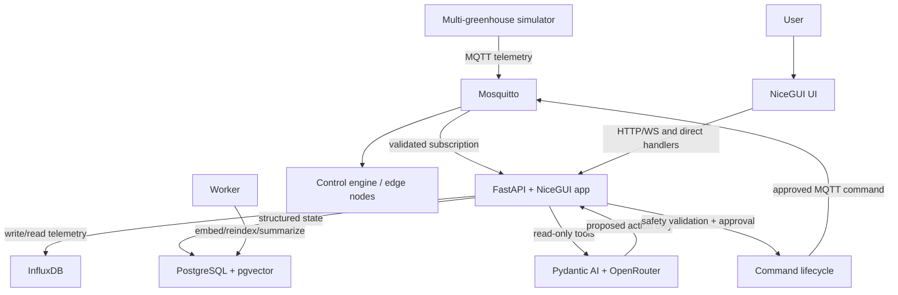
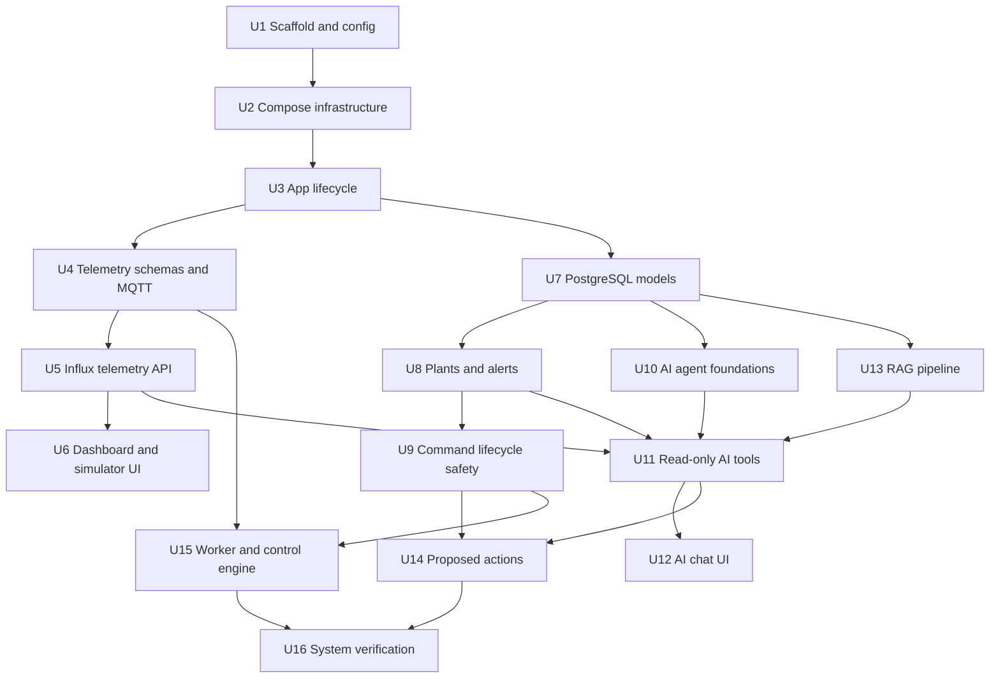
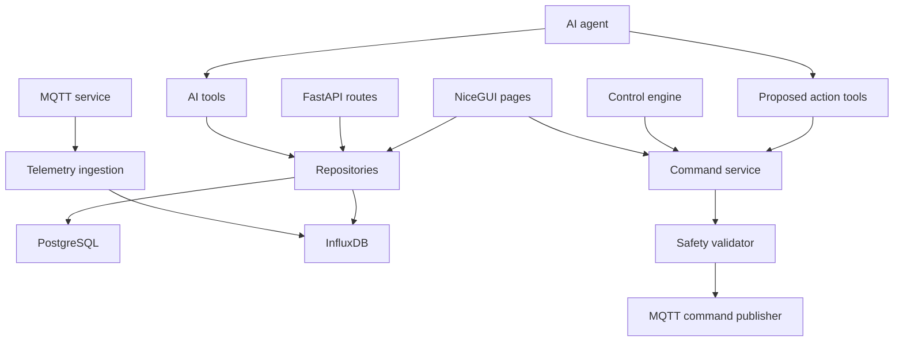

# feat: Build greenhouse fleet control system

## Summary

Build the complete Smart Greenhouse Management System described in the project docs: multi-greenhouse telemetry simulation and ingestion, group/greenhouse/zone dashboard UI, fleet metadata, plant batches/profiles, alerts, AI chat with transparent scoped tool use, RAG knowledge search, and safety-validated proposed actions that require user approval before MQTT execution.

The implementation follows the documented MVP order so each phase can be completed and verified independently while preserving the system invariant that the AI never directly controls actuators and every physical command is scoped to group, greenhouse, and zone.

---

## Problem Frame

The project exists to bridge the gap between simple greenhouse dashboards, blind automation, and hallucination-prone AI assistants. Users need a greenhouse-group system that can explain fleet, greenhouse, zone, and plant-batch state using real telemetry, plant thresholds, historical commands, alerts, and domain knowledge rather than unsupported model guesses.

The hardest part is cyber-physical safety across multiple objects: telemetry, recommendations, and commands cross MQTT, time-series storage, relational fleet state, UI approval, and LLM reasoning. The plan keeps actuation behind deterministic validation and human approval instead of trusting prompts as a safety boundary.

---

## Requirements

### Telemetry & IoT

- R1. Simulate telemetry for multiple edge nodes across greenhouse groups, greenhouses, and zones, and publish validated readings through scoped MQTT topics documented in `docs/ROUTES.md`.
- R2. Persist high-frequency telemetry in InfluxDB using the documented `microclimate` measurement with group, greenhouse, zone, sensor, and metric tags; expose latest, group summary, greenhouse summary, zone summary, range, comparison, and anomaly API endpoints.

### Data Model & Plant State

- R3. Provide a NiceGUI dashboard that shows group overview, greenhouse cards, zone detail, current readings, historical charts, actuator state, alerts, and system health.
- R4. Model greenhouse groups, greenhouses, zones, edge nodes, sensor registry, actuator registry, plant batches, plant profiles, group policies, control setpoints, command logs, alerts, AI conversations, AI messages, AI tool calls, RAG documents, and RAG chunks in PostgreSQL with pgvector.
- R5. Provide group, greenhouse, zone, device, and plant-batch CRUD; profile-backed threshold evaluation; alert generation; and command logging.

### AI & RAG

- R6. Implement an AI chat flow that answers group-, greenhouse-, and zone-scoped questions from real tools and persists conversations, messages, and every tool call for explainability.
- R7. Implement read-only AI tools for group overview, greenhouse list/state, zone state, group/greenhouse/zone telemetry summaries, greenhouse comparison, alerts, recent commands, and RAG search.
- R8. Implement RAG document ingestion, chunking, embedding, vector search, and reindexing for agronomic knowledge.

### Safety & Actuation

- R9. Implement scoped proposed action tools for watering, ventilation, lighting, and setpoint changes with required group_id, greenhouse_id, and zone_id, without granting the model direct MQTT access.
- R10. Validate every physical command with deterministic zone, greenhouse, and group safety rules; require user approval; re-check execution-time state; then publish approved commands to scoped MQTT topics.

### Infrastructure & UI

- R11. Provide NiceGUI pages for dashboard, greenhouses, devices, simulator, plants, control, AI chat, logs, RAG, and settings as listed in `docs/ROUTES.md`.
- R12. Ship Docker Compose infrastructure, configuration examples, health checks, migrations, and tests sufficient for local reproducibility and self-verification.

---

## Scope Boundaries

- No direct AI access to MQTT clients, actuator publishers, or physical command execution.
- No production-grade multi-user authorization beyond configuration/session foundations needed by NiceGUI and FastAPI; local development must still bind exposed app services to localhost or require a single-user local secret before command, RAG ingestion, or AI endpoints are reachable beyond the developer machine.
- No real ESP32 firmware; the multi-greenhouse simulator remains the edge-node source for this app build.
- No production deployment hardening beyond Docker Compose, health checks, secrets placeholders, and documented operational notes.
- No destructive database reset or table-drop workflow in the plan.
- No unbounded telemetry retention; retention/downsampling choices are included as operational configuration.

### Deferred to Follow-Up Work

- Real sensor hardware integration: separate hardware/firmware iteration after the multi-greenhouse simulator-backed app works.
- Production reverse proxy, TLS termination, and public hosting: separate deployment plan after local Compose is stable.
- Advanced autonomous PID/fuzzy tuning: build a safe baseline control engine first; optimization can follow with real telemetry.
- Full authentication and role-based authorization: separate security plan once local single-user behavior is complete.

---

## Context & Research

### Relevant Code and Patterns

- `docs/GOAL.md` defines the product differentiator: AI claims must be grounded in group/greenhouse/zone telemetry, profiles, command history, RAG, and alerts.
- `docs/ARCHITECTURE.md` defines the group/greenhouse/zone domain, safety invariant, data flow, service layout, database roles, and actuator safety limits.
- `docs/MVP.md` defines the implementation order: Multi-Greenhouse IoT Core, Fleet Metadata Core, AI Chat with Group-Aware Tools, RAG + Scoped Proposed Actions.
- `docs/STACK.md` defines the stack: FastAPI, NiceGUI, Mosquitto, InfluxDB, PostgreSQL, pgvector, OpenRouter, Docker Compose, pytest.
- `docs/DATABASE.md` defines fleet PostgreSQL tables and the InfluxDB `microclimate` measurement shape.
- `docs/ROUTES.md` defines group/greenhouse/zone REST endpoints, NiceGUI pages, and scoped MQTT topic hierarchy.
- `docs/AI_AGENT.md` defines group-aware tool categories, agent loop, structured response expectations, and tool-call logging.
- `docs/RAG.md` defines the RAG purpose, storage targets, embedding assumption, and search API.
- `.agents/skills/fastapi-python/SKILL.md` favors async I/O, functional FastAPI style, Pydantic v2 validation, dependency injection, and lifespan-managed resources.
- `.agents/skills/building-pydantic-ai-agents/SKILL.md` informs structured agent output, tool registration, approval/deferred tools, tool-call testing, and deterministic model doubles.
- `.agents/skills/docker-compose-orchestration/SKILL.md` informs service health checks, Compose networking, dependencies, and volume persistence.
- `.agents/skills/supabase-postgres-best-practices/SKILL.md` informs PostgreSQL schema constraints, indexes, pooling, and pgvector-adjacent performance considerations.

### Institutional Learnings

- `docs/solutions/ui-bugs/docker-compose-fastapi-nicegui-dashboard-launch-fix-2026-05-07.md` captures the verified Docker Compose image set, pgvector init, FastAPI root redirect, NiceGUI mounting pattern, and dashboard/sidebar fix.
- As implementation discovers more bugs or durable conventions, capture them with the project’s learning workflow rather than expanding this plan.

### External References

- FastAPI current docs confirm the `lifespan` async context manager as the recommended startup/shutdown pattern and `app.dependency_overrides` for tests.
- Pydantic AI current docs confirm deferred tools, approval-required tools, `DeferredToolRequests`, `DeferredToolResults`, structured output, and `TestModel` patterns; implementation must verify the exact OpenRouter provider configuration before coding U10/U14.
- Research found NiceGUI 3.x should be targeted; avoid NiceGUI 2.x because the docs are generic and 2.x has known security/version concerns.
- Research found InfluxDB should be pinned to 2.7.x because Flux is in maintenance mode and InfluxDB 3 changes the Python client/query surface.
- Research found aiomqtt does not provide automatic reconnect; MQTT listeners need an explicit reconnect loop or a dedicated FastAPI/MQTT integration.
- Research found InfluxDB async writes do not provide the same batching support as the synchronous WriteAPI; plan writes accordingly.

---

## Key Technical Decisions

| Decision | Rationale |
|---|---|
| Use one integrated FastAPI + NiceGUI application package for the web/API process. | NiceGUI runs on FastAPI/ASGI and can share repositories, dependencies, and app lifecycle without a UI-to-API network hop. Simulator, control engine, and worker remain separate entry points because they are independent MQTT/background actors. |
| Use Pydantic AI for the agent loop and tool approval while keeping OpenRouter as the model provider. | The docs require tool calling, structured responses, transparent tool logs, and human approval for proposed action tools. Pydantic AI supports deferred/approval-required tools and deterministic testing while OpenRouter remains the provider boundary; use an OpenAI-compatible OpenRouter base URL rather than the standalone `openrouter` package unless implementation research proves otherwise. |
| Keep InfluxDB for telemetry and PostgreSQL/pgvector for structured/RAG data. | This preserves the documented two-store architecture: high-frequency group/greenhouse/zone time series in InfluxDB, fleet business state and vector search in PostgreSQL. |
| Treat deterministic validation as the safety boundary, not prompt instructions. | The model can propose scoped actions, but FastAPI zone/group safety rules, approval state, and execution-time revalidation decide whether a command reaches MQTT. |
| Use repository functions as the shared seam for API routes, UI pages, and agent tools. | This prevents duplicate business logic across FastAPI endpoints, NiceGUI event handlers, and AI tools while keeping implementation testable. |
| Use test-first or characterization-first posture for safety, command lifecycle, and AI tool logging units. | These units carry the highest risk because errors could produce unsafe or unauditable actions. |
| Pin infrastructure and framework versions explicitly. | InfluxDB and NiceGUI version changes affect query language, APIs, and security posture. Compose and dependency files should avoid floating `latest` behavior. |

---

## Open Questions

### Resolved During Planning

- Should the plan cover MVP 1 only, MVP-by-MVP, or the full app? Full app was confirmed by the user.
- Should planning follow project docs or invent a new product scope? Project docs are the source of truth.
- Should Pydantic AI be considered even though docs name OpenRouter? Yes: use Pydantic AI as the agent/tool framework with OpenRouter as provider to satisfy approval and testing needs.

### Deferred to Implementation

- Exact OpenRouter chat model name: defer to configuration, but use the OpenAI-compatible OpenRouter provider path chosen in U10.
- Embedding provider choice: resolve before U7 creates the pgvector schema. Default to API embeddings compatible with `vector(1536)` and exclude `sentence-transformers` unless the schema dimension is intentionally changed before the first migration.
- Exact chart layout and UI visual design: defer to implementation while preserving required pages and user flows.
- Exact anomaly-detection thresholds beyond plant profile and safety rules: start with simple threshold logic and extend after telemetry exists.
- Exact Docker resource limits: choose sane local defaults during Compose implementation and document how to tune them.

---

## Output Structure

```text
app/
  main.py
  config.py
  dependencies.py
  api/
  ui/
  models/
  schemas/
  repositories/
  services/
  core/
services/
  simulator/
  control_engine/
  worker/
infra/
  mosquitto/
migrations/
  alembic/
tests/
  unit/
  integration/
  system/
```

The architecture doc originally names `services/api`, `services/ui`, and `packages/*`. The plan consolidates web/API code into `app/` to reduce duplication while preserving separate process boundaries for simulator, control engine, and worker.

---

## High-Level Technical Design

> *This illustrates the intended approach and is directional guidance for review, not implementation specification. The implementing agent should treat it as context, not code to reproduce.*



---

## Implementation Units



- U1. **Create project scaffold and configuration**

**Goal:** Establish the Python package structure, dependency groups, configuration model, environment example, and test layout used by all later units.

**Requirements:** R12

**Dependencies:** None

**Files:**
- Modify: `pyproject.toml`
- Create: `.env.example`
- Create: `app/__init__.py`
- Create: `app/config.py`
- Create: `app/core/__init__.py`
- Create: `app/core/mqtt_topics.py`
- Create: `app/core/safety_limits.py`
- Create: `tests/conftest.py`
- Create: `tests/unit/test_config.py`
- Create: `tests/unit/test_mqtt_topics.py`

**Approach:**
- Populate runtime dependencies from `docs/STACK.md`, but resolve conflicts before adding them: exclude `openrouter` if Pydantic AI uses OpenRouter through an OpenAI-compatible provider, exclude `sentence-transformers` unless local embeddings are chosen before schema creation, and exclude `simple-pid`/`scikit-fuzzy` while advanced PID/fuzzy tuning remains deferred.
- Put environment parsing in `app/config.py` using Pydantic Settings.
- Centralize MQTT topic builders and documented safety limits in `app/core/` so simulator, API, control engine, and tests share constants.
- Configure pytest and pytest-asyncio in `pyproject.toml`.
- Make the root project installable so `app` can be imported by the web app, simulator, worker, and control-engine entry points without path hacks.

**Patterns to follow:**
- `docs/STACK.md` dependency list.
- `.agents/skills/fastapi-python/SKILL.md` for Pydantic settings and async testing posture.

**Test scenarios:**
- Happy path: loading a complete `.env`-style configuration produces typed settings for PostgreSQL, InfluxDB, MQTT, OpenRouter, and app secrets.
- Edge case: missing optional values fall back to documented local defaults without requiring secrets for tests.
- Error path: missing required production-like secrets fails validation with a clear settings error.
- Happy path: MQTT topic builders return the exact documented topic forms for telemetry, command, event, alert, and actuator-state topics.

**Verification:**
- Dependency metadata matches the documented stack.
- Tests can import the `app` package and shared constants without side effects.
- Each later unit has stable configuration and topic helpers to reuse.

---

- U2. **Add Docker Compose infrastructure**

**Goal:** Provide reproducible local services for Mosquitto, PostgreSQL/pgvector, InfluxDB, and the application.

**Requirements:** R1, R2, R4, R12

**Dependencies:** U1

**Files:**
- Create: `docker-compose.yml`
- Create: `compose.override.yml`
- Create: `infra/mosquitto/mosquitto.conf`
- Create: `infra/mosquitto/acl.conf`
- Create: `Dockerfile`
- Test: `tests/system/test_compose_health.py`

**Approach:**
- Pin infrastructure images to verified tags, including `influxdb:2.7.12` and `pgvector/pgvector:0.8.2-pg17-trixie`.
- Add health checks for PostgreSQL, InfluxDB, Mosquitto, and the app.
- Use named volumes for PostgreSQL and InfluxDB state.
- Keep secrets in `.env` and `.env.example`; do not hardcode credentials.
- Disable anonymous Mosquitto access and use credentials plus ACLs so simulator clients can only publish telemetry topics, the app command publisher is the only command-topic publisher, and other services cannot bypass FastAPI safety validation.

**Patterns to follow:**
- `docs/STACK.md` infrastructure image and port table.
- `.agents/skills/docker-compose-orchestration/SKILL.md` health-check and dependency patterns.

**Test scenarios:**
- Integration: starting the Compose stack makes PostgreSQL, InfluxDB, Mosquitto, and app health checks report healthy.
- Error path: the app readiness endpoint reports dependency failure when a required service is unavailable.
- Integration: Mosquitto accepts publish/subscribe on allowed telemetry topics in local development.
- Error path: a telemetry-only MQTT credential cannot publish to command topics.

**Verification:**
- A clean checkout can start the local stack from documented environment variables.
- Compose does not use floating `latest` tags for stateful infrastructure.
- Health checks gate dependent startup rather than relying only on container start order.

---

- U3. **Build FastAPI + NiceGUI application lifecycle**

**Goal:** Create the integrated web/API application with lifespan-managed dependencies, health endpoints, routers, and NiceGUI mounting.

**Requirements:** R3, R11, R12

**Dependencies:** U1, U2

**Files:**
- Create: `app/main.py`
- Create: `app/dependencies.py`
- Create: `app/api/__init__.py`
- Create: `app/api/health.py`
- Create: `app/ui/__init__.py`
- Create: `app/ui/layouts/main_layout.py`
- Create: `app/ui/pages/dashboard.py`
- Create: `app/ui/pages/settings.py`
- Create: `tests/unit/test_health_api.py`
- Create: `tests/integration/test_app_lifespan.py`

**Approach:**
- Use FastAPI lifespan to initialize and shut down shared clients, pools, and background task handles.
- Mount NiceGUI 3.x with `ui.run_with(app, ...)`, run the process as `uvicorn app.main:app`, redirect `/` to `/dashboard`, and import all linked page modules before mounting so decorators register.
- Provide liveness and readiness endpoints with dependency-specific readiness detail.
- Ensure NiceGUI session secret and FastAPI session settings are configured consistently when session storage is used.
- Define the first-run shell with `ui.left_drawer()` navigation groups Operations (`dashboard`, `simulator`, `plants`, `control`), Intelligence (`ai-chat`, `rag`, `logs`), and System (`settings`), with placeholder/empty states available before telemetry exists.

**Patterns to follow:**
- FastAPI current docs for `lifespan` async context manager.
- FastAPI current docs for dependency overrides during tests.
- NiceGUI 3.x configuration/deployment guidance.

**Test scenarios:**
- Happy path: app startup initializes configured dependencies and readiness returns healthy when test doubles are healthy.
- Error path: readiness returns unhealthy detail when a dependency check fails while liveness remains available.
- Integration: dependency overrides replace production clients in endpoint tests.
- Integration: NiceGUI page registration does not remove or shadow `/api/*` routes.
- Happy path: the main layout exposes a desktop-first sidebar navigation with Operations, Intelligence, and System groups.

**Verification:**
- The app can be run as a single ASGI target.
- Startup and shutdown cleanly create and close resources without leaking background tasks in tests.

---

- U4. **Implement scoped telemetry schemas, simulator, and MQTT ingestion**

**Goal:** Publish simulated group/greenhouse/zone sensor readings to MQTT, validate inbound telemetry, and route valid messages toward telemetry persistence.

**Requirements:** R1, R2

**Dependencies:** U1, U2, U3

**Files:**
- Create: `app/schemas/telemetry.py`
- Create: `app/services/mqtt_service.py`
- Create: `app/services/telemetry_ingestion.py`
- Create: `services/simulator/__init__.py`
- Create: `services/simulator/main.py`
- Create: `services/simulator/scenarios.py`
- Create: `tests/unit/test_telemetry_schema.py`
- Create: `tests/unit/test_telemetry_ingestion.py`
- Create: `tests/integration/test_mqtt_ingestion.py`

**Approach:**
- Use strict Pydantic schemas for group ID, greenhouse ID, zone ID, sensor ID, metric, value, quality, timestamp, and message identity/idempotency metadata where QoS/reconnect behavior can replay messages.
- Include timestamps in MQTT payloads instead of relying only on broker receipt time, and make QoS/retained-message behavior an explicit choice for telemetry versus commands.
- Implement MQTT reconnect behavior explicitly because aiomqtt does not auto-reconnect.
- Keep simulator publishing configurable intervals and scenario presets for multiple groups/greenhouses/zones: normal, dry soil, overheating, low light, and sensor fault cases.

**Execution note:** Add schema and ingestion tests before wiring persistence so malformed telemetry cannot enter storage or AI context.

**Patterns to follow:**
- `docs/ROUTES.md` MQTT topic hierarchy.
- `docs/DATABASE.md` InfluxDB measurement fields and metrics list.

**Test scenarios:**
- Happy path: a valid simulator payload on a documented scoped telemetry topic is parsed into a typed telemetry reading.
- Edge case: unknown metric names are rejected before persistence.
- Edge case: stale or future timestamps are handled according to configured acceptance windows.
- Error path: non-numeric sensor values are rejected and do not reach telemetry storage.
- Integration: publishing to a test Mosquitto telemetry topic is received by the app subscriber and handed to ingestion.
- Integration: simulated reconnect resumes message processing after broker interruption.
- Edge case: replayed telemetry messages do not create duplicate alerts or unsafe current-state assumptions.

**Verification:**
- Simulator can generate all documented metrics across multiple greenhouses and zones.
- Invalid MQTT payloads cannot be stored or shown to the AI agent.

---

- U5. **Persist and query telemetry in InfluxDB**

**Goal:** Store validated telemetry in InfluxDB and expose the documented telemetry API endpoints.

**Requirements:** R2, R3, R7

**Dependencies:** U3, U4

**Files:**
- Create: `app/services/influx_client.py`
- Create: `app/repositories/telemetry_repository.py`
- Create: `app/api/telemetry.py`
- Create: `app/schemas/telemetry_api.py`
- Create: `tests/unit/test_telemetry_repository.py`
- Create: `tests/integration/test_telemetry_api.py`
- Create: `tests/integration/test_influx_telemetry.py`

**Approach:**
- Write points using the documented `microclimate` measurement with group, greenhouse, zone, sensor, and metric tags from `docs/DATABASE.md`.
- Prefer batched writes with the supported InfluxDB client mode; keep async API use focused on reads if batching support is insufficient.
- Implement latest, group summary, greenhouse summary, zone summary, range, comparison, and simple anomaly endpoints from `docs/ROUTES.md`; keep anomaly behavior threshold-based until enough telemetry exists to justify more complex analytics.
- Add retention/downsampling configuration notes without building advanced analytics first.

**Patterns to follow:**
- `docs/DATABASE.md` InfluxDB measurement format.
- `docs/ROUTES.md` telemetry endpoint list.

**Test scenarios:**
- Happy path: persisted readings can be queried as latest values grouped by group, greenhouse, zone, and metric.
- Happy path: group, greenhouse, and zone summaries return min, max, average, and latest values for stored metrics.
- Edge case: empty telemetry returns explicit empty results rather than fabricated zero values.
- Error path: InfluxDB read failure propagates as a clear API dependency error.
- Integration: a valid MQTT payload ingested through U4 becomes queryable through `/api/telemetry/latest`.

**Verification:**
- API responses are grounded only in stored telemetry.
- InfluxDB writes and reads are covered with real-container integration tests.

---

- U6. **Create dashboard and simulator UI pages**

**Goal:** Provide the first user-visible IoT core: group dashboard, greenhouse cards, zone detail charts, and controls for simulator scenarios.

**Requirements:** R3, R11

**Dependencies:** U3, U5

**Files:**
- Create: `app/ui/pages/dashboard.py`
- Create: `app/ui/pages/simulator.py`
- Create: `app/ui/components/telemetry_cards.py`
- Create: `app/ui/components/telemetry_charts.py`
- Create: `app/ui/components/alert_panel.py`
- Create: `tests/unit/test_dashboard_view_models.py`
- Create: `tests/integration/test_dashboard_data_flow.py`

**Approach:**
- Keep NiceGUI page logic thin by building view-model functions from repository results.
- Use Plotly or NiceGUI chart components for latest and historical metrics.
- Add a simulator page with an active-scenario indicator, start/stop control, scenario presets, and parameter controls that publish or trigger scenarios without bypassing telemetry validation.
- Show explicit empty/loading/error states rather than implying plant health without data; first-run dashboard should guide the user to start the simulator and add a plant/profile.

**Patterns to follow:**
- `docs/ROUTES.md` NiceGUI page list.
- `docs/GOAL.md` requirement that unsupported claims are not fabricated.

**Test scenarios:**
- Happy path: dashboard view model transforms group, greenhouse, and zone telemetry summaries into card/chart-ready structures.
- Edge case: no telemetry produces an empty-state message and no health claim.
- Error path: telemetry API/repository failure produces a visible error state.
- Integration: after simulator publishes readings, dashboard data flow can retrieve updated metrics.

**Verification:**
- `/dashboard` and `/simulator` exist and reflect real stored telemetry.
- The UI never labels plants healthy when telemetry is absent.

---

- U7. **Create PostgreSQL models, migrations, and repositories**

**Goal:** Implement structured database state for greenhouse groups, greenhouses, zones, edge nodes, sensors, actuators, plant batches, profiles, policies, setpoints, alerts, commands, AI logs, and RAG documents/chunks.

**Requirements:** R4, R5, R6, R8, R10

**Dependencies:** U1, U2, U3

**Files:**
- Create: `alembic.ini`
- Create: `migrations/alembic/env.py`
- Create: `migrations/alembic/script.py.mako`
- Create: `migrations/alembic/versions/2026_05_07_0001_initial_schema.py`
- Create: `app/models/base.py`
- Create: `app/models/group.py`
- Create: `app/models/greenhouse.py`
- Create: `app/models/zone.py`
- Create: `app/models/device.py`
- Create: `app/models/plant_batch.py`
- Create: `app/models/command.py`
- Create: `app/models/alert.py`
- Create: `app/models/ai.py`
- Create: `app/models/rag.py`
- Create: `app/repositories/session.py`
- Create: `app/repositories/group_repository.py`
- Create: `app/repositories/greenhouse_repository.py`
- Create: `app/repositories/zone_repository.py`
- Create: `app/repositories/device_repository.py`
- Create: `app/repositories/alert_repository.py`
- Create: `tests/integration/test_migrations.py`
- Create: `tests/integration/test_postgres_repositories.py`

**Approach:**
- Use SQLAlchemy 2.0 ORM with async sessions.
- Create the pgvector extension before vector columns.
- Use UUID primary keys and foreign keys matching `docs/DATABASE.md`, extending the documented schema where the plan requires missing alert and command lifecycle fields.
- Add indexes for foreign keys, alert status/time, command status/time, AI conversation lookup, and RAG vector search.
- Add enum-like constraints for controlled states where appropriate rather than free-text state transitions.
- Add command lifecycle fields needed by later units, including expiry/valid-until timing, update timestamps, duration/power representation, and structured validation error context.

**Execution note:** Start with migration tests against real PostgreSQL/pgvector before building repositories on top.

**Patterns to follow:**
- `docs/DATABASE.md` schema definitions.
- `.agents/skills/supabase-postgres-best-practices/SKILL.md` for constraints, indexes, and connection handling.

**Test scenarios:**
- Happy path: migrations create every documented table and required extension.
- Happy path: inserting a greenhouse group, greenhouse, zone, edge node, sensor, actuator, plant batch, profile, alert, command log, AI conversation, and RAG document succeeds with valid relationships.
- Edge case: deleting or missing parent rows respects foreign-key constraints.
- Error path: invalid command source/status values are rejected by model or database constraints.
- Integration: async repository methods commit and roll back correctly in tests.

**Verification:**
- PostgreSQL schema matches documented intent and is reproducible from migrations.
- Repositories expose async seams for API, UI, worker, and agent tools.

---

- U8. **Implement plant management, profiles, and alert generation**

**Goal:** Provide group/greenhouse/zone/device/plant-batch CRUD, plant profile thresholds, and basic alert generation when zone telemetry exceeds normal ranges.

**Requirements:** R5, R7, R11

**Dependencies:** U5, U7

**Files:**
- Create: `app/api/groups.py`
- Create: `app/api/greenhouses.py`
- Create: `app/api/devices.py`
- Create: `app/api/plants.py`
- Create: `app/schemas/plant_batches.py`
- Create: `app/repositories/plant_batch_repository.py`
- Modify: `app/repositories/alert_repository.py`
- Create: `app/services/threshold_service.py`
- Create: `app/ui/pages/plants.py`
- Create: `tests/unit/test_threshold_service.py`
- Create: `tests/integration/test_plants_api.py`
- Create: `tests/integration/test_alert_generation.py`

**Approach:**
- Implement group, greenhouse, zone, device registry, and plant-batch endpoints from `docs/ROUTES.md`.
- Use plant profiles to define normal ranges per crop/growth stage and zone plant batch.
- Generate alerts from telemetry/profile comparisons without blocking raw telemetry ingestion.
- Keep alert records structured enough for AI tools and UI logs to explain what triggered them.

**Patterns to follow:**
- `docs/MVP.md` MVP 2 scope.
- `docs/DATABASE.md` `plant_batches` and `plant_profiles` tables.
- `docs/AI_AGENT.md` `get_zone_state`, `get_today_zone_summary`, and `get_active_alerts` tool needs.

**Test scenarios:**
- Happy path: creating, listing, retrieving, and updating a plant batch works through API and repository paths.
- Happy path: telemetry below soil moisture minimum creates an active alert for the affected group/greenhouse/zone/plant-batch context.
- Edge case: telemetry metric without a corresponding profile threshold does not create a false alert.
- Error path: creating a plant batch for a nonexistent zone fails cleanly.
- Integration: active alerts are queryable after threshold evaluation and clearable/resolvable by follow-up state.

**Verification:**
- System knows which plants are in each greenhouse zone and what conditions are normal.
- Alert data can be consumed by dashboard, logs, and AI tools.

---

- U9. **Implement command lifecycle and safety validation**

**Goal:** Create deterministic command proposal, validation, approval, cancellation, expiry, and audit logging before any MQTT command execution exists.

**Requirements:** R9, R10, R11

**Dependencies:** U4, U5, U7, U8

**Files:**
- Create: `app/schemas/commands.py`
- Create: `app/repositories/command_repository.py`
- Create: `app/services/safety_validator.py`
- Create: `app/services/command_service.py`
- Create: `app/api/commands.py`
- Create: `app/ui/pages/control.py`
- Create: `app/ui/pages/logs.py`
- Create: `tests/unit/test_safety_validator.py`
- Create: `tests/unit/test_command_state_machine.py`
- Create: `tests/integration/test_commands_api.py`

**Approach:**
- Model command status as an explicit lifecycle: proposed, validated, approved, executing, executed, cancelled, rejected, expired, failed.
- Validate actuator, action, duration/power/value, cooldown, mutually unsafe actuator combinations, profile constraints, and current telemetry conditions.
- Re-check safety at approval/execution time so stale proposals cannot execute against changed conditions, using explicit expiry fields rather than implicit created-at math.
- Record command source, reason, validation status, validation errors, expiry, update timestamp, and execution outcome in `command_log`.
- Do not publish MQTT commands in this unit; build lifecycle safety first.

**Execution note:** Implement safety and state-machine tests before connecting MQTT publishing.

**Patterns to follow:**
- `docs/ARCHITECTURE.md` `SAFETY_LIMITS` and LLM intent flow.
- `docs/ROUTES.md` command endpoints.
- `docs/DATABASE.md` `command_log` table.

**Test scenarios:**
- Happy path: a safe pump proposal within duration and cooldown rules becomes validated and can be approved.
- Edge case: heater command is rejected when current temperature exceeds the configured forbidden threshold.
- Edge case: pump command inside cooldown window is rejected even if duration is safe.
- Edge case: individually safe actuator commands are rejected when their combination would create an unsafe greenhouse state.
- Error path: approving an expired command fails and records an expired state.
- Error path: invalid actuator/action pairs are rejected before persistence as executable commands.
- Integration: command proposal, approval, cancellation, and recent history endpoints reflect the same state machine.

**Verification:**
- No physical command can be marked executable without deterministic validation.
- Command audit trail is complete enough for UI and AI explanations.

---

- U10. **Implement AI agent foundations and persistence**

**Goal:** Create the group-aware AI chat foundation with OpenRouter-backed Pydantic AI, structured output, scoped conversation persistence, and tool-call logging infrastructure.

**Requirements:** R6, R7

**Dependencies:** U7, U9

**Files:**
- Create: `app/services/ai_agent/__init__.py`
- Create: `app/services/ai_agent/agent.py`
- Create: `app/services/ai_agent/models.py`
- Create: `app/services/ai_agent/prompts.py`
- Create: `app/services/ai_agent/tool_logging.py`
- Create: `app/repositories/ai_conversation_repository.py`
- Create: `app/repositories/ai_tool_log_repository.py`
- Create: `app/api/ai_chat.py`
- Create: `tests/unit/test_ai_response_schema.py`
- Create: `tests/unit/test_ai_tool_logging.py`
- Create: `tests/integration/test_ai_conversation_persistence.py`

**Approach:**
- Use Pydantic models for structured AI response fields: scope, status, summary, observations, recommendations, and proposed actions.
- Configure the model provider through settings so OpenRouter keys, base URL, and model names are not hardcoded, and minimize the telemetry/profile/log data sent to the external provider.
- Persist user and assistant messages in `ai_messages` and conversation metadata with optional group/greenhouse/zone scope in `ai_conversations`.
- Add tool logging hooks/seams so every tool call records name, arguments, result, status, error, and timestamp without logging API keys, raw credentials, or unnecessary embedding vectors.
- Keep real LLM calls out of normal unit tests by using deterministic model/test doubles.

**Execution note:** Use deterministic agent tests; do not depend on live OpenRouter calls for correctness tests.

**Patterns to follow:**
- `docs/AI_AGENT.md` system prompt and structured response format.
- Pydantic AI current docs for structured outputs, tool hooks, and testing models.

**Test scenarios:**
- Happy path: a user message creates or continues a conversation and stores both user and assistant messages.
- Happy path: structured AI output validates and serializes for API/UI consumption.
- Edge case: insufficient data response can explicitly state missing data without proposed actions.
- Error path: model/provider failure records an assistant-visible failure state without losing the user message.
- Integration: tool-call logging persists success and failure records linked to the conversation.

**Verification:**
- AI responses are structured, persisted, and auditable.
- The agent has no direct MQTT dependency.

---

- U11. **Implement read-only AI tools**

**Goal:** Provide safe autonomous tools that let the AI gather group overview, greenhouse state, zone state, telemetry summaries, comparisons, alerts, recent commands, and RAG context.

**Requirements:** R6, R7

**Dependencies:** U5, U8, U10

**Files:**
- Create: `app/services/ai_agent/tools/__init__.py`
- Create: `app/services/ai_agent/tools/group_tools.py`
- Create: `app/services/ai_agent/tools/greenhouse_tools.py`
- Create: `app/services/ai_agent/tools/zone_tools.py`
- Create: `app/services/ai_agent/tools/plant_tools.py`
- Create: `app/services/ai_agent/tools/telemetry_tools.py`
- Create: `app/services/ai_agent/tools/alert_tools.py`
- Create: `app/services/ai_agent/tools/command_tools.py`
- Create: `tests/unit/test_ai_read_only_tools.py`
- Create: `tests/integration/test_ai_tools_grounding.py`

**Approach:**
- Register read-only tools without approval requirement.
- Ensure tools return compact, typed, factual data suitable for model context.
- Use repositories/services rather than direct SQL or Influx queries inside tool definitions.
- Treat read-only tool output as a data-minimization boundary before content is sent to OpenRouter.
- Record every tool invocation through the tool logging seam from U10.

**Patterns to follow:**
- `docs/AI_AGENT.md` read-only tool list.
- `docs/GOAL.md` grounding requirements.

**Test scenarios:**
- Happy path: `get_group_overview` returns group, greenhouse, and zone state from PostgreSQL without telemetry fabrication.
- Happy path: `get_today_group_summary`, `get_today_greenhouse_summary`, and `get_today_zone_summary` return actual Influx-backed summaries.
- Happy path: `get_active_alerts` returns unresolved alerts produced by threshold evaluation.
- Edge case: missing telemetry returns a missing-data result the prompt can use safely.
- Error path: repository failure is logged as a failed tool call with sanitized error detail.
- Integration: an AI run that answers “How are my greenhouses?” calls tools and persists visible tool-call logs.

**Verification:**
- Read-only tools can answer factual questions from stored data.
- Tool transparency data is available for UI display.

---

- U12. **Build AI chat and tool transparency UI**

**Goal:** Provide the NiceGUI chat page where users ask natural-language group, greenhouse, or zone questions and inspect tool usage behind each answer.

**Requirements:** R6, R7, R11

**Dependencies:** U10, U11

**Files:**
- Create: `app/ui/pages/ai_chat.py`
- Create: `app/ui/components/chat_message.py`
- Create: `app/ui/components/tool_call_trace.py`
- Create: `app/ui/components/proposed_action_card.py`
- Modify: `app/api/ai_chat.py`
- Create: `tests/unit/test_chat_view_models.py`
- Create: `tests/integration/test_ai_chat_api.py`

**Approach:**
- Show conversation history, assistant structured status, observations, recommendations, and tool-call transparency, including visible loading/tool-progress and retry states for long-running AI responses.
- Add loading/error states for long-running LLM calls.
- Implement streaming or explicit progress feedback behind the same response/persistence boundary rather than bypassing message logging; if streaming proves impractical, preserve the same visible tool-progress states.
- Render proposed actions as pending approval cards only after U14 wires action proposals.

**Patterns to follow:**
- `docs/ROUTES.md` `/ai-chat` page and AI endpoints.
- `docs/AI_AGENT.md` explainability UI example.

**Test scenarios:**
- Happy path: chat page view model displays user message, assistant response, progress state, and list of tools used.
- Edge case: assistant response with no tools states that no tools were used rather than hiding the section ambiguously.
- Error path: failed AI run produces a visible error and preserves conversation history.
- Integration: sending a message through `/api/ai/chat` stores messages and exposes tool calls through `/api/ai/tool-calls/{conv_id}`.

**Verification:**
- Users can see what data sources the AI used for each response.
- Chat UI does not imply unsupported actuator execution.

---

- U13. **Implement RAG ingestion, embeddings, and search**

**Goal:** Add agronomic knowledge ingestion, chunking, embedding, vector storage, semantic search, and the `search_plant_knowledge` AI tool.

**Requirements:** R8, R7, R11

**Dependencies:** U7, U10, U11

**Files:**
- Create: `app/schemas/rag.py`
- Create: `app/repositories/rag_repository.py`
- Create: `app/services/rag/chunker.py`
- Create: `app/services/rag/embedding_client.py`
- Create: `app/services/rag/reindex_service.py`
- Create: `app/services/ai_agent/tools/rag_tools.py`
- Create: `app/api/rag.py`
- Create: `app/ui/pages/rag.py`
- Create: `tests/unit/test_rag_chunker.py`
- Create: `tests/unit/test_rag_search_tool.py`
- Create: `tests/integration/test_rag_api.py`
- Create: `tests/integration/test_pgvector_search.py`

**Approach:**
- Store curated source documents and chunks using `rag_documents` and `rag_chunks`, with document source attribution shown in search/tool results.
- Track embedding model metadata so reindexing can rebuild stale vectors when model settings change, but resolve the initial embedding dimension before the first migration lands.
- Use semantic chunking at paragraph/section boundaries where possible.
- Use pgvector search with appropriate index strategy once enough chunks exist.
- Add `/api/rag/documents`, `/api/rag/reindex`, and `/api/rag/search` endpoints with local-only/authenticated access, content size/type validation, ingestion status, and source attribution.

**Patterns to follow:**
- `docs/RAG.md` RAG purpose and flow.
- `docs/DATABASE.md` RAG schema and vector dimension note.
- Pydantic AI tool patterns from U11.

**Test scenarios:**
- Happy path: adding an allowed document stores source content, source attribution, ingestion status, and searchable chunks.
- Happy path: searching for wilting/watering knowledge returns relevant chunks with scores and source titles.
- Edge case: empty knowledge base returns no matches and does not fabricate agronomic advice.
- Edge case: embedding model dimension mismatch is rejected or triggers a clear reindex requirement.
- Error path: embedding provider failure records failed ingestion/reindex state without partial hidden success.
- Error path: oversized, unsupported, or untrusted RAG document input is rejected before embedding.
- Integration: `search_plant_knowledge` tool returns pgvector-backed results and logs the tool call.

**Verification:**
- AI can retrieve domain knowledge and combine it with group/greenhouse/zone telemetry through tools.
- RAG can be reindexed safely after embedding model changes.

---

- U14. **Implement proposed actions, approval workflow, and MQTT execution**

**Goal:** Allow AI and user flows to propose safe scoped actions, require approval, revalidate group/greenhouse/zone state, and publish approved MQTT commands.

**Requirements:** R9, R10, R11

**Dependencies:** U4, U9, U10, U11, U12, U13

**Files:**
- Create: `app/services/ai_agent/tools/proposed_action_tools.py`
- Create: `app/services/command_publisher.py`
- Modify: `app/services/command_service.py`
- Modify: `app/api/commands.py`
- Modify: `app/ui/components/proposed_action_card.py`
- Modify: `app/ui/pages/control.py`
- Create: `tests/unit/test_proposed_action_tools.py`
- Create: `tests/unit/test_command_publisher.py`
- Create: `tests/integration/test_command_approval_execution.py`
- Create: `tests/integration/test_ai_proposed_action_flow.py`

**Approach:**
- Register proposed action tools as approval-required/deferred tools, not direct execution tools; do not expose `execute_command` as an AI-callable tool unless it only creates or resolves an approval workflow without MQTT publication.
- Convert proposed watering, ventilation, lighting, and setpoint changes for a specific group/greenhouse/zone into command lifecycle records with visible pending, expired, rejected, approved, executing, executed, and failed UI states.
- On approval, re-run safety validation using current zone telemetry, greenhouse/group context, policies, and command history, then show the user whether validation passed or why it failed.
- Publish approved commands only through `command_publisher.py` to documented scoped MQTT command topics.
- Record executed/failed status and MQTT publish outcome in command logs.

**Execution note:** Add end-to-end command lifecycle tests before enabling AI-generated proposals in the UI.

**Patterns to follow:**
- `docs/AI_AGENT.md` proposed action tools and restricted action concept.
- Pydantic AI current docs for deferred/approval-required tools.
- `docs/ARCHITECTURE.md` correct AI-to-intent-to-validation-to-MQTT flow.

**Test scenarios:**
- Happy path: AI proposes watering, UI shows an approval card with group, greenhouse, zone, actuator, duration/value, reason, telemetry context, expiry, and safety summary; user approves, safety revalidation passes, MQTT command is published, and command status becomes executed.
- Happy path: user rejects a proposed action, the card moves to rejected state, and no MQTT command is published.
- Edge case: proposal is safe when created but unsafe at approval time; approval fails and no MQTT command is published.
- Edge case: duplicate approval attempts are idempotent and do not publish duplicate MQTT commands.
- Error path: MQTT publish failure marks command failed and preserves audit context.
- Integration: proposed action flow logs AI tool call, command lifecycle transitions, and final MQTT publish event.

**Verification:**
- The AI can suggest but cannot execute physical actions without user approval and deterministic validation.
- MQTT command publication has one narrow, tested path.

---

- U15. **Implement worker and baseline control engine**

**Goal:** Add background jobs for embeddings/summaries/reports and a baseline control engine that observes scoped telemetry and creates alerts or command proposals through the same safety path; autonomous publishing remains out of scope.

**Requirements:** R5, R8, R10, R12

**Dependencies:** U4, U5, U8, U9, U13, U14

**Files:**
- Create: `services/worker/__init__.py`
- Create: `services/worker/main.py`
- Create: `services/worker/jobs.py`
- Create: `services/control_engine/__init__.py`
- Create: `services/control_engine/main.py`
- Create: `services/control_engine/rules.py`
- Create: `tests/unit/test_control_engine_rules.py`
- Create: `tests/integration/test_worker_reindex_job.py`
- Create: `tests/integration/test_control_engine_command_flow.py`

**Approach:**
- Keep worker and control engine as separate process entry points under `services/`.
- Worker handles reindexing and scheduled summaries without blocking the web app lifecycle.
- Control engine starts as rule-based observer/proposer using thresholds; PID/fuzzy tuning and autonomous publishing remain deferred.
- Route control suggestions through command service/safety validation rather than publishing commands ad hoc; if a future autonomous mode is added, it needs a separate plan and threat model.

**Patterns to follow:**
- `docs/ARCHITECTURE.md` control engine role.
- `docs/MVP.md` MVP 4 worker/RAG/action responsibilities.
- `docs/STACK.md` control dependencies.

**Test scenarios:**
- Happy path: worker reindex job processes pending RAG documents and updates chunks.
- Happy path: control rule detects low soil moisture in a specific zone and creates an alert or pending command proposal without publishing MQTT directly.
- Edge case: control engine sees insufficient telemetry and does not issue a command.
- Error path: worker job failure is recorded/logged without corrupting existing RAG chunks.
- Integration: control engine uses the same command validation path as UI/AI proposals and cannot publish command MQTT messages directly.

**Verification:**
- Background processing is separated from request handling.
- Autonomous control behavior does not bypass command safety rules.

---

- U16. **Add full-system verification, documentation, and operational checks**

**Goal:** Provide self-verification coverage and docs for running, testing, and validating the final app locally.

**Requirements:** R1, R2, R3, R4, R5, R6, R7, R8, R9, R10, R11, R12

**Dependencies:** U1, U2, U3, U4, U5, U6, U7, U8, U9, U10, U11, U12, U13, U14, U15

**Files:**
- Modify: `README.md`
- Create: `docs/OPERATIONS.md`
- Create: `docs/TESTING.md`
- Create: `tests/system/test_full_iot_pipeline.py`
- Create: `tests/system/test_full_ai_grounding_flow.py`
- Create: `tests/system/test_full_action_approval_flow.py`
- Create: `tests/system/test_no_direct_ai_actuation.py`
- Create: `tests/system/test_settings_page_scope.py`

**Approach:**
- Document startup, environment variables, service health, migrations, simulator usage, and test tiers.
- Keep the settings page read-only or limited to non-secret local preferences unless a later auth/security plan expands it; do not expose raw credentials or editable safety limits there.
- Add system tests that prove the golden paths across MQTT, InfluxDB, PostgreSQL, UI/API, AI tools, RAG, safety validation, and command approval.
- Add explicit negative test coverage proving AI-generated actions and control-engine suggestions cannot publish directly to MQTT.
- Keep manual UI verification steps concise and tied to the documented pages, including first-run, approval-card, RAG ingestion, log filtering, and error recovery flows.

**Patterns to follow:**
- `docs/MVP.md` result statements for each MVP.
- `docs/GOAL.md` practical user questions.
- `docs/ARCHITECTURE.md` end-to-end data flow.

**Test scenarios:**
- Integration: multi-greenhouse simulator publishes telemetry, app ingests it, InfluxDB stores it, telemetry API returns it, and dashboard data can render it.
- Integration: plant profile threshold breach creates an alert visible to API/UI and read-only AI tools.
- Integration: AI answers “How are my greenhouses?” using group overview, greenhouse comparison, zone summaries, active alerts, and RAG when available.
- Integration: AI proposed scoped watering requires approval, passes safety validation, publishes exactly one MQTT command, and records audit logs.
- Error path: AI, tool, or control-engine attempt to execute an actuator without approval fails and no MQTT command is published.
- Error path: dependency outage surfaces through readiness and user-visible error states rather than silent failure.

**Verification:**
- A fresh local environment can run the app and pass the documented test suite.
- Each phase has a demo gate: Phase 1 live simulator dashboard, Phase 2 profile-backed alerts, Phase 3 grounded AI chat with visible tools, and Phase 4 approved MQTT action execution.
- Each MVP result from `docs/MVP.md` is demonstrably satisfied.
- The safety invariant is tested at system level, not just asserted in docs.

---

## System-Wide Impact



- **Interaction graph:** UI pages, API routes, AI tools, worker jobs, simulator, and control engine all share repository/service seams. Command execution has one narrow app-owned path through safety validation, approval, and MQTT publishing.
- **Error propagation:** Dependency errors should surface through readiness, structured API errors, UI error states, and failed tool-call/command logs. The AI should see missing-data signals rather than invented fallback values.
- **State lifecycle risks:** Command proposals can become stale, duplicate approvals can double-publish, reindexing can leave partial chunks, and MQTT reconnects can replay or miss messages. Units U4, U9, U13, U14, and U15 explicitly test these risks.
- **API surface parity:** Every user-visible behavior should be available through API/service seams that AI tools and UI can share; avoid UI-only business logic.
- **Integration coverage:** Unit tests alone cannot prove MQTT-to-Influx, pgvector search, AI tool logging, or command approval. Integration and system tests are required for those surfaces.
- **Unchanged invariants:** The AI remains an intelligence layer only. It can retrieve data and create proposed actions, but it cannot own MQTT command clients or bypass FastAPI validation.

---

## Risks & Dependencies

| Risk | Likelihood | Impact | Mitigation |
|---|---:|---:|---|
| AI or control-engine code bypasses safety through an accidental direct publisher dependency | Medium | High | Keep MQTT command publishing in `app/services/command_publisher.py`, enforce Mosquitto command-topic ACLs, and add system tests proving no direct AI/control-engine actuation. |
| Stale command approval executes against changed telemetry | Medium | High | Revalidate against current telemetry and command history at approval/execution time. |
| Malformed MQTT payload enters storage or AI context | Medium | High | Strict Pydantic validation before InfluxDB writes and before any AI tool exposure. |
| InfluxDB version drift breaks query code | Medium | Medium | Pin InfluxDB 2.7.x and avoid floating image tags. |
| Embedding model changes invalidate vectors | Medium | Medium | Resolve the initial embedding provider before schema creation, store embedding model metadata, and support full reindex. |
| NiceGUI/FastAPI session or mount behavior causes UI bugs | Medium | Medium | Test app mounting early and keep API routes under `/api/*`. |
| Integration tests become slow or flaky due to containers | Medium | Medium | Use unit tests for pure logic and session-scoped containers for DB/MQTT/Influx integration. |
| Docker Compose exposes too many local ports | Low | Low | Document ports in `.env.example` and keep production exposure deferred. |

---

## Alternative Approaches Considered

- Separate `services/api` and `services/ui` processes: rejected for the main web app because NiceGUI integrates naturally with FastAPI and shared repositories reduce duplicate HTTP hops. Separate processes are still used for simulator, worker, and control engine.
- Raw OpenRouter agent loop only: not chosen because proposed action approval flows, structured outputs, and deterministic agent tests are core requirements and Pydantic AI provides those primitives.
- TimescaleDB instead of InfluxDB: deferred because project docs explicitly choose InfluxDB for telemetry and PostgreSQL/pgvector for structured/RAG state. Consolidation can be revisited after the documented stack works.
- Direct AI command execution with prompt restrictions: rejected because prompt-based safety is insufficient for physical actuation.

---

## Phased Delivery

### Phase 1: IoT Core

- U1, U2, U3, U4, U5, U6
- Delivers simulated sensors, MQTT ingestion, InfluxDB telemetry, API endpoints, app shell, and dashboard/simulator UI. Demo gate: live simulator readings visible on the dashboard.

### Phase 2: PostgreSQL Core

- U7, U8, U9
- Delivers plant/profile state, alert generation, command lifecycle, and deterministic safety validation. Demo gate: profile-backed alert appears from simulated telemetry.

### Phase 3: AI Chat with Tools

- U10, U11, U12
- Delivers conversation persistence, structured AI responses, read-only tool grounding, and tool transparency UI. Demo gate: AI answers a greenhouse question with visible tool calls and no fabricated health claim.

### Phase 4: RAG + Proposed Actions

- U13, U14, U15, U16
- Delivers plant knowledge retrieval, action proposals, user approval, MQTT command execution, worker/control engine, and full-system verification. Demo gate: proposed action approval publishes exactly one validated MQTT command.

---

## Documentation / Operational Notes

- Update `README.md` with local setup, environment variables, Compose startup, migration setup, and MVP verification checklist.
- Update `docs/ARCHITECTURE.md` so its directory structure and control-engine safety description match the implemented plan.
- Add `docs/TESTING.md` with unit, integration, system, and phase-gate demo test tiers.
- Add `docs/OPERATIONS.md` with health endpoints, service ports, local-only/auth assumptions, credential handling, retention notes, InfluxDB version pinning, and safety invariant explanation.
- Keep `.env.example` complete but secret-free, and confirm `.env` remains ignored by git.
- Avoid any documented workflow that drops or recreates databases unless separately approved by the user.

---

## Success Metrics

- A local user can start the full stack and see multi-greenhouse simulator telemetry on the group dashboard after Phase 1.
- Plant/profile thresholds produce explainable zone alerts from real telemetry after Phase 2.
- AI chat answers practical group, greenhouse, and zone questions using visible tool calls after Phase 3.
- RAG search contributes agronomic context without replacing telemetry grounding.
- Proposed actions require approval, pass safety validation, publish exactly once to MQTT, and are auditable after Phase 4.
- System tests prove the AI cannot directly actuate devices.

---

## Sources & References

- Project goal: `docs/GOAL.md`
- Architecture: `docs/ARCHITECTURE.md`
- MVP roadmap: `docs/MVP.md`
- Stack: `docs/STACK.md`
- Database schema: `docs/DATABASE.md`
- Routes and MQTT topics: `docs/ROUTES.md`
- AI agent design: `docs/AI_AGENT.md`
- RAG design: `docs/RAG.md`
- FastAPI project skill: `.agents/skills/fastapi-python/SKILL.md`
- Pydantic AI project skill: `.agents/skills/building-pydantic-ai-agents/SKILL.md`
- Docker Compose project skill: `.agents/skills/docker-compose-orchestration/SKILL.md`
- PostgreSQL project skill: `.agents/skills/supabase-postgres-best-practices/SKILL.md`
