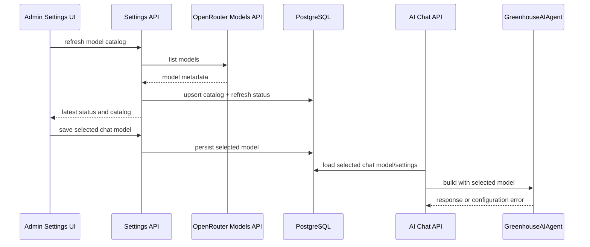

# feat: Add OpenRouter model settings

## Summary

Implement OpenRouter model settings as a database-backed admin capability: persist a refreshable model catalog, expose settings API endpoints, render NiceGUI controls for search/filter/selection, and resolve the saved chat model before constructing the Pydantic AI agent. Keep embedding model configuration visible but read-only so RAG vectors are not invalidated accidentally.

---

## Problem Frame

The current AI chat model is environment-driven, so model changes require config/deploy work instead of an admin action. The implementation must add runtime chat-model selection without widening the settings page into a secret-management surface or making embedding changes that would require RAG regeneration.

---

## Requirements

- R1. Admin settings must provide a manual refresh action for the OpenRouter model catalog.
- R2. The model catalog must be persisted so the admin UI can use the latest successful refresh without fetching OpenRouter on every page load.
- R3. The refresh experience must show status, including last refresh time, refresh failure state, and whether the selected chat model is present in the current catalog.
- R4. A failed refresh must not erase the previous successful model catalog.
- R5. Admins must be able to search OpenRouter models by model identity or display text available from catalog metadata.
- R6. Admins must be able to filter models by provider and capability categories derived from OpenRouter metadata.
- R7. The model list must show input and output prices per million tokens for each model when that pricing is available.
- R8. Admins must be able to save one global OpenRouter chat model, and AI chat must use that saved model instead of the environment-defined chat model.
- R9. The embedding model must be saved from application configuration and displayed in admin settings.
- R10. The embedding model must be read-only in admin settings and not changeable through this feature.
- R11. If the saved chat model is unavailable, invalid, or cannot be used, chat must block with a clear user-facing message instead of silently switching to another model.

**Origin actors:** A1 Admin, A2 Chat user, A3 System
**Origin flows:** F1 Refresh model catalog, F2 Select chat model, F3 Use configured model in chat
**Origin acceptance examples:** AE1 refresh failure preserves prior catalog, AE2 search/filter/save affects chat, AE3 read-only embedding model, AE4 unavailable chat model blocks without fallback

---

## Scope Boundaries

- Do not expose, edit, or persist OpenRouter API keys, bearer tokens, passwords, or safety settings through the settings page.
- Do not allow changing the embedding model from admin UI.
- Do not regenerate RAG content or change pgvector dimensions.
- Do not add per-user, per-greenhouse, or per-feature model settings.
- Do not add automatic scheduled model refresh.
- Do not add audit history for settings changes.
- Do not use live OpenRouter calls in tests.

### Deferred to Follow-Up Work

- User-specific OpenRouter `listForUser()` filtering: useful later if the app gains user auth/provider preference handling.
- Broader admin settings hub: keep this plan focused on OpenRouter model settings only.

---

## Context & Research

### Relevant Code and Patterns

- `app/config.py` defines `OpenRouterSettings`; extend it for embedding model/dimension config instead of leaving RAG embedding defaults hardcoded only in `app/services/rag/embedding_client.py`.
- `app/services/ai_agent/agent.py` constructs the Pydantic AI agent from `settings.openrouter.model` and persists that model in `AIMessage.model`; this is the chat model resolution seam.
- `app/api/ai_chat.py` constructs `GreenhouseAIAgent(session)` inside the chat endpoint; this endpoint can resolve the saved model before agent construction and map configuration failures to 503 responses.
- `app/ui/pages/settings.py` is currently a placeholder, and `tests/system/test_settings_page_scope.py` protects the settings page from exposing secrets or safety editing.
- `app/models/base.py`, `app/models/__init__.py`, and repository files under `app/repositories/` show the SQLAlchemy 2 async repository pattern to follow.
- `app/api/rag.py` builds `EmbeddingClient` from OpenRouter API key/base URL; it should pass configured embedding model/dimension while keeping the admin UI read-only.
- `tests/integration/test_migrations.py` asserts the full table set exactly, so new settings/catalog tables must be added there.

### Institutional Learnings

- `docs/solutions/ui-bugs/docker-compose-fastapi-nicegui-dashboard-launch-fix-2026-05-07.md`: keep NiceGUI mounted through the existing FastAPI app, import page modules explicitly, and verify installed NiceGUI component APIs before using new layout components.

### External References

- User-provided OpenRouter SDK Models reference: `https://openrouter.ai/docs/agent-sdk/typescript/api-reference/models/models`.
- OpenRouter model catalog endpoint: `https://openrouter.ai/api/v1/models`.
- Pydantic AI OpenRouter/OpenAI-compatible support is for model execution, not catalog persistence.

---

## Key Technical Decisions

- Use Python `httpx` for OpenRouter model catalog refresh: the project is a Python app, so the TypeScript SDK docs should inform API semantics without introducing a Node/TypeScript runtime dependency.
- Persist both normalized and raw catalog data: normalized fields support search, filters, and price display; raw metadata protects against OpenRouter catalog schema drift and future display needs.
- Use a small settings model plus catalog records rather than generic key/value settings only: selected chat model, embedding model, refresh status, and catalog rows have known behavior and benefit from typed access.
- Treat catalog refresh as replace/upsert on success only: successful refresh updates the catalog and status, while failed refresh records the error without deleting previous catalog data.
- Resolve the active chat model before building the Pydantic AI agent: this keeps the provider construction code simple and makes unavailable-model blocking explicit at the application boundary.
- Keep OpenRouter API key/base URL in environment configuration: admin settings must not become a secret-editing surface.

---

## Open Questions

### Resolved During Planning

- Should the TypeScript SDK be integrated directly? No. Use the user-provided SDK page as the contract reference, but implement catalog calls in Python with `httpx`.
- How should OpenRouter prices be handled? Parse string decimal per-token prices and store/display input/output prices per million tokens.
- Where should embedding model editability live? The embedding model is configured through env/example config, persisted/displayed read-only, and not editable in admin UI.

### Deferred to Implementation

- Exact OpenRouter capability labels: derive from `architecture.input_modalities`, `architecture.output_modalities`, and `supported_parameters` during implementation, then keep labels stable in UI/tests.
- Exact migration revision ID: generate or choose the next Alembic revision during implementation.
- Exact NiceGUI table/filter widget mix: choose components supported by the installed NiceGUI version while preserving required behavior.

---

## High-Level Technical Design

> *This illustrates the intended approach and is directional guidance for review, not implementation specification. The implementing agent should treat it as context, not code to reproduce.*

---

## Implementation Units

- U1. **Add persistent model settings schema**

**Goal:** Add typed PostgreSQL persistence for selected chat model, read-only embedding model metadata, catalog refresh status, and cached OpenRouter model metadata.

**Requirements:** R2, R3, R4, R8, R9, R10

**Dependencies:** None

**Files:**
- Create: `app/models/model_settings.py`
- Create: `app/repositories/model_settings_repository.py`
- Create: `migrations/versions/<revision>_create_model_settings.py`
- Modify: `app/models/__init__.py`
- Modify: `tests/integration/test_migrations.py`
- Test: `tests/unit/test_model_settings_repository.py`

**Approach:**
- Add ORM models for a singleton app/model settings record and catalog rows.
- Store selected chat model, configured embedding model, embedding dimension, refresh status/error/timestamps, normalized catalog fields, and raw OpenRouter metadata.
- Use repository methods for reading current settings, bootstrapping embedding settings from config, setting selected chat model, upserting successful catalog refreshes, recording refresh failures, and querying catalog rows.
- Keep repository methods commit-free; API endpoints should own commits following existing repository patterns.

**Patterns to follow:**
- `app/models/base.py` for UUID/timestamp mixins.
- `app/models/rag.py` for JSONB metadata naming conventions.
- `app/repositories/rag_repository.py` for async repository methods.
- `tests/integration/test_migrations.py` for metadata table assertions.

**Test scenarios:**
- Happy path: bootstrapping settings with configured embedding model creates or updates the singleton settings record without changing selected chat model.
- Happy path: saving a selected chat model persists the selected model and can be read back.
- Happy path: successful catalog upsert stores normalized provider/capability/pricing fields and raw metadata.
- Error path: recording refresh failure updates failure status/error while preserving existing catalog rows.
- Edge case: catalog query with empty search/filter returns all rows in deterministic display order.
- Edge case: catalog query with provider and capability filters returns only matching rows.

**Verification:**
- SQLAlchemy metadata includes the new tables.
- Repository tests prove settings and catalog behavior without a live OpenRouter call.

---

- U2. **Add OpenRouter model catalog client and config**

**Goal:** Implement a Python OpenRouter Models API client and centralize chat/embedding model configuration defaults.

**Requirements:** R1, R6, R7, R9

**Dependencies:** U1

**Files:**
- Create: `app/services/openrouter_models.py`
- Modify: `app/config.py`
- Modify: `app/services/rag/embedding_client.py`
- Modify: `app/api/rag.py`
- Modify: `.env.example`
- Test: `tests/unit/test_openrouter_models.py`
- Test: `tests/unit/test_config.py`

**Approach:**
- Add embedding model and embedding dimension to application config so `.env.example` documents exact embedding settings.
- Keep existing OpenRouter API key/base URL env-driven.
- Implement model listing with `httpx` against OpenRouter’s Models API semantics from the user-provided SDK docs and public catalog endpoint.
- Normalize provider, display name, context length, supported parameters, modalities, capability labels, and input/output price per million tokens.
- Use `Decimal` for catalog price normalization before converting to display/storage values.
- Update RAG embedding client construction to pass configured embedding model/dimension while preserving read-only admin behavior.

**Patterns to follow:**
- `app/services/rag/embedding_client.py` for external HTTP client error wrapping.
- `tests/unit/test_config.py` for env/default config coverage.

**Test scenarios:**
- Happy path: model list response with prompt/completion prices normalizes input/output price per million tokens.
- Happy path: supported parameters and modalities become provider/capability filters.
- Edge case: missing optional pricing or capability fields produces nullable/empty normalized values rather than failing the whole refresh.
- Error path: HTTP error from OpenRouter raises a refresh-specific service error with useful message.
- Error path: malformed catalog root or missing `data` raises a service error.
- Happy path: config default and env override tests cover chat model, embedding model, and embedding dimension.
- Integration: RAG embedding client builder passes configured embedding model/dimension.

**Verification:**
- OpenRouter catalog tests use mocked HTTP responses only.
- `.env.example` includes the read-only embedding model setting expected to appear in admin UI.

---

- U3. **Expose settings API endpoints**

**Goal:** Add FastAPI endpoints for reading settings/catalog state, refreshing the catalog, filtering models, and saving the selected chat model.

**Requirements:** R1, R2, R3, R4, R5, R6, R7, R8, R9, R10

**Dependencies:** U1, U2

**Files:**
- Create: `app/api/settings.py`
- Create: `app/schemas/model_settings.py`
- Modify: `app/main.py`
- Test: `tests/integration/test_settings_api.py`

**Approach:**
- Provide a settings summary endpoint returning selected chat model, read-only embedding model, refresh status, and selected-model availability.
- Provide catalog list endpoint supporting search, provider filter, and capability filter.
- Provide manual refresh endpoint that calls the OpenRouter catalog client, persists successful refreshes, commits success, records failures without deleting prior catalog, and returns status.
- Provide selected-chat-model update endpoint that validates the model exists in the cached catalog before saving.
- Avoid returning secrets or secret-derived config values.

**Patterns to follow:**
- `app/api/ai_chat.py` for router shape, dependency injection, and commit ownership.
- `app/schemas/rag.py` for reusable Pydantic response/request schemas.

**Test scenarios:**
- Covers AE1. Given existing catalog rows, when refresh client raises an error, API returns failure status and prior catalog remains queryable.
- Covers AE2. Given catalog rows with provider/capability/pricing metadata, list endpoint applies search and filters and returns input/output per-million prices.
- Covers AE2. Given an existing catalog model, saving it as selected chat model updates settings and commits.
- Edge case: attempting to save a model ID not in the cached catalog returns a client error and does not change selected chat model.
- Covers AE3. Settings summary includes embedding model/dimension as read-only values and excludes any editable embedding endpoint.
- Error path: missing OpenRouter API key/base URL for refresh is surfaced as refresh failure without exposing secret values.

**Verification:**
- API tests cover success and failure paths with mocked repository/client collaborators.
- FastAPI app registers the settings router.

---

- U4. **Use selected chat model in AI chat**

**Goal:** Make AI chat load the persisted selected chat model and block clearly when the selected model cannot be used.

**Requirements:** R8, R11

**Dependencies:** U1, U3

**Files:**
- Modify: `app/services/ai_agent/agent.py`
- Modify: `app/api/ai_chat.py`
- Test: `tests/unit/test_ai_agent_model_settings.py`
- Test: `tests/integration/test_ai_chat_api.py`
- Test: `tests/integration/test_ai_conversation_persistence.py`

**Approach:**
- Add an explicit construction path that receives the active chat model resolved from DB settings rather than reading `settings.openrouter.model` directly.
- Keep env chat model as initial/bootstrap/default only when no persisted selected chat model exists, not as silent fallback after a saved model becomes invalid.
- Validate selected model availability against cached catalog before agent execution when catalog data exists.
- Persist assistant message `model` using the resolved active model.
- Map unavailable/invalid selected model to a clear 503-style API error so the NiceGUI chat page can display it through existing error handling.

**Patterns to follow:**
- `app/services/ai_agent/agent.py` for provider/model construction and `AIConfigurationError` mapping.
- `app/api/ai_chat.py` existing error handling for agent configuration failures.
- Existing AI chat tests that patch `GreenhouseAIAgent`.

**Test scenarios:**
- Covers AE2. Given selected model `anthropic/example`, when chat succeeds, `GreenhouseAIAgent` builds with that model and persisted assistant message records it.
- Covers AE4. Given selected model is absent from the current catalog, chat returns a blocking error and does not construct a fallback model.
- Covers AE4. Given selected model exists in settings/catalog but the provider rejects it during execution, chat returns a clear blocking error and does not retry with a fallback model.
- Error path: OpenRouter API key missing still returns configuration error without exposing key details.
- Edge case: no selected chat model exists yet, initial bootstrap uses configured env chat model and records it as the selected setting.
- Integration: chat endpoint commits only after successful chat and selected-model resolution.

**Verification:**
- Chat behavior is deterministic in tests with mocked agent/model settings repository.
- No fallback silently changes the model when a saved model is unavailable.

---

- U5. **Replace settings placeholder with admin model settings UI**

**Goal:** Render the admin settings page for catalog refresh, model search/filter/comparison, chat model selection, refresh status, selected-model availability, and read-only embedding model display.

**Requirements:** R1, R3, R5, R6, R7, R8, R9, R10, R11

**Dependencies:** U3, U4

**Files:**
- Modify: `app/ui/pages/settings.py`
- Modify: `tests/system/test_settings_page_scope.py`
- Test: `tests/unit/test_settings_view_models.py`

**Approach:**
- Build the NiceGUI page against the settings API rather than calling OpenRouter directly from UI code.
- Show manual refresh button, last refresh status/time/error, selected-model availability, read-only embedding model, search input, provider filter, capability filter, model list, input/output price per million tokens, and save action.
- Keep API key/token/password/safety strings and controls out of the UI source to preserve the existing system-scope safety test.
- Add small view-model helpers if needed to format prices, missing metadata, availability, and filter options without bloating the page function.

**Patterns to follow:**
- `app/ui/pages/ai_chat.py` for `api_client`, error display, and relative API calls.
- `app/ui/layouts/main_layout.py` for page structure.
- Prior NiceGUI learning: verify components against installed NiceGUI and avoid unsupported components.

**Test scenarios:**
- Covers AE2. Given model rows with provider, capabilities, and prices, view-model formatting exposes searchable/filterable display values and per-million prices.
- Covers AE2. Given supported NiceGUI/page test hooks, search/filter/save controls call the settings API with the selected provider, capability, search text, and chat model ID.
- Covers AE3. Settings page source includes read-only embedding model display but no editing action for embedding settings.
- Covers AE1. Settings page source includes manual refresh and refresh-status/error rendering paths.
- Safety regression: settings page source does not include `password`, `token`, `api_key`, or `safety`.
- Edge case: missing price/capability metadata renders an understandable empty/unknown state.

**Verification:**
- The placeholder assertion is removed and replaced with feature-specific source/view-model coverage.
- UI uses only app API endpoints and does not expose OpenRouter secrets.

---

- U6. **Update documentation and operational notes**

**Goal:** Document model settings behavior, env/example configuration, and operational constraints for refresh and embedding model visibility.

**Requirements:** R8, R9, R10, R11

**Dependencies:** U1, U2, U3, U4, U5

**Files:**
- Modify: `README.md`
- Modify: `docs/AI_AGENT.md`
- Modify: `docs/RAG.md`
- Modify: `docs/DATABASE.md`
- Modify: `.env.example`
- Test: `tests/system/test_settings_page_scope.py`

**Approach:**
- Explain that chat model selection is database-backed and editable through admin settings.
- Explain that embedding model is configured through environment/example config and shown read-only in admin settings.
- Document that changing embedding config outside the UI can require RAG reindexing and dimension compatibility checks.
- Update database docs with the new settings/catalog tables at a high level.

**Patterns to follow:**
- Existing concise docs under `docs/`.
- `docs/DATABASE.md` existing warning about embedding dimensions.

**Test scenarios:**
- Test expectation: none for prose docs beyond existing source/system checks; documentation should be reviewed manually for consistency with implemented behavior.

**Verification:**
- Docs mention admin chat model selection, read-only embedding model display, and no silent fallback behavior.

---

## System-Wide Impact

- **Interaction graph:** Admin settings UI talks to settings API; settings API uses OpenRouter catalog client and settings repository; AI chat API resolves settings before constructing `GreenhouseAIAgent`; RAG API reads embedding config for embedding client construction.
- **Error propagation:** OpenRouter refresh errors should surface in settings status without deleting catalog data; selected-model unavailability should surface to chat as a blocking user-facing error.
- **State lifecycle risks:** Catalog refresh is a partial-update risk; persist success atomically and record failures separately. Selected chat model and catalog availability can drift after refresh.
- **API surface parity:** The NiceGUI settings page and any future agent/admin tooling should use the same settings API, not direct DB/OpenRouter access.
- **Integration coverage:** Need cross-layer tests for refresh failure preserving catalog, selected model affecting chat, and settings page not exposing secrets.
- **Unchanged invariants:** LLM still cannot directly control actuators; OpenRouter secrets remain environment-configured; embedding vector dimension remains fixed for existing RAG data.

---

## Risks & Dependencies

| Risk | Mitigation |
|------|------------|
| OpenRouter model response schema changes | Store raw metadata and normalize only fields needed for current UI; tests cover missing optional fields. |
| Price precision errors | Parse string prices with `Decimal` and convert per-token prices to per-million display values explicitly. |
| Failed refresh erases usable catalog | Repository refresh success and failure paths are separate; tests cover preservation. |
| Saved model disappears after refresh | Settings status reports selected-model availability and chat blocks instead of silently falling back. |
| Embedding model appears editable or changes accidentally | Keep embedding changes out of API/UI; source/system tests assert no editing surface. |
| New migration/table breaks metadata tests | Update `tests/integration/test_migrations.py` with expected tables and columns. |
| NiceGUI component mismatch | Use installed NiceGUI-supported primitives already used in the repo, or verify components during implementation. |

---

## Documentation / Operational Notes

- Add `.env.example` entries for the exact chat default, embedding model, and embedding dimension.
- Document that OpenRouter model refresh is manual and uses the Models API through the backend.
- Document that embedding model changes remain an operator/config responsibility and may require RAG reindexing outside this feature.
- Do not run destructive database commands while implementing migrations; use normal Alembic migration flow.

---

## Sources & References

- **Origin document:** [docs/brainstorms/2026-05-08-openrouter-model-settings-requirements.md](../brainstorms/2026-05-08-openrouter-model-settings-requirements.md)
- Related code: `app/config.py`
- Related code: `app/services/ai_agent/agent.py`
- Related code: `app/api/ai_chat.py`
- Related code: `app/ui/pages/settings.py`
- Related code: `app/services/rag/embedding_client.py`
- Related code: `app/api/rag.py`
- Related code: `tests/system/test_settings_page_scope.py`
- Related code: `tests/integration/test_migrations.py`
- Institutional learning: `docs/solutions/ui-bugs/docker-compose-fastapi-nicegui-dashboard-launch-fix-2026-05-07.md`
- OpenRouter Models SDK reference: `https://openrouter.ai/docs/agent-sdk/typescript/api-reference/models/models`
- OpenRouter model catalog endpoint: `https://openrouter.ai/api/v1/models`
