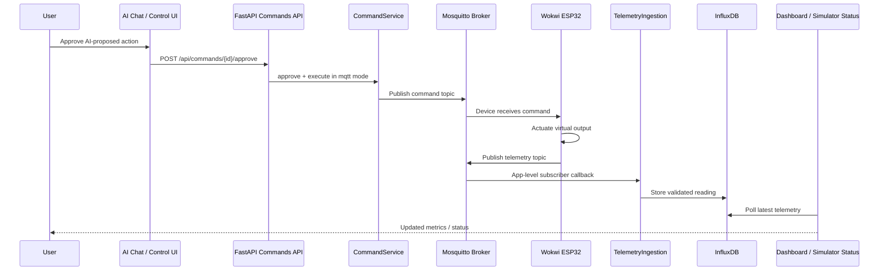

# Wokwi MQTT Mode for AI-Driven Greenhouse Control

## Summary

Add a Wokwi/MQTT operational mode where AI-approved greenhouse actions are published as MQTT commands to Wokwi ESP32 simulator devices, and Wokwi devices publish telemetry back into the existing InfluxDB pipeline. This plan connects the existing command publisher and telemetry ingestion services into the app lifecycle, updates Mosquitto configuration for the current topic hierarchy, and adds reference Wokwi firmware/projects for virtual greenhouse zones.

---

## Problem Frame

The codebase already contains MQTT primitives (`MQTTService`, `CommandPublisher`, `TelemetryIngestion`, canonical topic builders), but the runtime loop is incomplete: inbound MQTT telemetry is not subscribed at app startup, the Mosquitto ACL still references an old topic hierarchy, and no Wokwi firmware/project exists to act as a real simulated device. AI-approved actions can be logged and published, but there is no end-to-end Wokwi loop from command → device action → telemetry response → UI update.

---

## Requirements

- R1. The system must support a Wokwi/MQTT operational mode alongside Internal Simulator mode
- R2. In Wokwi/MQTT mode, approved AI or manual commands must be published to MQTT command topics matching `app/core/mqtt_topics.py`
- R3. Wokwi ESP32 devices must subscribe to command topics and actuate virtual outputs (pump, fan, heater, lamp)
- R4. Wokwi ESP32 devices must publish telemetry messages for temperature, air_humidity, soil_moisture, co2, light, and actuator state metrics back to MQTT
- R5. The FastAPI app must subscribe to MQTT telemetry topics at startup and route messages through `TelemetryIngestion` into InfluxDB
- R6. Mosquitto configuration and ACLs must allow the app and Wokwi devices to read/write the canonical `greenhouse-groups/...` topic hierarchy
- R7. The UI must make mode selection visible and clearly show whether Wokwi/MQTT is connected, receiving telemetry, and publishing commands
- R8. The implementation must preserve the existing command proposal and safety validation flow

---

## Scope Boundaries

- Internal Simulator animated visual feedback is handled in Plan 1
- Physical hardware support beyond Wokwi virtual ESP32s is out of scope
- TLS/MQTTS and production device credentials are out of scope for v1; local development may use unauthenticated or simple username/password MQTT
- Device provisioning, OTA firmware updates, and fleet management are out of scope
- Building a public hosted MQTT broker is out of scope; use local Mosquitto via Wokwi Private Gateway or a public broker for demos
- Device acknowledgment semantics are limited in v1: command `executed` means "published to MQTT", not "device confirmed actuation"

### Deferred to Follow-Up Work

- Device acknowledgment/state topic support (`state` channel) with command status updated only after Wokwi confirms receipt
- TLS and authenticated per-device credentials
- Multi-device fleet provisioning and device registry UI
- Production-grade MQTT observability dashboards

---

## Context & Research

### Relevant Code and Patterns

- `app/core/mqtt_topics.py` — canonical topic builders: telemetry, commands, alerts, state
- `app/services/mqtt_service.py` — async MQTT service with connect, publish, subscribe, listen, auto-reconnect
- `app/services/telemetry_ingestion.py` — parses MQTT topics, validates telemetry envelope, writes to telemetry repository
- `app/services/command_publisher.py` — publishes CommandLog payloads to MQTT command topics
- `app/services/command_service.py` — command lifecycle and execution path
- `app/api/commands.py` — command propose/approve/reject endpoints
- `app/api/simulator.py` — internal simulator mode; should not run simultaneously against same group as Wokwi mode
- `app/ui/pages/simulator.py` — place for mode selector and Wokwi connection status panel
- `app/ui/pages/control.py` — existing manual command flow
- `app/ui/pages/ai_chat.py` — AI-generated proposed actions
- `app/schemas/telemetry.py` — `TelemetryEnvelope` / `TelemetryReading` payload contract
- `infra/mosquitto/acl.conf` — currently uses old topic hierarchy and must be updated
- `infra/mosquitto/mosquitto.conf` — broker listener/auth config
- `compose.override.yml` — local port mappings for Mosquitto (`127.0.0.1:11883`)

### Institutional Learnings

- Runtime assets must be mounted/copied in Docker; Wokwi firmware templates or static docs should be included intentionally if served by the app
- NiceGUI/FastAPI startup must import all pages before `ui.run_with(app)`; MQTT startup hooks should be registered in FastAPI lifespan without disrupting NiceGUI mounting

### External References

- Wokwi ESP32 uses `Wokwi-GUEST` WiFi for simulated networking
- Wokwi Public Gateway can reach public MQTT brokers, but cannot reach local Docker services
- Wokwi Private Gateway can reach host services via `host.wokwi.internal`, recommended for local Mosquitto integration
- PubSubClient works in Wokwi but defaults to 256-byte MQTT packets; telemetry JSON requires increasing buffer size to 1024
- Wokwi projects are defined by `diagram.json` and `sketch.cpp`/`sketch.ino`, optionally `wokwi.toml` for VS Code

---

## Key Technical Decisions

- **Use the existing MQTT topic hierarchy**: All Wokwi firmware and Mosquitto ACLs must match `greenhouse-groups/{group_id}/greenhouses/{greenhouse_id}/zones/{zone_id}/{channel}`. Do not introduce a second Wokwi-specific topic scheme
- **FastAPI lifespan owns MQTT subscription**: Start an app-level MQTT listener task during FastAPI startup and cancel it on shutdown. This wires `TelemetryIngestion` into the runtime without requiring a separate process
- **Command execution remains safety-first**: Wokwi/MQTT mode keeps the existing `propose` → validation → approval → execution path. AI tools still only propose actions; user approval remains required
- **Wokwi firmware is a reference device**: Add a `firmware/wokwi-greenhouse-zone/` project that represents one zone. Scaling to more zones happens by changing group/greenhouse/zone constants or duplicating the project, not by adding provisioning infrastructure
- **Command status v1 means publish success**: For v1, `executed` means the app successfully published a command to MQTT. Device acknowledgment is deferred to keep the first Wokwi integration bounded
- **Mode exclusivity per group**: Internal Simulator and Wokwi/MQTT should not both generate telemetry for the same group simultaneously. The UI should warn or stop the internal simulator before enabling Wokwi/MQTT for the same group

---

## Open Questions

### Resolved During Planning

- **Local Wokwi connection strategy**: Prefer Wokwi Private Gateway + `host.wokwi.internal:11883` for local Mosquitto; allow public broker env override for users without Private Gateway
- **Firmware library**: Use Arduino framework with PubSubClient and ArduinoJson; increase MQTT buffer size to 1024
- **MQTT subscription ownership**: FastAPI app lifecycle starts/stops the telemetry subscriber
- **Topic structure**: Use `app/core/mqtt_topics.py` as the source of truth

### Deferred to Implementation

- **Exact Wokwi sensor calibration**: Final map functions from analog sensor values to greenhouse metrics depend on chosen Wokwi parts
- **Public broker fallback UX**: Whether to expose public broker setup in UI or docs only can be decided during implementation
- **Multiple zone firmware layout**: v1 can support one reference zone; multi-zone expansion can duplicate projects or introduce configurable identity later

---

## Output Structure

    firmware/
      wokwi-greenhouse-zone/
        diagram.json
        platformio.ini
        wokwi.toml
        src/
          main.cpp

---

## High-Level Technical Design

> *This illustrates the intended approach and is directional guidance for review, not implementation specification. The implementing agent should treat it as context, not code to reproduce.*



---

## Implementation Units

- U1. **MQTT Runtime Subscriber Lifecycle**

**Goal:** Start a background MQTT subscriber when the FastAPI app starts so inbound telemetry from Wokwi devices is ingested into InfluxDB.

**Requirements:** R4, R5

**Dependencies:** None

**Files:**
- Create: `app/services/mqtt_runtime.py`
- Modify: `app/main.py`
- Modify: `app/services/telemetry_ingestion.py` (if needed for callback ergonomics)
- Test: `tests/unit/test_mqtt_runtime.py`

**Approach:**
- Create `MQTTRuntime` service that owns one long-running listener task using `MQTTService.listen()` (which manages its own aiomqtt client connection)
- On startup, connect to MQTT, subscribe to `greenhouse-groups/+/greenhouses/+/zones/+/telemetry`, and pass each message to `TelemetryIngestion.handle_message()`
- **Important:** Verify that `app/core/mqtt_topics.py`'s `all_telemetry_topic()` returns `"greenhouse-groups/+/greenhouses/+/zones/+/telemetry"` (six segments), not `"greenhouse-groups/+/+/+/telemetry"` (three wildcards). If the builder uses fewer wildcards, update it before U1 begins and add a unit test confirming the wildcard pattern matches each individual `telemetry_topic()` output
- On shutdown, cancel the task and disconnect cleanly
- Surface connection state (connected, reconnecting, last_message_at, error) for the UI status panel
- Ensure listener task failures are logged and retried using the existing reconnect pattern in `MQTTService`

**Patterns to follow:**
- `app/services/mqtt_service.py` — existing connection and listen loop
- `app/services/telemetry_ingestion.py` — payload parsing and repository writes
- FastAPI lifespan pattern in `app/main.py`

**Test scenarios:**
- Happy path: runtime starts → subscribes to telemetry topic → received payload calls telemetry ingestion
- Happy path: shutdown cancels listener task without leaving pending asyncio tasks
- Error path: MQTT connection fails → status reflects reconnecting/error, app remains running
- Error path: invalid telemetry payload → ingestion logs validation error and listener continues
- Integration: publish Wokwi-shaped telemetry payload → repository write is invoked

**Verification:**
- App subscribes to telemetry topics at startup
- Incoming MQTT messages reach `TelemetryIngestion`
- Subscriber survives invalid messages and reconnect scenarios

---

- U2. **Mosquitto Topic and ACL Alignment**

**Goal:** Update Mosquitto configuration so Wokwi devices and the backend can use the canonical topic hierarchy.

**Requirements:** R2, R4, R6

**Dependencies:** None

**Files:**
- Modify: `infra/mosquitto/acl.conf`
- Modify: `infra/mosquitto/mosquitto.conf`
- Modify: `compose.override.yml` (only if host port or listener changes are needed)
- Test: `tests/unit/test_mqtt_topics.py`

**Approach:**
- Replace old ACL entries (`greenhouse/+/telemetry/#`) with the canonical topic hierarchy matching `app/core/mqtt_topics.py`
- Grant backend read/write to `greenhouse-groups/#`
- Grant Wokwi/device user write access to telemetry/state and read access to commands
- **Migration concern:** The existing internal simulator publishes telemetry under the old `greenhouse/...` hierarchy. The ACL update must be coordinated with Plan 1's simulated telemetry migration to the new hierarchy. Deploy both changes together to avoid dropping the internal simulator's telemetry during transition
- Keep local development port mapping compatible with Wokwi Private Gateway (`host.wokwi.internal:11883`)
- Do not weaken production auth defaults unless explicitly separated into dev-only override config

**Patterns to follow:**
- `app/core/mqtt_topics.py` — source of truth for topic structure
- Existing Mosquitto config files under `infra/mosquitto/`

**Test scenarios:**
- Happy path: backend user can publish commands and read telemetry
- Happy path: Wokwi/device user can read commands and publish telemetry
- Error path: device user cannot write arbitrary admin topics outside `greenhouse-groups/#`
- Integration: topic built by `mqtt_topics.command_topic()` matches ACL-permitted command pattern

**Verification:**
- ACL rules match the app's topic builders
- Wokwi devices can connect and exchange MQTT messages with local broker

---

- U3. **Mode-Aware Command Publishing for Wokwi/MQTT**

**Goal:** Ensure commands created in Wokwi/MQTT mode are published to MQTT using existing `CommandPublisher`, while preserving proposal, safety validation, and approval flow.

**Requirements:** R1, R2, R8

**Dependencies:** U1, U2

**Files:**
- Modify: `app/services/command_service.py`
- Modify: `app/services/command_publisher.py`
- Modify: `app/models/command.py`
- Test: `tests/unit/test_command_mqtt_mode.py`

**Approach:**
- This plan owns the `mode` field on `CommandLog`. Field type: `VARCHAR(16)` with values `simulator` | `mqtt`, default `simulator`. Plan 1 consumes it through the shared `mode_router.py`
- For `mode = mqtt`, approved commands publish through `CommandPublisher.publish()` exactly once
- Command payload must contain actuator, action, value, duration_seconds, and command_id so Wokwi firmware can act and log serial output
- Use QoS 1 for command topic publishing (backend `CommandPublisher`) and QoS 1 subscription (firmware) to guarantee delivery. Update `MQTTService.publish()` to accept a qos parameter if needed
- Keep status semantics: publish success transitions to `executed`; publish failure transitions to `failed`
- Preserve validation through `SafetyValidator` before publishing

**Patterns to follow:**
- `app/services/command_publisher.py` — current MQTT payload builder
- `app/services/command_service.py` — current command state transitions
- `app/api/commands.py` — approval endpoint contract

**Test scenarios:**
- Happy path: approved MQTT-mode watering command publishes to command topic with expected payload
- Happy path: approved lamp command publishes action and target zone
- Error path: MQTT publish raises → command marked failed with error
- Edge case: command was created in simulator mode but current UI mode changed to MQTT → executes in original command mode
- Integration: AI-proposed command → approval endpoint → `CommandPublisher.publish()` called

**Verification:**
- MQTT-mode commands publish to correct topics
- Safety validation remains enforced
- Command status transitions are correct on publish success/failure

---

- U4. **Wokwi Greenhouse Zone Firmware Project**

**Goal:** Add a reference Wokwi ESP32 project that subscribes to greenhouse command topics, actuates virtual outputs, and publishes telemetry matching the backend schema.

**Requirements:** R3, R4

**Dependencies:** U2

**Files:**
- Create: `firmware/wokwi-greenhouse-zone/diagram.json`
- Create: `firmware/wokwi-greenhouse-zone/platformio.ini`
- Create: `firmware/wokwi-greenhouse-zone/wokwi.toml`
- Create: `firmware/wokwi-greenhouse-zone/src/main.cpp`

**Approach:**
- Use ESP32 DevKit with DHT22 for temperature/humidity, potentiometers for soil moisture/light/co2, and LEDs for actuator outputs
- Connect to `Wokwi-GUEST` WiFi and MQTT broker (default `host.wokwi.internal:11883`, configurable constants)
- Subscribe to command topic for one configured group/greenhouse/zone
- Use QoS 1 for command topic subscription (backend publishes at QoS 1, consistent with U3)
- Publish one telemetry envelope per metric every 5 seconds at QoS 0 (telemetry is not critical)
- Increase PubSubClient buffer size to 1024 to support nested JSON telemetry payloads
- Use ArduinoJson for payload parsing and serialization
- Actuator command handling:
  - pump: turn blue LED on/off; publish pump_state
  - fan: drive fan LED or simulated power value; publish fan_power
  - heater: turn red/orange LED on/off; publish heater_power
  - lamp: turn yellow LED on/off; publish lamp_state
- Telemetry payload must match `TelemetryEnvelope` schema exactly:
  ```json
  {
    "message_id": "esp32-12345",
    "reading": {
      "group_id": "group-001",
      "greenhouse_id": "gh-001",
      "zone_id": "zone-01",
      "sensor_id": "temp-zone-01",
      "metric": "temperature",
      "value": 24.5,
      "quality": "ok",
      "timestamp": "2026-05-11T12:00:00Z"
    }
  }
  ```
  Each metric is a separate message with its own `sensor_id` and `metric`. Validate against `app/schemas/telemetry.py` during testing

**Patterns to follow:**
- `app/schemas/telemetry.py` — payload contract
- `app/core/mqtt_topics.py` — topic structure
- `services/simulator/main.py` — existing Python MQTT simulator payload shape if present

**Test scenarios:**
- Happy path: Wokwi connects to WiFi and MQTT broker
- Happy path: Wokwi publishes valid temperature telemetry accepted by backend
- Happy path: Wokwi receives pump command and toggles pump LED
- Happy path: Wokwi publishes actuator state telemetry after command
- Edge case: broker unavailable → firmware retries connection without crashing
- Error path: malformed command payload → serial log error, loop continues

**Verification:**
- Wokwi project starts and connects to MQTT
- Backend receives and stores telemetry from Wokwi
- Commands from app appear in Wokwi serial monitor and change virtual outputs

---

- U5. **Wokwi/MQTT Mode UI Status Panel**

**Goal:** Make Wokwi/MQTT mode visible in the UI with connection status, last telemetry timestamp, broker configuration, and guidance for launching the Wokwi project.

**Requirements:** R1, R7

**Dependencies:** U1, U4

**Files:**
- Modify: `app/ui/pages/simulator.py`
- Create: `app/ui/components/mqtt_status_panel.py`
- Create: `app/api/mqtt_status.py`
- Modify: `app/main.py` (register status router)
- Test: `tests/unit/test_mqtt_status_panel.py`

**Approach:**
- Add Wokwi/MQTT option to the mode selector introduced in Plan 1
- When selected, show a status panel with:
  - broker host/port
  - subscriber state: connected/reconnecting/error
  - last telemetry received timestamp
  - most recent topic received
  - Wokwi launch instructions/path to firmware project
- Add `GET /api/mqtt/status` endpoint reading from `MQTTRuntime` state
- Use `ui.timer(3.0, refresh_mqtt_status)` to update the panel, with adaptive interval: poll every 3s when reconnecting, every 15s when connected and stable. Stop polling when mode is not Wokwi/MQTT
- If the internal simulator is running for the same group, warn the user before enabling Wokwi/MQTT mode to avoid conflicting telemetry sources

**Patterns to follow:**
- `app/ui/pages/simulator.py` — existing status card layout
- `app/ui/components/telemetry_cards.py` — badges and color states
- NiceGUI `ui.timer()` for status refresh

**Test scenarios:**
- Happy path: MQTT connected → status panel shows connected and latest telemetry
- Happy path: no telemetry yet → status panel shows connected but waiting for device
- Error path: MQTT disconnected → status panel shows reconnecting/error state
- Edge case: internal simulator running → UI warns before enabling Wokwi/MQTT

**Verification:**
- Users can see whether Wokwi/MQTT mode is connected and receiving data
- Status updates without page refresh
- UI prevents or warns about simulator/MQTT source conflicts

---

- U6. **Documentation and Developer Setup Flow**

**Goal:** Document how to run Wokwi/MQTT mode locally, including Private Gateway setup, public broker fallback, and expected telemetry/command topics.

**Requirements:** R6, R7

**Dependencies:** U1, U2, U4, U5

**Files:**
- Modify: `README.md` (or existing project docs if present)
- Create: `docs/wokwi-mqtt-mode.md`
- Test expectation: none — documentation-only unit

**Approach:**
- Document the local development flow:
  1. Start Docker Compose services
  2. Confirm Mosquitto is reachable on host port 11883
  3. Start Wokwi Private Gateway
  4. Open `firmware/wokwi-greenhouse-zone` in Wokwi/VS Code
  5. Confirm ESP32 serial logs show MQTT connected
  6. Use AI chat or control page to approve a command
  7. Observe Wokwi LED/serial output and telemetry in the app
- Include public broker fallback instructions for users without Private Gateway
- Explain v1 command status semantics: `executed` means "published to broker"
- List canonical topics and payload examples at a high level

**Patterns to follow:**
- Existing documentation style in `docs/solutions/`
- Docker operational notes from prior NiceGUI/Docker learnings

**Test scenarios:**
- Test expectation: none — documentation-only unit

**Verification:**
- A developer can follow the docs to connect Wokwi ESP32 to local Mosquitto and see telemetry in the app

---

## System-Wide Impact

- **Interaction graph:** AI chat/control page → CommandService → CommandPublisher → Mosquitto → Wokwi → Mosquitto → MQTTRuntime → TelemetryIngestion → InfluxDB → dashboard/status UI. This is the first full device loop in the application runtime.
- **Error propagation:** MQTT publish failures mark commands failed. MQTT subscriber failures update runtime status and retry without crashing the FastAPI app. Invalid telemetry is logged and ignored.
- **State lifecycle risks:** MQTT runtime task must start once per app process and stop cleanly. Duplicate subscribers could ingest duplicate telemetry; lifecycle ownership must be centralized.
- **API surface parity:** Existing command APIs remain unchanged. New `/api/mqtt/status` endpoint exposes runtime state. Topic hierarchy becomes externally consumed by Wokwi firmware, so future changes become contract changes.
- **Integration coverage:** End-to-end behavior requires integration tests or manual verification with a broker: app publishes command, Wokwi receives, Wokwi publishes telemetry, app ingests.
- **Unchanged invariants:** AI tools continue to propose actions only. User approval remains required before command execution. Safety validation remains the gate before publishing to MQTT.

---

## Risks & Dependencies

| Risk | Mitigation |
|------|------------|
| Wokwi Public Gateway cannot reach local Docker Mosquitto | Recommend Wokwi Private Gateway for local development; provide public broker fallback docs |
| Mosquitto ACL mismatch blocks messages | Align ACL with `app/core/mqtt_topics.py` and add tests ensuring topic builders match allowed patterns |
| PubSubClient 256-byte default buffer truncates telemetry JSON | Set MQTT buffer size to 1024 in firmware and keep payloads compact |
| Duplicate telemetry if internal simulator and Wokwi run for same group | Warn/prevent mode conflict in UI; document mode exclusivity per group |
| Command `executed` status may imply device acted when only MQTT publish succeeded | Document v1 semantics clearly and defer device acknowledgment to follow-up |
| App startup blocked by MQTT unavailable | MQTT runtime must run as background task and not block FastAPI/NiceGUI startup |

---

## Documentation / Operational Notes

- Wokwi Private Gateway is recommended for local development because local Mosquitto is mapped to `127.0.0.1:11883`
- Public MQTT broker fallback should only be used with non-sensitive demo data
- If Mosquitto auth is enabled, Wokwi firmware must include the configured username/password
- Topic hierarchy in firmware is now an external contract; changes to `app/core/mqtt_topics.py` require firmware updates
- The new `firmware/` directory is a runtime/developer asset, not imported by Python; Docker image updates are only needed if the app serves firmware docs/assets directly

---

## Sources & References

- Codebase: `app/core/mqtt_topics.py`, `app/services/mqtt_service.py`, `app/services/telemetry_ingestion.py`, `app/services/command_publisher.py`, `app/services/command_service.py`, `infra/mosquitto/acl.conf`, `infra/mosquitto/mosquitto.conf`
- Wokwi docs: ESP32 WiFi simulation, IoT Gateway, diagram format, VS Code workflow
- PubSubClient docs: MQTT publish/subscribe library for Arduino/ESP32, buffer size considerations
- Plan 1: `docs/plans/2026-05-11-001-feat-simulator-animated-visual-feedback-plan.md`
