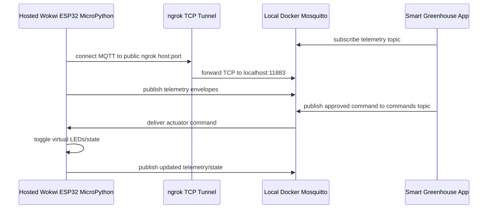

# Wokwi MicroPython MQTT via ngrok

## Summary

Replace the current Wokwi C++ reference firmware with a MicroPython-first Wokwi ESP32 project and document a local development flow where hosted Wokwi connects to the developer's Docker Mosquitto broker through an ngrok TCP tunnel. The app-side MQTT runtime, command publishing, topic hierarchy, and status panel from the Wokwi/MQTT plan remain the backend foundation.

---

## Problem Frame

The existing Wokwi integration was implemented as an Arduino/C++ `PlatformIO` project using PubSubClient. The user's intended workflow is Python-oriented: run a MicroPython script in Wokwi and connect it to the local Docker Mosquitto broker while using the hosted Wokwi website, which cannot directly reach `localhost` without a tunnel.

---

## Requirements

- R1. Replace the Wokwi firmware example with a MicroPython ESP32 project, not C++/PlatformIO.
- R2. The MicroPython script must subscribe to canonical command topics and publish telemetry envelopes matching `app/schemas/telemetry.py`.
- R3. The hosted Wokwi site must be able to reach local Docker Mosquitto through an ngrok TCP tunnel.
- R4. Documentation must explain how to start Docker Mosquitto, expose it with ngrok, copy the generated host/port into MicroPython config, and verify telemetry/commands.
- R5. Existing app-side MQTT behavior must remain unchanged: `CommandPublisher`, `MQTTRuntime`, canonical topics, and status API stay source of truth.
- R6. Tests must catch regressions where C++ firmware files remain authoritative or MicroPython files stop matching topic/payload contracts.

---

## Scope Boundaries

- Do not self-host the Wokwi web simulator; Wokwi remains hosted.
- Do not add production TLS/device provisioning.
- Do not change app-side MQTT topic hierarchy.
- Do not replace Mosquitto with a public MQTT broker as the primary path.
- Do not make ngrok credentials part of the repository.

### Deferred to Follow-Up Work

- Device acknowledgements that update command status only after ESP32 receipt.
- Optional UI fields for editing the Wokwi broker host/port directly from the app.
- TLS/authenticated per-device credentials for production deployments.

---

## Context & Research

### Relevant Code and Patterns

- `firmware/wokwi-greenhouse-zone/src/main.cpp` — current C++ firmware to replace or demote.
- `firmware/wokwi-greenhouse-zone/diagram.json` — Wokwi device layout can be reused for MicroPython.
- `docs/wokwi-mqtt-mode.md` — current setup documentation to update from Private Gateway/C++ to ngrok/MicroPython.
- `app/core/mqtt_topics.py` — canonical topic hierarchy.
- `app/schemas/telemetry.py` — telemetry envelope payload contract.
- `app/services/command_publisher.py` — command payload shape sent to devices.
- `tests/unit/test_wokwi_firmware.py` — existing firmware structure tests to update.

### Institutional Learnings

- Runtime/developer assets should be explicitly documented and tested when they are part of setup flow.
- Docker/NiceGUI development docs should call out host/container networking assumptions clearly.

### External References

- Wokwi supports ESP32 MicroPython projects and hosted networking via `Wokwi-GUEST`.
- ngrok TCP tunnels expose a local TCP service as a public host/port pair, which fits MQTT broker access for hosted Wokwi.

---

## Key Technical Decisions

- **Use MicroPython as the only authoritative firmware example:** Replace `src/main.cpp` / `platformio.ini` with MicroPython-oriented files so future users do not follow the wrong language path.
- **Use ngrok TCP as the primary hosted-Wokwi connection path:** Hosted Wokwi can connect to a public TCP endpoint, while local Docker Mosquitto remains the broker.
- **Keep broker identity explicit in `config.py`:** MicroPython firmware should isolate `MQTT_HOST`, `MQTT_PORT`, `MQTT_USER`, and `MQTT_PASSWORD` in one config file so users paste ngrok values without editing core logic.
- **Keep app-side MQTT contracts unchanged:** The firmware adapts to `app/core/mqtt_topics.py` and `CommandPublisher` payloads; Python app code should not fork behavior for Wokwi.
- **Document ngrok free-tier hostname churn:** ngrok TCP host/port may change between sessions, so docs must explain that the Wokwi config needs updating after each new tunnel.

---

## Open Questions

### Resolved During Planning

- **Firmware language:** MicroPython, not C++.
- **Hosted Wokwi to local Mosquitto path:** ngrok TCP tunnel to Docker Mosquitto host port.
- **Primary broker:** local Docker Mosquitto remains primary; ngrok only exposes it.

### Deferred to Implementation

- **Exact MicroPython MQTT library import:** Choose the Wokwi-compatible `umqtt.simple` import pattern during implementation based on the MicroPython runtime available in Wokwi.
- **Timestamp source:** If Wokwi MicroPython lacks reliable NTP/time setup, implementation may use a simple ISO timestamp fallback acceptable for local demos or add NTP sync.

---

## Output Structure

    firmware/
      wokwi-greenhouse-zone/
        diagram.json
        main.py
        config.py
        README.md
    docs/
      wokwi-mqtt-mode.md

---

## High-Level Technical Design

> *This illustrates the intended approach and is directional guidance for review, not implementation specification. The implementing agent should treat it as context, not code to reproduce.*

---

## Implementation Units

- U1. **Replace C++ Wokwi Firmware with MicroPython**

**Goal:** Make MicroPython the authoritative Wokwi firmware example.

**Requirements:** R1, R2, R6

**Dependencies:** None

**Files:**
- Remove or replace: `firmware/wokwi-greenhouse-zone/src/main.cpp`
- Remove or replace: `firmware/wokwi-greenhouse-zone/platformio.ini`
- Create: `firmware/wokwi-greenhouse-zone/main.py`
- Create: `firmware/wokwi-greenhouse-zone/config.py`
- Modify: `firmware/wokwi-greenhouse-zone/diagram.json`
- Test: `tests/unit/test_wokwi_firmware.py`

**Approach:**
- Move MQTT broker settings, device identity, topic constants, and publish interval into `config.py`.
- Implement `main.py` using MicroPython networking and MQTT client primitives.
- Subscribe to `greenhouse-groups/{group_id}/greenhouses/{greenhouse_id}/zones/{zone_id}/commands`.
- Publish telemetry to `greenhouse-groups/{group_id}/greenhouses/{greenhouse_id}/zones/{zone_id}/telemetry`.
- Keep the existing DHT22, potentiometer, and LED layout where possible.
- Remove C++/PlatformIO as the primary path so users are not confused by two competing firmware implementations.

**Execution note:** Start by updating the firmware structure test to fail on missing `main.py`/`config.py` and on lingering C++-only assumptions.

**Patterns to follow:**
- `app/core/mqtt_topics.py` — topic contract.
- `app/schemas/telemetry.py` — payload contract.
- `app/services/command_publisher.py` — command payload fields.

**Test scenarios:**
- Happy path: firmware project contains `main.py`, `config.py`, and `diagram.json`.
- Happy path: `main.py` contains canonical telemetry and command topic templates.
- Happy path: `main.py` publishes required metrics: temperature, air_humidity, soil_moisture, co2, light.
- Edge case: test fails if `platformio.ini` remains the only build entry point.
- Error path: `main.py` includes malformed-command handling that logs and continues.

**Verification:**
- Firmware project is MicroPython-first.
- Wokwi files no longer point users primarily to C++/PlatformIO.
- Tests assert MicroPython files and canonical MQTT contracts.

---

- U2. **Add ngrok TCP Local Broker Setup**

**Goal:** Document and support connecting hosted Wokwi to Docker Mosquitto through ngrok TCP.

**Requirements:** R3, R4

**Dependencies:** U1

**Files:**
- Modify: `docs/wokwi-mqtt-mode.md`
- Create: `firmware/wokwi-greenhouse-zone/README.md`
- Test: `tests/unit/test_wokwi_docs.py`

**Approach:**
- Explain local port shape: Docker Mosquitto exposes MQTT on host port `11883`.
- Explain ngrok TCP tunnel shape: local `11883` becomes a public host and port.
- Tell the developer to paste the ngrok host and port into `firmware/wokwi-greenhouse-zone/config.py`.
- Include a warning that ngrok TCP URLs can change between sessions.
- Include a verification checklist: Mosquitto running, ngrok tunnel active, Wokwi serial shows MQTT connected, app status panel receives telemetry.

**Patterns to follow:**
- Existing `docs/wokwi-mqtt-mode.md` operational style.
- Docker operational notes in project docs.

**Test scenarios:**
- Happy path: docs mention ngrok TCP, local Mosquitto `11883`, Wokwi hosted site, and `config.py` host/port.
- Error path: docs include troubleshooting for connection refused / stale ngrok host / wrong target zone.

**Verification:**
- A developer can follow docs to expose local Mosquitto and configure Wokwi MicroPython.

---

- U3. **Update MQTT Status Panel Copy for ngrok/MicroPython**

**Goal:** Make the UI guidance match the new MicroPython + ngrok workflow.

**Requirements:** R3, R4, R5

**Dependencies:** U1, U2

**Files:**
- Modify: `app/ui/components/mqtt_status_panel.py`
- Test: `tests/unit/test_mqtt_status_panel.py`

**Approach:**
- Replace Private Gateway / C++ wording with MicroPython + ngrok TCP wording.
- Show firmware path `firmware/wokwi-greenhouse-zone/main.py`.
- Tell users to paste ngrok TCP host/port into `firmware/wokwi-greenhouse-zone/config.py`.
- Keep runtime status display unchanged.

**Patterns to follow:**
- Existing status badge helper tests in `tests/unit/test_mqtt_status_panel.py`.
- Existing NiceGUI status panel style.

**Test scenarios:**
- Happy path: helper/status panel tests verify status labels remain stable.
- Happy path: panel source includes MicroPython/ngrok guidance text.

**Verification:**
- Simulator page no longer instructs users to use Private Gateway as the primary path.
- UI points users to MicroPython config file.

---

- U4. **Validate App-Side MQTT Compatibility**

**Goal:** Confirm the existing app-side MQTT runtime and command publishing remain compatible with the MicroPython device.

**Requirements:** R2, R5, R6

**Dependencies:** U1

**Files:**
- Modify: `tests/unit/test_command_mqtt_mode.py` if payload expectations need tightening
- Modify: `tests/unit/test_mqtt_topics.py` if topic coverage needs MicroPython-specific examples
- Modify: `tests/unit/test_mqtt_runtime.py` if telemetry ingestion callback expectations need tightening

**Approach:**
- Keep app code unchanged unless tests reveal a contract mismatch.
- Add/adjust tests to assert command payload fields MicroPython consumes: command_id, actuator, action, value, duration_seconds, source, reason.
- Ensure telemetry topic wildcard remains compatible with MicroPython topic string construction.

**Patterns to follow:**
- Existing MQTT unit tests created for Plan 2.
- `app/services/command_publisher.py` payload builder.

**Test scenarios:**
- Happy path: MQTT command payload contains all fields the MicroPython script consumes.
- Happy path: wildcard telemetry subscription matches MicroPython telemetry topic.
- Edge case: command with `value=None` still serializes in a way MicroPython handles safely.

**Verification:**
- Full unit suite passes.
- No app-side MQTT regressions are introduced by firmware replacement.

---

## System-Wide Impact

- **Interaction graph:** Wokwi hosted site → ngrok TCP → local Docker Mosquitto → app MQTT runtime remains the device loop.
- **Error propagation:** ngrok tunnel failures surface as Wokwi MQTT connection failures and as no telemetry in app status; app should continue running.
- **State lifecycle risks:** ngrok host/port may change per session; docs and config isolation reduce repeated mistakes.
- **API surface parity:** No FastAPI endpoint changes are required; only docs/UI copy and firmware assets change.
- **Integration coverage:** Unit tests can validate file contracts, but real verification requires running ngrok + Wokwi and observing telemetry/commands.
- **Unchanged invariants:** AI tools still propose only; command approval still gates MQTT publishing; canonical topics remain unchanged.

---

## Risks & Dependencies

| Risk | Mitigation |
|------|------------|
| ngrok TCP host/port changes each run | Isolate values in `config.py` and document updating them after tunnel restart. |
| Free ngrok account may not support stable TCP endpoints | Treat the flow as local development; do not rely on stable endpoints in committed config. |
| Hosted Wokwi cannot reach local Docker without tunnel | Make ngrok TCP the primary documented path. |
| MicroPython MQTT library limitations differ from PubSubClient | Keep payloads compact and JSON parsing simple; test structure and run Wokwi manually. |
| Timestamps may be difficult in Wokwi MicroPython | Defer exact time/NTP behavior to implementation; document fallback if needed. |

---

## Documentation / Operational Notes

- Do not commit personal ngrok auth tokens or reserved domains.
- If Mosquitto authentication is enabled, use demo credentials in local config only and keep production credentials out of firmware examples.
- The C++ firmware can be deleted or moved to a non-authoritative archive, but the default docs should only present MicroPython.

---

## Sources & References

- Existing plan: `docs/plans/2026-05-11-002-feat-wokwi-mqtt-integration-plan.md`
- Related code: `app/core/mqtt_topics.py`, `app/services/command_publisher.py`, `app/services/mqtt_runtime.py`, `app/schemas/telemetry.py`
- Existing docs: `docs/wokwi-mqtt-mode.md`
- Existing firmware: `firmware/wokwi-greenhouse-zone/`
