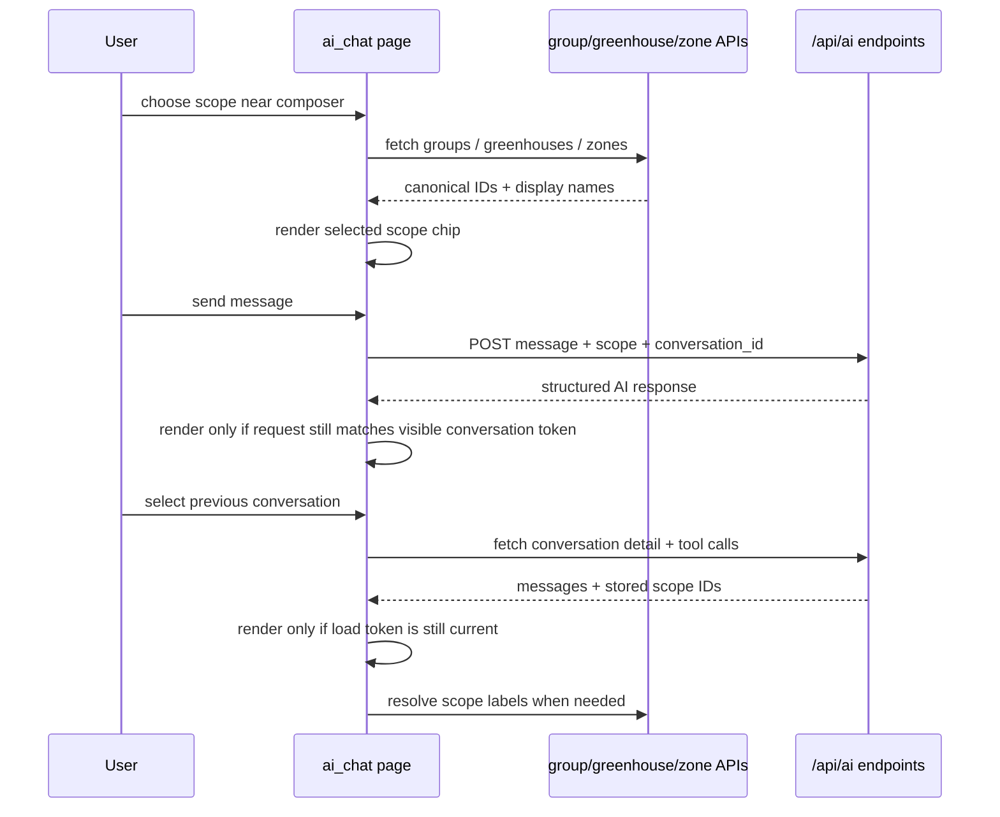

# feat: Redesign chat scope selection and isolate conversation rendering

## Summary

Redesign the AI chat page so fleet scope is selected from the chat composer instead of typed as raw IDs above the chat, while fixing stale async rendering paths that can mix messages from different conversations. The work keeps the existing chat API shape, resolves scope selections to canonical IDs from existing group/greenhouse/zone endpoints, and adds focused tests around scope state and conversation switching.

---

## Problem Frame

The current AI chat page asks users to type group, greenhouse, and zone IDs manually in a top context card. That is error-prone, disconnected from the chat action, and can silently fail when display-style IDs are not UUIDs. Separately, conversation selection and in-flight chat responses can render into the same visible chat area after the user has switched threads, which makes previous chats appear mixed with the current conversation.

---

## Assumptions

*This plan was authored without synchronous user confirmation. The items below are agent inferences that fill gaps in the input — un-validated bets that should be reviewed before implementation proceeds.*

- The desired “like hyperlink” interaction means a selectable scope token/chip near the message composer, not literal inline markup inside the textarea.
- The top conversation selector remains above the chat; only raw scope ID inputs move into the chat/composer area.
- Conversation scope remains request-level state for the existing `/api/ai/chat` contract; this plan does not require backend parsing of inline mention text.
- If a conversation is selected, the composer should show that conversation’s stored scope and use it for subsequent sends unless the user explicitly changes or clears it.

---

## Requirements

- R1. Replace manual Group ID, Greenhouse, and Zone text inputs with an in-chat/composer scope selection experience that uses existing fleet entities.
- R2. Scope selection must send canonical IDs compatible with the existing `AIScope` / `/api/ai/chat` contract.
- R3. Selecting saved conversations repeatedly or rapidly must not visually mix messages, tool calls, or assistant responses from different conversations.
- R4. Selecting an existing conversation must rehydrate the visible scope state from that conversation’s stored scope.
- R5. The redesigned chat page must preserve existing AI response rendering, proposed action approvals/rejections, and tool-call transparency.
- R6. New behavior must be covered by focused unit/integration tests for scope state, stale-render prevention, and conversation switching.

---

## Scope Boundaries

- Do not redesign the AI agent prompt, tool registry, safety validation, command approval API, or MQTT command pipeline.
- Do not introduce a new backend endpoint unless implementation proves name rehydration cannot be done cleanly through existing group/greenhouse/zone endpoints.
- Do not parse scope tokens out of the message text; message content and scope remain separate payload fields.
- Do not add persistence through module-level UI state or cross-user globals.

### Deferred to Follow-Up Work

- Full browser automation coverage for the entire AI chat page can follow after the core state model is unit/integration tested.
- A documented `docs/solutions/` entry for the message-mixing bug should be added after implementation verifies the final root cause and fix.

---

## Context & Research

### Relevant Code and Patterns

- `app/ui/pages/ai_chat.py` is the primary page. It currently renders the conversation selector and manual scope inputs in the top context card, stores selected conversation/scope in local dictionaries, appends fresh messages directly into `chat_area`, and uses a delayed timer for conversation selection.
- `app/api/ai_chat.py` defines `AIChatRequest`, `AIConversationSummary`, `AIConversationDetail`, and the `/api/ai/chat` plus conversation/tool-call endpoints. Conversation detail already returns stored scope IDs.
- `app/services/ai_agent/models.py` defines `AIScope` and `AIResponse`; scope remains separate from the message string.
- `app/repositories/ai_conversation_repository.py` parses scope strings as UUIDs before storing them. Display IDs such as `group-001` are intentionally ignored, so the UI must send real entity IDs.
- `app/schemas/plant_batches.py` contains `GroupResponse`, `GreenhouseResponse`, and `ZoneResponse` shapes used by existing fleet APIs.
- `app/ui/api_client.py` is the existing pattern for NiceGUI pages calling FastAPI endpoints through `api_client()`.
- `app/ui/components/chat_message.py`, `app/ui/components/tool_call_trace.py`, and `app/ui/components/proposed_action_card.py` should remain the rendering components for chat content.
- `tests/unit/test_chat_view_models.py` already covers pure chat formatting and scope-dict helpers and is the natural place to add state/model helper coverage.
- `tests/integration/test_ai_chat_api.py` and `tests/integration/test_ai_conversation_persistence.py` cover API and persistence behavior for AI chat and conversation scope.

### Institutional Learnings

- `docs/solutions/ui-bugs/nicegui-i18n-docker-hot-reload-2026-05-11.md` documents that NiceGUI `ui.select` emits display labels rather than dict keys in this project’s selector pattern. New selectors should keep a deliberate label-to-ID mapping instead of assuming displayed labels are canonical values.
- The same learning reinforces render-time i18n via `app.i18n.core._`; all new chat labels and empty/error states should follow that pattern.

### External References

- Not used. Existing NiceGUI and API patterns in the repository are sufficient for this bounded UI/state redesign.

---

## Key Technical Decisions

- Composer-level scope chips/selectors instead of inline textarea tokens: this preserves the existing API contract where `message` and `scope` are separate fields and avoids hidden parsing of user text.
- Keep conversation selection separate from scope selection: saved-thread loading remains a top-level context action, while the scope a new message will use lives adjacent to the send action.
- Introduce a small page-local state model for scope and render request identity: this gives unit-testable behavior without adding cross-user module globals or a larger frontend architecture.
- Treat async load/send results as stale unless they match the current render token/conversation identity: clearing the chat area alone is insufficient when requests complete out of order.
- Re-render confirmed conversation state after sends where needed instead of relying only on incremental append: this preserves tool-call transparency and prevents assistant responses from landing in the wrong visible thread.

---

## Open Questions

### Resolved During Planning

- Should scope selection create a backend parser for mention text? No. The existing request body already separates scope from message text, and keeping that contract limits risk.
- Should external framework research be required? No. The work extends established NiceGUI page/API-client patterns already present in the repo.

### Deferred to Implementation

- Exact visual treatment of the scope token/chip: choose the smallest NiceGUI/Quasar control that fits the current theme while preserving clear remove/change affordances.
- Exact name rehydration strategy for existing conversation scopes: prefer existing list endpoints and local label maps; add backend enrichment only if the existing API shape makes the UI brittle.
- Whether to disable conversation switching during an in-flight send or allow switching while ignoring stale results: implementation can choose the least disruptive UI after adding stale-result guards.

---

## High-Level Technical Design

> *This illustrates the intended approach and is directional guidance for review, not implementation specification. The implementing agent should treat it as context, not code to reproduce.*

---

## Implementation Units

### U1. Extract testable chat scope and render-state helpers

**Goal:** Create a small pure state layer that represents selected scope, scope label metadata, and current render identity so UI callbacks can avoid stale renders.

**Requirements:** R2, R3, R4, R6

**Dependencies:** None

**Files:**
- Modify: `app/ui/pages/ai_chat.py`
- Test: `tests/unit/test_chat_view_models.py`

**Approach:**
- Remove the unused module-level `_SESSION_MESSAGES` state from the page.
- Keep helper behavior pure where possible: converting selected scope to the existing scope dict, resetting dependent scope fields when parent selection changes, and generating/comparing render tokens for async load/send operations.
- Model partial scope explicitly: group only, group plus greenhouse, or group plus greenhouse plus zone.
- Preserve `_build_scope_dict` compatibility so existing API request assembly remains straightforward.

**Patterns to follow:**
- Existing pure helper tests in `tests/unit/test_chat_view_models.py`.
- Existing page-local dictionaries in `app/ui/pages/ai_chat.py`, but without cross-user module-level mutable state.

**Test scenarios:**
- Happy path: selecting group, greenhouse, and zone produces a scope dict with all three canonical IDs.
- Happy path: selecting only a group produces a scope dict with group ID and null greenhouse/zone.
- Edge case: changing the group clears greenhouse and zone selections so stale child IDs do not leak into the payload.
- Edge case: clearing scope produces all-null scope fields.
- Edge case: a stale render token is rejected when a newer conversation load token exists.
- Edge case: removing `_SESSION_MESSAGES` does not change `_parse_assistant_content` or `_build_scope_dict` behavior.

**Verification:**
- Scope state has no module-level mutable message storage.
- Pure helper tests prove scope conversion and stale-token checks without requiring a running NiceGUI app.

---

### U2. Add composer-level fleet scope selector

**Goal:** Replace raw scope ID inputs with a selector/chip experience inside or immediately above the composer area that resolves display selections to canonical group/greenhouse/zone IDs.

**Requirements:** R1, R2, R5, R6

**Dependencies:** U1

**Files:**
- Modify: `app/ui/pages/ai_chat.py`
- Modify: `app/ui/static/theme.css`
- Test: `tests/unit/test_chat_view_models.py`

**Approach:**
- Remove the Group ID, Greenhouse, and Zone text inputs from the top `Conversation Context` card.
- Keep the conversation selector and New Conversation action in the top card.
- Add scope controls next to the message composer: a visible selected-scope chip/summary, a change/select action, and a clear action.
- Populate selector options from existing APIs: groups first, then greenhouses for selected group, then zones for selected greenhouse.
- Maintain explicit label-to-ID maps for each selector level so NiceGUI display values never become the submitted ID accidentally.
- Show empty/error states locally in the selector area rather than writing scope-selection failures into the chat transcript.

**Patterns to follow:**
- `app/ui/pages/ai_chat.py` usage of `api_client()` for UI-to-API calls.
- Render-time i18n pattern with `_()` from `app.i18n.core`.
- Selector mapping caution from `docs/solutions/ui-bugs/nicegui-i18n-docker-hot-reload-2026-05-11.md`.
- Existing theme class style in `app/ui/static/theme.css` for chat panel/composer styling.

**Test scenarios:**
- Happy path: group API result displayed as a human label maps back to the group UUID in `scope_state`.
- Happy path: after selecting a group, selecting a greenhouse maps to the greenhouse UUID and keeps the parent group UUID.
- Happy path: after selecting a greenhouse, selecting a zone maps to the zone UUID and keeps parent IDs.
- Edge case: changing group after choosing a greenhouse and zone clears child selections and child label maps.
- Edge case: empty groups list shows a non-crashing empty state and leaves scope unset.
- Error path: failed group/greenhouse/zone fetch shows a local error state and does not mutate current scope.
- Integration-style unit scenario: sending a message after selecting scope builds the same `scope` payload shape expected by `/api/ai/chat`.

**Verification:**
- Users can choose scope without typing raw IDs.
- Chat payloads still send `scope.group_id`, `scope.greenhouse_id`, and `scope.zone_id` as canonical strings or null.
- Existing message composer behavior remains intact.

---

### U3. Isolate conversation rendering from stale loads and sends

**Goal:** Fix message mixing by ensuring conversation loads and AI responses only render into the chat area when they still belong to the currently visible conversation/request.

**Requirements:** R3, R5, R6

**Dependencies:** U1

**Files:**
- Modify: `app/ui/pages/ai_chat.py`
- Test: `tests/unit/test_chat_view_models.py`
- Test: `tests/integration/test_ai_chat_api.py`

**Approach:**
- Replace delayed `ui.timer` conversation loading with an async-safe selection flow that records a new render token whenever a conversation is selected.
- Clear and render the chat area only from the latest active load token.
- When sending a message, capture the selected conversation/render identity at send start and ignore or avoid rendering the response if the user has switched conversations before the response returns.
- Prefer rendering from persisted conversation state after successful sends when a conversation ID is known, so tool-call panels and proposed actions stay consistent with loaded conversations.
- Ensure `start_new_conversation()` resets selected conversation, render token, scope state, scope UI, errors, loading UI, and chat content together.

**Patterns to follow:**
- Existing `load_conversation_messages()` fetches conversation detail and tool calls together; keep that atomic rendering boundary.
- Existing `is_processing` guard for duplicate sends, extended with render-identity checks rather than broad global locking.
- Existing `tool_call_panel()` and `proposed_action_card()` rendering components.

**Test scenarios:**
- Happy path: selecting conversation A clears the empty state and renders only A messages and A tool calls.
- Happy path: selecting conversation B after A clears A content and renders only B content.
- Edge case: rapid select A then B, with A completing last, leaves only B visible because A’s stale token is ignored.
- Edge case: send in conversation A, switch to conversation B before the response returns, and verify A’s assistant response is not rendered into B.
- Edge case: clicking New Conversation while a load is in flight prevents the stale load from repopulating the chat.
- Error path: a failed stale load does not overwrite the error area for the current conversation.
- Integration scenario: conversation detail response scope fields remain available for UI rehydration after selecting a saved conversation.

**Verification:**
- Repeatedly selecting saved conversations cannot accumulate mixed message bubbles in the same visible chat area.
- In-flight sends cannot append assistant output to a different visible conversation.
- Existing proposed action approval/rejection callbacks still receive the correct command ID.

---

### U4. Rehydrate and synchronize scope when selecting conversations

**Goal:** Make the new composer scope selector reflect the stored scope of the selected conversation and reset cleanly for new conversations.

**Requirements:** R1, R2, R4, R6

**Dependencies:** U2, U3

**Files:**
- Modify: `app/ui/pages/ai_chat.py`
- Test: `tests/unit/test_chat_view_models.py`
- Test: `tests/integration/test_ai_conversation_persistence.py`

**Approach:**
- Read `group_id`, `greenhouse_id`, and `zone_id` from `AIConversationDetail` when loading a saved conversation.
- Update page-local scope state before rendering the composer scope chip so follow-up messages use the selected conversation’s scope by default.
- Resolve display labels through available group/greenhouse/zone list data when possible; if a label cannot be resolved, show a safe fallback that still preserves the canonical ID.
- Reset scope state and scope UI when starting a new conversation.
- Keep the existing API contract unchanged: the chat request still posts explicit scope state alongside the optional selected conversation ID.

**Patterns to follow:**
- `AIConversationSummary` / `AIConversationDetail` fields in `app/api/ai_chat.py`.
- Persistence expectations in `tests/integration/test_ai_conversation_persistence.py`.
- Existing NiceGUI UI refresh pattern in `load_conversations()` and `load_conversation_messages()`.

**Test scenarios:**
- Happy path: selecting a conversation with group, greenhouse, and zone IDs updates scope state with those IDs.
- Happy path: selecting a group-only conversation updates only group scope and leaves child scope null.
- Edge case: selecting a conversation with null scope clears the visible scope chip.
- Edge case: starting a new conversation after viewing a scoped conversation clears all scope state.
- Edge case: unresolved/deleted scope ID displays a fallback label but preserves the canonical ID for request payloads.
- Integration scenario: a conversation created with UUID scope can be fetched and its scope IDs match what the UI rehydrates.

**Verification:**
- Conversation scope shown near the composer matches the selected saved conversation.
- Follow-up messages in a loaded conversation do not accidentally reuse stale scope from a previously viewed conversation.

---

## System-Wide Impact

- **Interaction graph:** The change is contained to the AI chat page UI, existing group/greenhouse/zone read APIs, and existing `/api/ai` endpoints. AI agent tools and command approval paths remain unchanged.
- **Error propagation:** Scope fetch failures should surface near the selector; chat send/load failures continue to use the page’s existing error/loading areas.
- **State lifecycle risks:** The main risk is stale async callbacks mutating current UI state after the visible conversation changed; render tokens and page-local state reset boundaries mitigate this.
- **API surface parity:** The `/api/ai/chat` request shape should remain unchanged. Existing API clients that send `message`, `conversation_id`, and `scope` should keep working.
- **Integration coverage:** Unit tests should cover state helpers; integration tests should prove conversation detail/persistence scope remains sufficient for UI rehydration.
- **Unchanged invariants:** AI never directly actuates hardware. Proposed actions still require explicit approval through existing cards and command endpoints.

---

## Risks & Dependencies

| Risk | Mitigation |
|------|------------|
| NiceGUI select events return display labels instead of canonical IDs | Maintain explicit label-to-ID maps and test mapping helpers. |
| Stale async responses still render after conversation changes | Gate all load/send render paths with current render identity checks. |
| Scope display labels are unavailable when rehydrating old conversations | Fall back to safe ID display while preserving canonical IDs; prefer existing list endpoints for label resolution. |
| Scope mutation mid-conversation confuses backend conversation scope | Rehydrate from selected conversation by default and keep request payload explicit; avoid backend contract changes in this pass. |
| UI tests become brittle if they depend on NiceGUI internals | Put most logic in pure helpers and keep page-level tests focused on state transitions and payloads. |

---

## Documentation / Operational Notes

- If implementation confirms a reusable root-cause pattern for NiceGUI stale async rendering, add a follow-up `docs/solutions/ui-bugs/` entry after the code is fixed and tested.
- No migration, deployment, or environment changes are expected.
- For manual verification, run the app through the existing Docker Compose development workflow and exercise rapid conversation switching plus scope selection in the browser.

---

## Sources & References

- Related code: `app/ui/pages/ai_chat.py`
- Related code: `app/api/ai_chat.py`
- Related code: `app/services/ai_agent/models.py`
- Related code: `app/repositories/ai_conversation_repository.py`
- Related code: `app/schemas/plant_batches.py`
- Related tests: `tests/unit/test_chat_view_models.py`
- Related tests: `tests/integration/test_ai_chat_api.py`
- Related tests: `tests/integration/test_ai_conversation_persistence.py`
- Institutional learning: `docs/solutions/ui-bugs/nicegui-i18n-docker-hot-reload-2026-05-11.md`
