# fix: Redesign AI chat scope selection and prevent conversation mixing

## Summary

Redesign the AI chat page so group/greenhouse/zone scope is selected from real fleet entities inside the chat composer as a mention-like picker instead of typed into top-of-page ID fields. Treat all-greenhouses chat as the existing unscoped/default state. Fix conversation rendering so rapid previous-chat selection and in-flight AI responses cannot mix messages from different conversations.

---

## Problem Frame

The current `/ai-chat` page asks users to type scope IDs manually, which is error-prone and exposes internal UUID/display-ID details. It also renders chat messages directly into a shared NiceGUI container while async conversation loads and AI responses are in flight, so selecting previous conversations repeatedly or switching during a response can show messages under the wrong conversation.

---

## Requirements

- R1. Replace manual `Group ID`, `Greenhouse`, and `Zone` text inputs with an in-chat/composer scope selector that lets users choose real fleet entities.
- R2. Preserve the existing API contract where chat message text and scope are sent separately; scope selection must not inject raw tokens into the user message text.
- R3. Ensure selected scope resolves to canonical UUID values accepted by the AI conversation persistence layer.
- R4. When loading a saved conversation, render only that conversation's persisted messages, tool calls, and scope.
- R5. Prevent stale async loads, optimistic user messages, loading indicators, errors, or AI responses from rendering into a newer selected conversation.
- R6. Keep approval/rejection flows for proposed actions unchanged.
- R7. Add regression coverage for scope transformation and conversation-switching/race behavior.
- R8. Return enough chat response metadata for the UI to identify the persisted conversation created or continued by a send request.

---

## Scope Boundaries

- Do not redesign the AI agent prompt, tool registry, safety validation, or MQTT command execution flow.
- Do not change the `/api/ai/chat` request shape; add only minimal response metadata needed to identify the persisted conversation for a send request.
- Do not introduce full rich-text inline token parsing in the textarea; the mention-like interaction should remain a selector/chip UX that keeps message text clean.
- Do not add persistent user preferences for default scope in this pass.
- Do not create a new fleet-level scope field; all-greenhouses chat remains the existing unscoped/default state.
- Do not create new group/greenhouse/zone management flows from the chat page.

### Deferred to Follow-Up Work

- Document the final bug pattern in `docs/solutions/ui-bugs/` after the implementation lands and the regression is proven.
- Consider richer searchable autocomplete if the cascading selector becomes cumbersome with large fleets.

---

## Context & Research

### Relevant Code and Patterns

- `app/ui/pages/ai_chat.py` owns the current page state, conversation selector, manual scope inputs, message rendering, and send/load callbacks.
- `app/ui/components/chat_message.py`, `app/ui/components/tool_call_trace.py`, and `app/ui/components/proposed_action_card.py` provide existing message, tool-call, and proposed-action rendering components that should continue to be reused.
- `app/ui/api_client.py` is the established NiceGUI-to-FastAPI access pattern; the chat page should continue using the local REST API instead of direct repository/service calls.
- `app/api/ai_chat.py` exposes conversation summaries/details and returns stored `group_id`, `greenhouse_id`, and `zone_id` values for selected conversations.
- `app/services/ai_agent/models.py` defines `AIScope`; `app/repositories/ai_conversation_repository.py` silently drops non-UUID scope strings, so UI selection must produce real UUIDs.
- `app/schemas/plant_batches.py` defines group, greenhouse, and zone response shapes used by existing fleet endpoints.
- Existing tests in `tests/unit/test_chat_view_models.py`, `tests/integration/test_ai_chat_api.py`, and `tests/integration/test_ai_conversation_persistence.py` are the closest coverage anchors.

### Institutional Learnings

- `docs/solutions/ui-bugs/nicegui-i18n-docker-hot-reload-2026-05-11.md` documents that NiceGUI `ui.select` events can emit display labels rather than dict keys. Scope selectors and conversation selectors should maintain explicit label-to-ID mappings rather than assuming display text is canonical.
- The same learning reinforces calling `_()` at render time for language-aware NiceGUI components.

### External References

- External research was skipped because this work is bounded to existing NiceGUI/FastAPI patterns and local code already provides the relevant API and UI conventions.

---

## Key Technical Decisions

- Use a composer-adjacent chip/selector for scope, not inline textarea token parsing: this matches the existing separate `message` + `scope` API contract and avoids stripping artificial mention tokens from user text.
- Keep conversation selection in the top context card, but remove manual scope text inputs from that card: saved-thread navigation and message scoping remain separate concerns while scope moves to the place where a message is composed.
- Use canonical UUIDs as selector values whenever possible, with duplicate-safe display labels/chips: display names must never be treated as unique identifiers.
- Treat conversation loads and AI responses as request-scoped UI updates: callbacks should confirm they still target the currently displayed conversation before clearing, rendering, showing loading state, or showing errors.
- Return the persisted `conversation_id` from `/api/ai/chat` via an API-only response model or service result wrapper, not by adding persistence metadata to the Pydantic AI model output schema.
- Re-render from persisted conversation state after successful sends when practical: this keeps fresh tool-call panels and proposed-action cards aligned with the same path used for saved conversation rendering.
- Remove the unused module-level `_SESSION_MESSAGES` state: page-local state and persisted API responses are the source of truth.

---

## Open Questions

### Resolved During Planning

- Should the mention-like selector be true inline rich text or chips near the composer? Resolved as chips/selector near the composer because the API already separates message text from scope and NiceGUI textarea does not provide native inline token rendering.
- Should this plan change AI safety/proposed-action behavior? No; proposed action approval/rejection remains unchanged and only rendering/state wiring is touched.

### Deferred to Implementation

- Exact selector widget composition: implementation can choose the simplest NiceGUI controls that support canonical ID mapping, cascading fetches, reset behavior, duplicate-safe labels, and clear visual scope chips.

---

## High-Level Technical Design

> *This illustrates the intended approach and is directional guidance for review, not implementation specification. The implementing agent should treat it as context, not code to reproduce.*

```mermaid
stateDiagram-v2
    [*] --> EmptyChat
    EmptyChat --> LoadingConversation: select saved conversation
    LoadingConversation --> ShowingConversation: latest load completes
    LoadingConversation --> LoadingConversation: newer conversation selected
    LoadingConversation --> LoadingConversation: stale load ignored; no UI mutation
    ShowingConversation --> SendingMessage: send with selected scope
    SendingMessage --> ShowingConversation: response still targets visible conversation
    SendingMessage --> ShowingConversation: user switches conversation; stale response ignored
    ShowingConversation --> EmptyChat: new conversation
```

The scope selector owns a small page-local state object for selected group, greenhouse, and zone IDs plus display labels. No selected scope means fleet-wide/default chat. Changing a higher-level selection clears dependent lower-level selections. `send_message()` reads only this canonical state when building `AIScope`.

---

## Implementation Units

### U1. Stabilize conversation render state

**Goal:** Prevent previous-chat selection and in-flight chat responses from rendering stale messages into the visible conversation.

**Requirements:** R4, R5, R6, R7, R8

**Dependencies:** None

**Files:**
- Modify: `app/ui/pages/ai_chat.py`
- Modify: `app/api/ai_chat.py`
- Modify: `app/services/ai_agent/agent.py`
- Test: `tests/unit/test_chat_view_models.py`
- Test: `tests/integration/test_ai_chat_api.py`
- Test: `tests/integration/test_ai_conversation_persistence.py`

**Approach:**
- Extract a small testable render/request state helper or state object so load/send token decisions can be unit-tested outside NiceGUI callbacks.
- Replace ad-hoc render appends with a single page-local notion of the currently displayed conversation/request target.
- Ensure conversation load callbacks verify they still match the latest selected conversation before clearing or rendering `chat_area`.
- Ensure send callbacks do not append optimistic user messages, loading indicators, errors, or assistant output if the user has switched to another conversation while the request was in flight.
- Fix saved conversation selection to resolve duplicate-safe display labels to canonical conversation UUIDs before calling load logic.
- Return the persisted conversation UUID from the chat endpoint/service response so newly created conversations can be selected and refreshed without guessing from the newest list item; keep this metadata outside the Pydantic AI `AIResponse` output schema.
- Stale successful send responses must not mutate the visible chat area, but they may safely refresh the conversation list or notify that a response completed in another conversation.
- Prefer refreshing the visible conversation from API after a successful send so fresh messages, tool calls, and proposed actions share the same render path as saved conversations.
- Remove unused `_SESSION_MESSAGES` to avoid shared module-level state in a multi-user NiceGUI process.

**Execution note:** Add characterization-style regression tests for stale render guards before changing the UI flow where possible.

**Patterns to follow:**
- Existing `load_conversation_messages()` clear-and-render pattern in `app/ui/pages/ai_chat.py`.
- Existing parse/format pure function tests in `tests/unit/test_chat_view_models.py`.
- Existing chat API persistence expectations in `tests/integration/test_ai_chat_api.py` and `tests/integration/test_ai_conversation_persistence.py`.

**Test scenarios:**
- Happy path: selecting conversation A fetches A detail/tool calls and renders only A messages.
- Edge case: selecting A then B before A finishes ignores A's stale result and leaves only B visible.
- Edge case: selecting conversations with duplicate titles loads the canonical selected conversation UUID, not the display title.
- Edge case: sending in conversation A then switching to B before response completion does not leave A's user bubble, loading indicator, error, or assistant response in B.
- Integration: a successful new conversation send returns the created conversation ID from an API-only response shape and refreshes through the conversation-detail path.
- Integration: a successful existing conversation send returns the same conversation ID from an API-only response shape and refreshes through the conversation-detail path.
- Edge case: a new conversation send that completes after the user switches away does not render into the visible chat but leaves the created conversation discoverable in the conversation list.
- Regression: proposed action approval/rejection callbacks remain wired after the new render path.

**Verification:**
- Repeated previous-chat clicks cannot visually mix messages from multiple conversations.
- Fresh AI responses render only if their originating conversation is still visible.
- Proposed-action cards still render and call existing approve/reject endpoints.

---

### U2. Add composer-level scope selector state

**Goal:** Replace manual scope ID entry with a composer-adjacent selector/chip state model that stores canonical IDs and display labels.

**Requirements:** R1, R2, R3, R7

**Dependencies:** None

**Files:**
- Modify: `app/ui/pages/ai_chat.py`
- Test: `tests/unit/test_chat_view_models.py`

**Approach:**
- Move scope UI from the top context card into a compact scope row directly above the message input.
- Default state shows no selected scope, which means fleet-wide/default chat, plus an action to choose scope.
- Use a cascading Group → Greenhouse → Zone selector flow; lower-level controls stay disabled until prerequisites are selected.
- Represent selected group, greenhouse, and zone as display chips while keeping their UUIDs in page-local state for API payloads.
- Support partial scope: group-only, group + greenhouse, or group + greenhouse + zone.
- Clear dependent selections when an upstream entity changes; chip remove actions follow the same dependency rules, and a clear-all action returns to unscoped chat.
- Keep message textarea content unchanged; scope is sent only through the `scope` field.
- Ensure scope controls have visible labels/programmatic names and chip remove/clear actions are keyboard-focusable.

**Patterns to follow:**
- Existing `_build_scope_dict()` contract in `app/ui/pages/ai_chat.py`.
- Existing NiceGUI render-time i18n calls in `app/ui/pages/ai_chat.py` and `app/ui/components/chat_message.py`.
- Label-to-code mapping guidance from `docs/solutions/ui-bugs/nicegui-i18n-docker-hot-reload-2026-05-11.md`.

**Test scenarios:**
- Happy path: selected group/greenhouse/zone IDs produce the expected `scope` dict without modifying message text.
- Happy path: no selected scope sends all scope fields as `None` and represents fleet-wide/default chat.
- Happy path: group-only selection sends group ID with greenhouse and zone as `None`.
- Edge case: changing group clears previously selected greenhouse and zone.
- Edge case: removing a group chip clears greenhouse and zone, removing a greenhouse chip clears zone, and clearing scope returns all fields to `None`.
- Accessibility: scope controls have visible/programmatic labels and remove/clear controls are keyboard-focusable.
- Regression: display labels are not used as API scope IDs when label and UUID differ.
- Regression: duplicate group, greenhouse, or zone names remain selectable without overwriting each other's canonical UUIDs.

**Verification:**
- Users can choose scope from the composer without typing raw IDs.
- API payloads still contain `message` and `scope` as separate fields.
- Scope state never sends display labels where UUIDs are required.

---

### U3. Populate selector options from fleet APIs

**Goal:** Load real group, greenhouse, and zone options into the composer scope selector using existing REST endpoints.

**Requirements:** R1, R3, R7

**Dependencies:** U2

**Files:**
- Modify: `app/ui/pages/ai_chat.py`
- Test: `tests/unit/test_chat_view_models.py`
- Test: `tests/integration/test_ai_chat_api.py`

**Approach:**
- Fetch groups from `GET /api/groups` when the chat page or selector is opened.
- Fetch greenhouses after group selection using `GET /api/groups/{group_id}/greenhouses`.
- Fetch zones after greenhouse selection using `GET /api/groups/{group_id}/greenhouses/{greenhouse_id}/zones`.
- Verify the endpoint `id` fields are UUIDs accepted by `AIScope` before using them as canonical selector values.
- Maintain selector options keyed by canonical UUID when supported, or generate unique display labels with short IDs while preserving human labels separately for chips.
- Show local loading states for groups, greenhouses, and zones; keep the last valid higher-level scope while dependent options are loading.
- Handle empty and failed option loads locally in the selector surface without putting unrelated errors into the message history.
- Place fleet endpoint integration tests in a fixture that registers the group and greenhouse routers, rather than assuming the AI-chat-only test app exposes those routes.

**Patterns to follow:**
- Existing `api_client()` usage in `app/ui/pages/ai_chat.py`.
- Existing user-facing error/notification style in `_approve_command()`, `_reject_command()`, and `send_message()`.
- Group/greenhouse/zone response schemas in `app/schemas/plant_batches.py`.

**Test scenarios:**
- Happy path: groups load, selecting a group loads greenhouses, selecting a greenhouse loads zones.
- Edge case: empty group list shows an empty selector state and leaves scope unset.
- Edge case: group with no greenhouses keeps group-level scope valid and shows no greenhouse options.
- Loading: groups, greenhouses, and zones each show a local loading state; dependent controls are disabled while their options load.
- Error path: failed groups fetch shows a selector error and does not block unscoped chat.
- Error path: failed greenhouse or zone fetch leaves the last valid higher-level scope intact and clears invalid dependent scope.
- Regression: duplicate display labels at each selector level are handled without losing canonical IDs or selecting the wrong entity.

**Verification:**
- Scope picker is populated from existing backend APIs.
- Users can still send unscoped messages if fleet option loading fails.
- Cascading selections remain internally consistent across changes and failures.

---

### U4. Rehydrate conversation scope and reset new-chat state

**Goal:** Keep composer scope chips in sync when users load saved conversations or start a new conversation.

**Requirements:** R1, R3, R4, R5, R7

**Dependencies:** U1, U2, U3

**Files:**
- Modify: `app/ui/pages/ai_chat.py`
- Test: `tests/unit/test_chat_view_models.py`
- Test: `tests/integration/test_ai_chat_api.py`

**Approach:**
- When `load_conversation_messages()` receives conversation detail, update scope state from the returned `group_id`, `greenhouse_id`, and `zone_id` if the load is still current.
- Resolve display labels for stored scope IDs through already loaded options when available.
- If an entity referenced by a saved conversation cannot be resolved from current options, keep the canonical ID in historical state and show a simple unresolved-scope chip with a shortened ID rather than adding targeted fetch flows in this pass.
- Require explicit user re-selection or clearing before sending with an unresolved scope ID.
- When starting a new conversation, clear selected conversation, message area, and scope selector state together.

**Patterns to follow:**
- `AIConversationDetail` response fields in `app/api/ai_chat.py`.
- Existing `start_new_conversation()` reset pattern in `app/ui/pages/ai_chat.py`.
- Existing integration tests that assert conversations persist scope in `tests/integration/test_ai_conversation_persistence.py`.

**Test scenarios:**
- Happy path: selecting a conversation scoped to group/greenhouse/zone updates scope chips to match that conversation.
- Happy path: starting a new conversation clears selected conversation, rendered messages, and all scope chips.
- Edge case: conversation with no scope clears composer scope chips.
- Edge case: conversation with only group scope shows group chip and no greenhouse/zone chips.
- Edge case: conversation references an entity absent from current lists; UI keeps canonical ID for history, marks the label as unresolved/stale, and requires re-selection or clearing before follow-up send.
- Regression: after loading a scoped conversation, sending a follow-up uses the conversation's visible scope, not stale scope from a previous chat.

**Verification:**
- Saved conversation scope is visible and matches the payload used for follow-up messages.
- New conversation starts from a clean scope state.
- Conversation switching cannot leak previous scope into the new visible thread.

---

## System-Wide Impact

- **Interaction graph:** The main affected callbacks are conversation selection, conversation loading, scope option loading, new-conversation reset, and send-message completion inside `app/ui/pages/ai_chat.py`.
- **Error propagation:** Fleet selector load errors should stay in the selector surface; chat send errors should continue using the existing error container; proposed-action errors continue using notifications.
- **State lifecycle risks:** Async loads and sends must be guarded so stale callbacks do not mutate current UI state. Scope state should remain page-local, not module-global.
- **API surface parity:** Existing AI chat request behavior should remain compatible; group/greenhouse/zone APIs are reused as-is.
- **Integration coverage:** Unit tests should cover pure state transformations; integration tests should cover persisted conversation scope and API payload expectations.
- **Unchanged invariants:** AI tool safety, proposed-action confirmation, MQTT publishing rules, and OpenRouter model settings remain unchanged.

---

## Risks & Dependencies

| Risk | Mitigation |
|------|------------|
| NiceGUI `ui.select` returns labels instead of keys, causing wrong IDs to be sent | Maintain explicit label-to-ID maps and test label/UUID mismatch cases |
| Async AI response arrives after the user switches conversations | Gate render/update operations by current conversation/request target |
| Existing conversations contain scope IDs that cannot be resolved to current entity names | Preserve canonical IDs and show stale/unresolved display instead of silently dropping scope |
| Selector UI becomes too large in the composer | Keep top card for conversation selection only and use compact chips/selectors near the composer |
| Tests become too coupled to NiceGUI internals | Extract and test pure state/option mapping helpers where possible; reserve UI-level checks for behavior that cannot be proven with pure functions |

---

## Documentation / Operational Notes

- Do not add the deferred `docs/solutions/ui-bugs/` entry in this implementation; create it as follow-up after verification.
- No database migrations or destructive database operations are planned.
- No production deployment configuration changes are planned.

---

## Sources & References

- Related code: `app/ui/pages/ai_chat.py`
- Related code: `app/api/ai_chat.py`
- Related code: `app/services/ai_agent/models.py`
- Related code: `app/repositories/ai_conversation_repository.py`
- Related code: `app/schemas/plant_batches.py`
- Related tests: `tests/unit/test_chat_view_models.py`
- Related tests: `tests/integration/test_ai_chat_api.py`
- Related tests: `tests/integration/test_ai_conversation_persistence.py`
- Institutional learning: `docs/solutions/ui-bugs/nicegui-i18n-docker-hot-reload-2026-05-11.md`
